# INTRODUÇÃO

## Conheça a Cielo Smart  

A Cielo Smart é mais do que uma maquininha de pagamentos, é uma plataforma aberta que permite a criação de soluções completas para o varejo, unindo frente de caixa, gestão de negócios e meios de pagamento em um único dispositivo. 

Essa solução suporta aplicativos desenvolvidos para sistema Android, possibilitando que desenvolvedores parceiros possam criar aplicativos especializados para diversos segmentos e qualquer porte de cliente. 

Com a Cielo Smart, você tem acesso a mais de 50 aplicativos para gestão do seu negócio, integração com sistemas de automação, bateria de longa duração, e conexão constínua, o que contribui para a estabilidade nas transações. A plataforma aceita todas as formas de pagamento e possui um design moderno, ergonômico e discreto, com carregador magnético, NFC e conectividade 4G. Essas características visam proporcionar maior eficiência, segurança e praticidade no uso diário.


**Modelos de negócio**  

A integração com a Cielo Smart pode ser aplicada em diferentes cenários, dependendo do modelo de negócio e da proposta da sua solução. A seguir, apresentamos os principais modelos disponíveis para você explorar e implementar. 

- **Aplicativos públicos**: Disponíveis na Cielo Store, esses apps podem ser acessados por qualquer usuário da Cielo Smart. São ideais para soluções com grande alcance, como controle de vendas, gestão de estoque, delivery, entre outros. A monetização pode ser feita por assinatura, licenciamento ou modelo de uso. 
- **Aplicativos privados**: Desenvolvidos sob medida para um cliente ou grupo específico, esses aplicativos não ficam visíveis na loja pública. São muito utilizados por redes, franquias ou empresas que precisam de soluções personalizadas e exclusivas. 
- **Integração com sistemas de automação comercial**: A Cielo Smart pode ser conectada a sistemas de frente de caixa (PDV) e ERPs, permitindo a sincronização de vendas, controle de estoque, emissão de notas fiscais e muito mais. É a escolha ideal para empresas que já possuem um sistema próprio e desejam integrá-lo à maquininha. 
- **Soluções de parceiros**: Empresas também podem atuar como parceiras da Cielo, oferecendo soluções homologadas. Isso inclui desde o desenvolvimento de aplicativos até serviços de integração, suporte técnico e consultoria especializada.<br/>
<br/>

Para aprender mais sobre funcionalidades e especificidades técnicas, acesse a seção [Visão Geral Técnica](https://developercielo.github.io/manual/cielo-lio#vis%C3%A3o-geral-t%C3%A9cnica). 

## Primeiros passos

Está iniciando agora a sua jornada de integração e não sabe por onde começar? Aqui, você encontra uma visão simplificada dos principais passos para integrar com a Cielo Smart e publicar seu aplicativo na Cielo Store. 

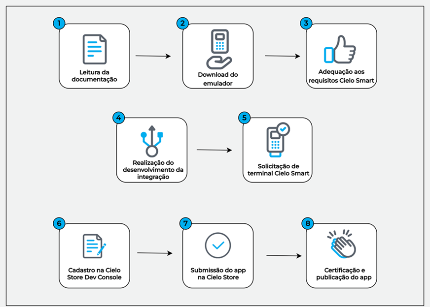

Cada passo dessa jornada está detalhado nas seções deste portal, como explicamos a seguir.

A primeira seção desta documentação, intitulada **Introdução**, apresenta uma [visão geral da Cielo Smart](https://developercielo.github.io/manual/cielo-lio#conhe%C3%A7a-a-cielo-smart), explicando sua proposta e benefícios. Nessa parte, você encontra este [guia de primeiros passos](https://developercielo.github.io/manual/cielo-lio#primeiros-passos) com orientações básicas para iniciar a integração, um [glossário](https://developercielo.github.io/manual/cielo-lio#gloss%C3%A1rio) com os principais termos técnicos utilizados ao longo da documentação, os [canais de suporte](https://developercielo.github.io/manual/cielo-lio#suporte-t%C3%A9cnico) disponíveis, informações sobre o nosso [programa de parceria](https://developercielo.github.io/manual/cielo-lio#seja-um-parceiro) e uma área dedicada às [últimas atualizações da plataforma](https://developercielo.github.io/manual/cielo-lio#comunicados). 

A seção **Visão geral técnica** aprofunda os aspectos técnicos da Cielo Smart, detalhando as [funcionalidades disponíveis nos terminais](https://developercielo.github.io/manual/cielo-lio#funcionalidades), os [modelos de equipamentos compatíveis](https://developercielo.github.io/manual/cielo-lio#terminais-e-caracter%C3%ADsticas-da-cielo-smart) e as [boas práticas recomendadas para desenvolvedores](https://developercielo.github.io/manual/cielo-lio#boas-pr%C3%A1ticas-para-desenvolvedores) que desejam garantir qualidade, segurança e desempenho em suas soluções. 

A seção **Pré-publicação de aplicativo** reúne os principais pontos que devem ser considerados antes de iniciar o processo de publicação de um app. Ela inclui os [pré-requisitos técnicos](https://developercielo.github.io/manual/cielo-lio#pr%C3%A9-requisitos), os [modelos de integração disponíveis](https://developercielo.github.io/manual/cielo-lio#modelos-de-integra%C3%A7%C3%A3o), e orientações sobre o uso do [Emulador Cielo](https://developercielo.github.io/manual/cielo-lio#emulador-cielo). Também aborda como [solicitar e ativar uma Cielo Smart](https://developercielo.github.io/manual/cielo-lio#solicitando-uma-cielo-smart), além de listar [recursos indisponíveis e sugerir alternativas viáveis](https://developercielo.github.io/manual/cielo-lio#recursos-indispon%C3%ADveis-e-sugest%C3%B5es-de-substitutos) para garantir uma experiência completa e funcional no aplicativo.

Já em **Publicando um aplicativo**, o foco é no processo de criação, testes e publicação de aplicativos. Você aprende desde os primeiros passos no desenvolvimento até o uso do [Cielo Store Dev Console](https://developercielo.github.io/manual/cielo-lio#cielo-store-dev-console), ferramenta que permite gerenciar os aplicativos dentro da plataforma. Também são explicadas as diferenças entre [loja pública](https://developercielo.github.io/manual/cielo-lio#loja-p%C3%BAblica) e [loja privada](https://developercielo.github.io/manual/cielo-lio#loja-privada), como acompanhar o [status do aplicativo](https://developercielo.github.io/manual/cielo-lio#status-de-um-aplicativo), os critérios para publicação e como utilizar o ambiente Sandbox, que funciona como um emulador para testes sem a necessidade de um terminal físico.  

A seção **Integração via Deep Link** apresenta uma forma simples e eficiente de [conectar seu aplicativo à Cielo Smart por meio de deep links](https://developercielo.github.io/manual/cielo-lio#integra%C3%A7%C3%A3o-via-deeplink). São fornecidos exemplos práticos, formatos de chamada e orientações para garantir compatibilidade e segurança na comunicação.

A seção **Integração Remota** detalha como [realizar transações e interações com a Cielo Smart de forma remota](https://developercielo.github.io/manual/cielo-lio#integra%C3%A7%C3%A3o-remota). O conteúdo inclui fluxos de integração, requisitos técnicos e boas práticas para garantir confiabilidade e desempenho.

Na seção **Pix**, você encontra [orientações para integrar pagamentos via Pix na Cielo Smart](https://developercielo.github.io/manual/cielo-lio#pix), oferecendo uma alternativa moderna e instantânea às transações tradicionais. 

Por fim, a seção de **Perguntas Frequentes** reúne as [dúvidas mais comuns](https://developercielo.github.io/manual/cielo-lio#faq) entre os usuários da plataforma. 

## Glossário

Este glossário reúne os principais termos utilizados no ecossistema de desenvolvimento da Cielo Smart. Ele foi criado para facilitar a compreensão de conceitos técnicos e operacionais, promovendo uma integração mais eficiente com nossas soluções. Consulte-o sempre que tiver dúvidas sobre nomenclaturas ou funcionalidades. 

| **Termo**                 | **Descrição**                                                                                                                                           |
|--------------------------|----------------------------------------------------------------------------------------------------------------------------------------------------------|
| Ambiente Sandbox         | Ambiente de testes que simula o ambiente de produção, permitindo que desenvolvedores testem suas integrações sem realizar transações reais.             |
| Aplicativo privado       | Aplicativo desenvolvido para ser disponibilizado exclusivamente em lojas privadas da Cielo Smart. É acessível apenas por estabelecimentos comerciais previamente autorizados pela empresa responsável. |
| Aplicativo público       | Aplicativo desenvolvido para ser disponibilizado na loja pública, acessível por qualquer cliente da Cielo.                                              |
| Certificação             | Processo de validação técnica exigido pela Cielo para garantir que a aplicação atende aos requisitos de segurança e funcionamento antes de ir para produção. |
| Cielo Store              | Loja de aplicativos da Cielo, onde desenvolvedores e parceiros podem publicar soluções na Cielo Smart.                                                  |
| Cielo Store Dev Console  | Plataforma para desenvolvedores gerenciarem seus aplicativos na Cielo Store, incluindo publicação, atualização e acompanhamento do processo de publicação.            |
| Credenciais              | Conjunto de dados (como Client-ID e Access token) utilizados para autenticar e autorizar o acesso às APIs da Cielo.                                     |
| Deep Link                 | Método de integração que permite a comunicação entre aplicativos por meio de URLs personalizadas, facilitando a chamada de funções específicas na Cielo Smart. |
| Emulador                 | Ferramenta que simula o comportamento de um terminal Cielo em um ambiente de desenvolvimento, permitindo testes sem o hardware físico.                  |
| Loja privada             | Espaço exclusivo dentro da Cielo Smart destinado a empresas que desejam disponibilizar aplicativos para estabelecimentos comerciais específicos.         |
| Loja pública             | Ambiente da Cielo Smart onde os aplicativos públicos ficam disponíveis para todos os estabelecimentos que utilizam os terminais da Cielo.               |
| Maquininha/terminal      | Dispositivo físico fornecido pela Cielo para realizar transações de pagamento.                                                                          |
| Order                    | Representa um pedido ou ordem de pagamento, geralmente contendo informações como valor, itens.                                                          |
| Produção                 | Ambiente real onde as transações são processadas de fato, com movimentação financeira e dados reais.                                                    |
| Transaction              | Representa uma transação financeira, como uma venda, cancelamento ou estorno, realizada por meio das soluções da Cielo.                                |


## Suporte técnico

Nosso objetivo é apoiar você em cada etapa do desenvolvimento de soluções integradas com a Cielo Smart, desde o planejamento até a publicação. 

Caso tenha dúvidas e precise de ajuda, você poderá entrar em contato conosco abrindo um chamado ou agendando uma chamada de vídeo. 

### Abrindo um chamado

Você pode abrir um chamado de duas maneiras:

- Enviando um e-mail para **suportesolucoesintegradas@cielo.com.br**;

### Agendando uma chamada de vídeo

Você também pode [agendar uma chamada de vídeo](https://outlook.office.com/book/SuporteSoluesIntegradasSmart@cielo.onmicrosoft.com/?ismsaljsauthenabled) no dia e horário que preferir para conversar diretamente com nossos desenvolvedores especializados em suporte às soluções integradas da Cielo Smart. 

Siga o passo-a-passo abaixo para agendar uma chamada de vídeo com nosso time técnico:

**1.** Acesse a [página de reservas](https://outlook.office.com/book/SuporteSoluesIntegradasSmart@cielo.onmicrosoft.com/?ismsaljsauthenabled) <br/>
**2.** Selecione a data e o horário de sua preferência. <br/>
**3.** Adicione seus detalhes como nome e sobrenome, e-mail e número de telefone. <br/>
**4**. Selecione o produto. <br/>
**5**. Descreva a sua dúvida ou o problema que está enfrentando. <br/>
**6**. Clique em **Reservar**.

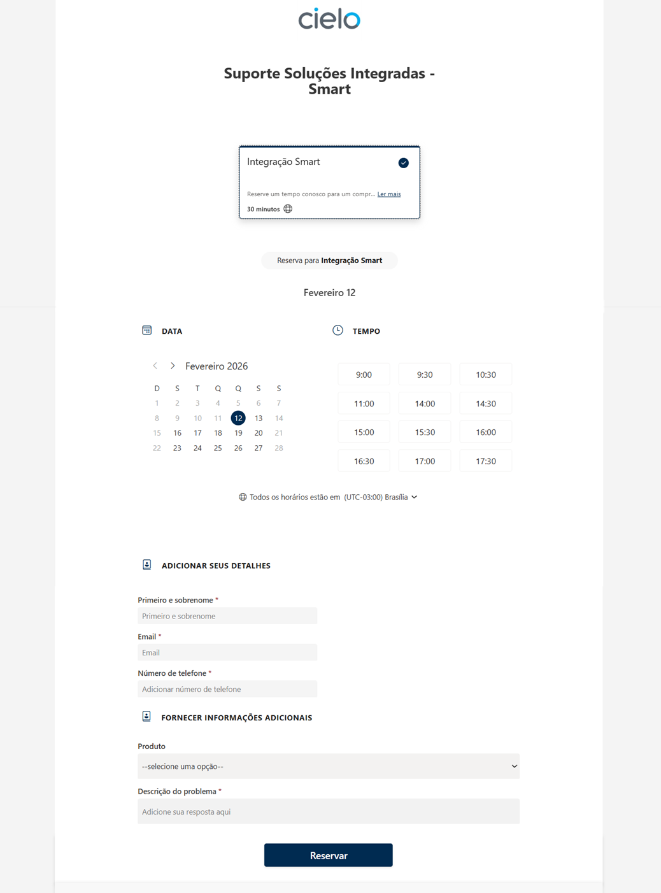

Pronto! Sua chamada de vídeo foi agendada e você receberá um e‑mail com a confirmação da reserva e o link para acessar a reunião.

<aside style="background-color: #d4edda; padding: 15px; border-left: 5px solid #28a745; color: #155724;margin-top: 20px; margin-bottom: 20px;"> Para reagendar sua chamada de vídeo, acesse o e-mail de confirmação da reserva e clique em Reagendar. </aside>

## Seja um parceiro

A Aliança Cielo objetiva construir parcerias estratégicas com empresas de tecnologia, ampliando nossa atuação no mercado com soluções integradas e completas. A proposta é democratizar o acesso à inovação, conectando nossos serviços às soluções dos parceiros. A maioria das parcerias é formada por meio da integração entre os produtos da Cielo e as soluções dos parceiros. Também há troca de leads qualificados, criando oportunidades comerciais para ambos os lados. 
  
**Quem pode ser parceiro?**

O programa é destinado a empresas de tecnologia de todos os portes que atuam nos segmentos do varejo físico e do e-commerce. Isso inclui Software Houses, TEF Houses, desenvolvedores de soluções integradas com maquininhas e aplicativos para Cielo Smart, além de plataformas de e-commerce, orquestradores de pagamento, agências implementadoras e criadores de marketplaces. 


Ficou com dúvidas? Envie um e-mail para **parcerias@cielo.com.br** ou [acesse o site](https://www.cielo.com.br/alianca/) com mais informações sobre o programa de parcerias e seus benefícios. 

## Comunicados

**Atualização obrigatória dos seus apps para a Cielo Smart!**

*Julho de 2025*

Estamos em processo de migração para a nova geração de terminais Cielo Smart. Para garantir o funcionamento dos seus aplicativos, é essencial que eles estejam adaptados até 15/10/2025.  

Datas importantes:

-  **29/08:** Fim do suporte a apps não adaptados (sem Deep Link ou SDK &lt; 2.1.0).
-  **15/10:** Corte definitivo: Apps não adaptados poderão deixar de funcionar.

<aside style="background-color: #f8d7da; padding: 15px; border-left: 5px solid #dc3545; color: #721c24;margin-top: 20px; margin-bottom: 20px;"> Se o seu app não for adaptado, o terminal poderá ficar indisponível e não será possível publicar ou atualizar versões antigos.  A partir de outubro, todas as trocas de terminais e novas contratações serão feitas exclusivamente com terminais Cielo Smart.</aside>

Para migrar:
-  Utilize a [integração via Deep links](https://developercielo.github.io/manual/cielo-lio#integra%C3%A7%C3%A3o-via-deeplink).
-  [Solicite um terminal Smart](https://developercielo.github.io/manual/cielo-lio#solicitando-uma-cielo-smart) para testes via Portal do Desenvolvedor.
-  Em caso de dúvidas, [entre em contato com o suporte](https://developercielo.github.io/manual/cielo-lio#suporte-t%C3%A9cnico). <br/>
   <br/>

**Cielo Smart: A evolução da LIO On**

*Março de 2025*

A Cielo Smart chegou para transformar a experiência de desenvolvimento na plataforma Cielo. Evolução direta da LIO On, ela oferece mais performance, compatibilidade e foco em inovação. 

Com a Cielo Smart, você aproveita: 

- **Compatibilidade ampliada**: Seu app roda em novos terminais sem necessidade de ajustes ou retrabalho. 
- **Mais robustez e velocidade**: Melhorias significativas no desempenho e no tempo de aprovação de pagamentos. 
- **Smart first**: Todas as novas funcionalidades e atualizações serão lançadas exclusivamente para a Cielo Smart. 

<aside style="background-color: #f8d7da; padding: 15px; border-left: 5px solid #dc3545; color: #721c24;margin-top: 20px; margin-bottom: 20px"> O uso de WebView não é permitido na nova Cielo Smart. </aside>


**Conheça os benefícios da integração via Deep link**

*Dezembro de 2024*

Adapte seus aplicativos com a integração via Deep link e aproveite novas funcionalidades sem precisar atualizar bibliotecas externas.  

Se você já utiliza a integração via Deep link, veja abaixo como se adaptar a Cielo Smart: 

**1.** Atualize o arquivo AndroidManifest.xml. Para fazer isso, adicione a seguinte tag para garantir que o app seja distribuído corretamente nos terminais durante o processo de publicação: 

```html
<application>

    ...
    
    <meta-data
    android:name="cs_integration_type"
    android:value="uri" />
    
    <activity>
    ...
    <activity/>

<application/>
```

**2.** Certifique-se de que seu app está em conformidade com os requisitos do Android 10, incluindo permissões, notificações, criação de intents, entre outros.

<aside style="background-color: #f8d7da; padding: 15px; border-left: 5px solid #dc3545; color: #721c24;margin-top: 20px; margin-bottom: 20px;"> Informamos que o SDK foi descontinuado. A partir de agora, serão disponibilizados apenas patches com correções pontuais. Caso ainda esteja utilizando o SDK da Cielo, é essencial garantir o uso da versão 2.1.0 ou superior. </aside>

Recomendamos fortemente a migração para a integração via Deep link, que oferece uma solução mais leve, flexível e segura para o seu app. Ao eliminar a dependência de SDKs, a integração se torna mais rápida, personalizável e compatível com diferentes dispositivos e versões. Além disso, reduz conflitos com bibliotecas externas, facilita a manutenção e melhora o desempenho, ao evitar a sobrecarga de código de terceiros. 

Para saber mais, acesse a [documentação de integração via Deep link](https://developercielo.github.io/manual/cielo-lio#credenciais).

# VISÃO GERAL TÉCNICA

## Funcionalidades

A Cielo Smart oferece funcionalidades exclusivas que agregam valor à experiência do cliente. Entre os principais destaques, estão: 

- **Impressora térmica**: Permite a impressão da 1ª e 2ª via do comprovante após a finalização do pagamento. Além disso, aplicações parceiras podem utilizar os recursos da impressora para gerar documentos relevantes ao negócio do cliente.

<aside style="background-color: #d4edda; padding: 15px; border-left: 5px solid #28a745; color: #155724;margin-top: 20px; margin-bottom: 20px;"> A impressora térmica do terminal Smart deve ser utilizada com bobinas que atendam às seguintes especificações: papel azul com gramatura de 48 g/m², comprimento de 12 metros, diâmetro máximo de 30 milímetros e largura de 57 milímetros.</aside>

- **Tecnologia NFC**: Compatível com pagamentos por aproximação (*contactless*), oferecendo mais agilidade e praticidade nas transações.
- **Cielo Store**: Loja de aplicativos integrada com mais de 50 apps voltados para gestão de vendas, estoque, equipe, entre outros.
- **Multiconexão (Wi-Fi + 4G)**: Garante conectividade em diferentes ambientes, permitindo mobilidade e vendas em qualquer ponto da loja.
- **Frente de caixa móvel**: Pode ser usada como um ponto de venda portátil, ideal para atendimento em movimento.
- **Leitor de código de barras**: Facilita o cadastro e a venda de produtos com leitura rápida e precisa.
- **Calculadora integrada**: Para facilitar o cálculo de valores antes de finalizar a venda.
- **Múltiplas formas de pagamento**: Inclui débito, crédito (à vista e parcelado), voucher, Pix, QR Code e mais de 80 bandeiras de cartões.
- **Integração com sistemas de automação comercial**: Via APIs REST permitindo que desenvolvedores criem soluções personalizadas para o terminal.

<aside style="background-color: #d4edda; padding: 15px; border-left: 5px solid #28a745; color: #155724;margin-top: 20px; margin-bottom: 20px;"> A Cielo Smart é compatível com periféricos de hardware como impressoras Bluetooth (parceiros utilizam impressoras das marcas Zebra, Datex e Leopardo) e leitores RFID. A conexão e o pareamento desses dispositivos são de responsabilidade do aplicativo do parceiro. </aside>

## Arquitetura

A plataforma Cielo Smart é baseada em Android que consiste em:

- Uma loja de aplicativos [Cielo Store](https://developercielo.github.io/manual/cielo-lio#cielo-store) para os desenvolvedores publicarem seus aplicativos e os disponibilizarem para os estabelecimentos comerciais (lojistas).
- Uma plataforma com arquitetura em nuvem e APIs REST que permite a integração com sistemas de automação comercial de parceiros.
  Acesse a [documentação da integração remota](https://developercielo.github.io/manual/cielo-lio#integra%C3%A7%C3%A3o-remota)
- Chamadas via intent, de forma que aplicativos de parceiros possam se integrar com as funcionalidades de pagamento da Cielo Smart.
  Acesse a [documentação da integração via Deep link](https://developercielo.github.io/manual/cielo-lio#integra%C3%A7%C3%A3o-via-deeplink7)

<aside style="background-color: #d4edda; padding: 15px; border-left: 5px solid #28a745; color: #155724;margin-top: 20px; margin-bottom: 20px;"> A Cielo Smart já vem configurada com um SIM Card. A operadora do SIM Card é definida de acordo com o endereço de cadastro do estabelecimento comercial. A Cielo envia o SIM Card da melhor operadora de acordo com o endereço de cadastro do terminal solicitado. Esse SIM Card permite a conexão com a tecnologia 3G/4G da Cielo Smart e possui um pacote de dados ilimitado. </aside>

## Terminais e características da Cielo Smart

Atualmente, quatro terminais da Cielo Smart estão disponíveis: DX8000, L300 (LIO V3), L400 e L300 (V4). 

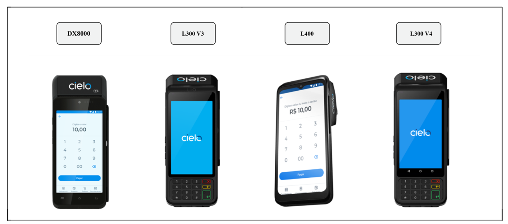

Abaixo, você encontra as especificações técnicas dos modelos disponíveis: 


|         | **DX8000**                  | **L300 (LIO V3)**           | **L400**                     | **L300 (V4)**           |
|---------------------------|-----------------------------|-----------------------------|------------------------------|-----------------------------|
| **Versão**                | DX8000                      | L300 (LIO V3)              | L400                         | L300 (V4)              |
| **Sistema operacional**   | Android 10 Security OS      | Android 7.1 (Nougat)       | Android 11                   | Android 11                 |
| **Memória**               | 1GB RAM                     | 1GB RAM                    | 2GB RAM                      | 2GB RAM                    |
| **Armazenamento**         | 8 GB                        | 8 GB                       | 32 GB                        | 32 GB                      |
| **Dual Chip**             | Sim                         | Não                        | Sim                          | Não                        |
| **Frequência**            | 2.4GHz + 5.0 GHz            | 2.4GHz + 5.0 GHz           | 2.4GHz + 5.0 GHz             | 4G, 3G e 2G                |
| **Tipo do SIM Card**      | 2 SIM card (2FF) + ESIM     | 1 SIM card (2FF) + ESIM    | 2x SIM / 1x SAM / 1x MicroSD | Mini SIM                   |
| **Frequência GSM MHz**    | Quad-Band                   | Quad-Band                  | Não identificado             | Quad-Band                |
| **Tamanho em polegadas**  | 5.5"                        | 5"                         | 6.5"                         | 5"                         |
| **Tipo de tela**          | AMOLED                      | AMOLED                     | TFT painel IPS               | IPS                        |
| **Resolução da tela**     | 720 x 1280                  | 720 x 1280                 | 720 x 1600                   | 480 x 854               |
| **Densidade de pixels**   | 1080p                       | 267 ppi                    | 269,92 ppi                   | 196 ppi                    |
| **Câmera**                | 5 Mega Pixels               | 5 Mega Pixels              | Frontal: 2MP / Traseira: 2MP | Frontal: 2MP / Traseira: 5MP   |
| **Resolução da câmera**   | 4160 x 3120 pixels          | 4160 x 3120 pixels         | Frontal: 2MP / Traseira: 2MP  | 2592 x 1944 pixels   |
| **Flash**                 | Flash LED                   | Flash LED                  | Flash LED                    | Flash LED                        |
| **USB**                   | USB-C                       | USB-C                      | USB-C                        | USB-C                      |
| **Bluetooth**             | Indisponível                | Versão 4.2                 | 5.0                          | 5.0                        |
| **WiFi**                  | 802.11a/b/g/n(2.4GH+5.0GHz) | 802.11a/b/g/n(2.4GH+5.0GHz)| 2.4GHz e 5GHz                | Dual Band                  |
| **GPS**                   | GPS + A-GPS, Glonass        | GPS + A-GPS, Glonass       | GPS / AGPS / GLONASS / Beidou| GPS / A-GPS / GLONASS      |
| **Sensores**              | Acelerômetro, Prox. e Lumin | Acelerômetro, Prox. e Lumin| NA                           | Não                        |
| **Saída de áudio**        | Não                         | Audio Jack 3.5mm           | Não identificado             | Speaker + Entrada 3.5mm    |
| **Peso**                  | 450 g                       | 417 g                      | 450 g                        | 450 g                      |
| **Altura**                | 198mm                       | 70mm                       | 50mm                         | 202mm                      |
| **Largura**               | 83mm                        | 82mm                       | 79mm                         | 79mm                       |
| **Comprimento**           | 62.5mm                      | 205mm                      | 186mm                        | 68mm                       |


## Boas práticas para desenvolvedores

Aqui, estão reunidas orientações essenciais para garantir que sua integração aconteça de forma eficiente, segura e alinhada à experiência esperada na Cielo Smart.

**Segurança e Privacidade**

- Proteja dados sensíveis de clientes e funcionários. 
- Nunca exponha tokens de autenticação ou senhas. <br/>
<br/>

**Rate limiting e performance**

- Escalone as solicitações da Automação Comercial ou PDV para evitar picos de tráfego. 
- Utilize cache para dados grandes ou para armazenar valores especializados.  
- Evite chamadas POST em multi-threading para prevenir deadlocks.  
- Minimize o uso de dados, considerando conexões móveis limitadas. 
- Otimize as operações visando o baixo consumo de bateria.  <br/>
<br/>

**Qualidade de código**

- O aplicativo deve seguir as boas práticas de desenvolvimento Java e Android, conforme as diretrizes oficiais para desenvolvedores da plataforma Android. 
- Aplique os princípios Design Orientado a Objetos (S.O.L.I.D.) e diretrizes de estilo Java. 
- Entenda e configure corretamente compileSdkVersion, targetSdkVersion e minSdkVersion. 
- Aproveite os botões nativos do Android, como os botões **Voltar** e **Início**.   <br/>
<br/>

**Usabilidade e experiência do usuário** 

- Utilize ícones com dimensionamento padrão Android. Siga [esta guideline].(https://m3.material.io/styles/icons/overview) 
- Implemente ferramentas de monitoramento de falhas em seus produtos Android com o objetivo de manter a consciência operacional do produto. Sugerimos a utilização do [Crashlytics](https://firebase.google.com/products/crashlytics?hl=pt-br). 
- Colete métricas de uso do aplicativo para melhorar o produto. 
- Priorize clareza e acessibilidade no design do seu aplicativo: contraste, fontes legíveis e texto grande. 
- Esclareça os termos de uso da aplicação e ofereça suporte adequado ao usuário. 
- Seu aplicativo será usado em condições de trabalho de ritmo rápido em ambientes dinâmicos, portanto, construa fluxos de fácil entendimento com o mínimo de passos possível. 
- Ao adaptar um aplicativo desenvolvido para outra plataforma, mantenha apenas os recursos e botões relevantes para o usuário da Cielo Smart. 
- Recomenda-se o uso do [Material Design](https://m3.material.io/) no desenvolvimento de aplicações para a Cielo Smart, promovendo a adoção de boas práticas de design e melhorando a experiência em dispositivos móveis. <br/>

# PRÉ-PUBLICAÇÃO DE APLICATIVO   

## Pré-requisitos

Com a Cielo Smart, empresas e parceiros podem executar seus aplicativos diretamente na plataforma da Cielo. Esses aplicativos podem ou não estar integrados com o pagamento, dependendo dos objetivos específicos de cada negócio.  

Antes de iniciar o desenvolvimento de um aplicativo para a Cielo Smart, é importante atender a alguns requisitos técnicos que garantem compatibilidade e desempenho. A seguir, apresentamos os principais pontos que devem ser considerados para uma integração eficiente com a plataforma. 

**Linguagem de programação** 

A Cielo Smart é compatível com aplicativos desenvolvidos em Java ou Kotlin. Recomenda-se o uso dessas linguagens para garantir melhor desempenho, estabilidade e integração com o sistema.  

Embora outras linguagens possam ser utilizadas, a responsabilidade pela compatibilidade e funcionamento do aplicativo será inteiramente do desenvolvedor. 

**Ambiente de desenvolvimento**

Recomenda-se o uso da IDE Android Studio versão 2.2.2 ou superior para garantir a correta execução dos aplicativos na Cielo Smart.  

Os links abaixos oferecem direcionamentos de instalação, configuração e criação de projetos. 
- [Guia de instalação e configuração do Android Studio](https://developer.android.com/index.html)  
- [Criando um novo projeto no Android Studio](https://developer.android.com/training/basics/firstapp/creating-project.html) <br/>
<br/>

**Versão target da aplicação**

Para garantir compatibilidade com os modelos e versões do Android utilizados nos terminais Smart, recomenda-se:  
- SDK mínima: 24  
- SDK target: 29  <br/>
<br/>

<aside style="background-color: #f8d7da; padding: 15px; border-left: 5px solid #dc3545; color: #721c24;margin-top: 20px; margin-bottom: 20px;"> Ao atualizar seu aplicativo para usar targetSDK ≥ 31, podem ocorrer erros indicando que a assinatura do app foi alterada, impedindo o envio de novas versões. Esse problema está relacionado à atualização do targetSDK. Anteriormente, a extração dos dados do APK era feita com keytool, mas agora utiliza apk-signer. Essa mudança foi necessária para dar suporte ao Signature Scheme v2 e versões posteriores. Quando o Android é atualizado, mas o esquema de assinatura do APK não é ajustado, as informações não são extraídas corretamente, resultando em erro de certificado por incompatibilidade com o que estava previamente cadastrado. Para resolver este problema, gere novamente o APK utilizando o esquema de assinatura v2 e realize o upload do arquivo novamente. </aside>

Aplicativos com target inferior à versão 29 não poderão ser distribuídos na Cielo Smart. Além disso, é essencial que o aplicativo esteja em conformidade com os requisitos do Android 10, como permissões, notificações e uso de serviços em foreground.  

<aside style="background-color: #f8d7da; padding: 15px; border-left: 5px solid #dc3545; color: #721c24;margin-top: 20px; margin-bottom: 20px;"> A Cielo não permite que aplicativos sejam desenvolvidos utilizando o recurso WebView. Esse recurso visual deixa a plataforma da Cielo Smart vulnerável. Caso a aplicação esteja utilizando o WebView, esta não atenderá aos parâmetros de certificação e não será disponibilizada na Cielo Store. </aside>

## Modelos de integração

Integração é o processo de conectar diferentes sistemas ou aplicações para que eles possam trabalhar juntos de forma fluida. No contexto da Cielo Smart, isso significa permitir que o sistema de automação comercial ou Ponto de Venda (PDV) do cliente se comunique com os serviços da Cielo, como pagamentos, cancelamentos e impressão de comprovantes, de maneira segura e eficiente. 

A Cielo oferece dois principais modelos de integração para facilitar a comunicação entre o sistema do cliente e a Cielo Smart: 

- **Integração via Deep link**: Esse modelo utiliza deep links para permitir que aplicativos Android se comuniquem diretamente com os recursos da Cielo. [Clique aqui](https://developercielo.github.io/manual/cielo-lio#integra%C3%A7%C3%A3o-via-deeplink5) para aprender mais sobre a integração via Deep link. 

- **Integração remota**: Neste modelo, você continua utilizando seu sistema de PDV normalmente. Quando chega o momento de realizar o pagamento, o sistema se conecta ao Order Manager por meio de um conjunto de APIs. [Clique aqui](https://developercielo.github.io/manual/cielo-lio#integra%C3%A7%C3%A3o-remota6) para aprender mais sobre a integração remota. 

## Emulador Cielo

Disponibilizamos um aplicativo que facilita a validação da sua integração com a Cielo Smart, eliminando a necessidade de utilizar o hardware físico em modo debug. Essa solução simula o comportamento da Cielo Smart, processando solicitações e gerando respostas para o software de integração. Com isso, você pode realizar testes e depuração diretamente no ambiente de desenvolvimento, sem precisar de um dispositivo físico da Cielo Smart. 

<aside style="background-color: #f8d7da; padding: 15px; border-left: 5px solid #dc3545; color: #721c24;margin-top: 20px; margin-bottom: 20px;"> A instalação do emulador em terminais debug não é permitida em nenhuma hipótese, pois pode comprometer o funcionamento do equipamento. </aside>

### Baixando o Emulador Cielo

**1**. [Clique aqui](https://s3-sa-east-1.amazonaws.com/cielo-lio-store/apps/lio-emulator/1.61.8/lio-emulator.apk) para fazer o download do emulador.

<aside style="background-color: #d4edda; padding: 15px; border-left: 5px solid #28a745; color: #155724;margin-top: 20px; margin-bottom: 20px;"> O emulador só pode ser instalado em dispositivos com Android 7 ou 10. </aside>

<aside style="background-color: #f8d7da; padding: 15px; border-left: 5px solid #dc3545; color: #721c24;margin-top: 20px; margin-bottom: 20px;"> Caso tenha dificuldade com a instalação, acesse as configurações do seu aparelho e vá até o menu “Segurança”. Em seguida, localize o item “Fontes desconhecidas”, na seção “Administração do dispositivo”. Então, confirme sua escolha para permitir a instalação de arquivos APK baixados por fontes alternativas. </aside>

**2**. Após a instalação, abra o aplicativo. A primeira tela exibida será a de boas-vindas, contendo uma mensagem inicial e dois botões. O botão para limpar dados irá remover os pedidos criados pelo integrador. Já o botão de configurações permite ajustar as respostas automáticas para testes de chamadas de impressão.

**3**. Então, instale o aplicativo de integração. Para fins didáticos, utilizamos o [aplicativo Sample, disponível no GitHub da Cielo](https://github.com/DeveloperCielo/LIO-SDK-Sample-Integracao-Local).  Para instalar o aplicativo Sample, baixe os arquivos do projeto disponíveis no GitHub. Assim, você terá um APK que poderá ser instalado no seu dispositivo.

<aside style="background-color: #d4edda; padding: 15px; border-left: 5px solid #28a745; color: #155724;margin-top: 20px; margin-bottom: 20px;"> O aplicativo Sample é um aplicativo de exemplo desenvolvido pela Cielo para demonstrar como funciona a integração entre um sistema de vendas e a Cielo Smart (ou o emulador, no caso de testes). </aside>  

**4**. Em seguida, abra o arquivo no Android Studio e clique em **Run App** para instalar o aplicativo no seu dispositivo.

**Utilizando o Emulador Cielo**

**1**. Ao entrar no Emulador Cielo, a primeira tela exibida será a de boas-vindas, contendo uma mensagem introdutória e dois botões principais: 

- **Configurações**: abre um menu com opções para definir respostas automáticas, especialmente úteis para simular chamadas de impressão durante os testes.
- **Limpar dados**: essa opção apaga os pedidos que foram criados pelo sistema integrador, permitindo começar os testes do zero. 


**2**. Com o aplicativo de integração instalado, você deve selecionar o tipo de integração desejada: **Integração Local** ou **Integração via Deep Link**.


<aside style="background-color: #d4edda; padding: 15px; border-left: 5px solid #28a745; color: #155724;margin-top: 20px; margin-bottom: 20px;"> Recomendamos utilizar a integração via Deep Link. Neste artigo, apresentaremos os fluxos e telas com base nessa integração. </aside>  

**3**. Ao selecionar a integração, você verá as opções para realizar pagamentos ou para imprimir textos e imagens. Abaixo, detalhamos esses fluxos. 


### Realizando pagamentos

**1**. Ao clicar em **Realizar Pagamento**, serão exibidos os dados de pagamento. 

- **Valor da transação**: Corresponde ao valor informado no campo amount da requisição. 
- **Produto principal (Primary Product)**: Menu suspenso com todas as opções de produtos principais disponíveis para a transação. 
- **Produto secundário (Secondary Product)**: Menu suspenso que exibe os produtos secundários vinculados ao produto principal selecionado. 
- **Lista de Estabelecimentos Comerciais (ECs)**: Campo que apresenta os ECs disponíveis para seleção.

<aside style="background-color: #d4edda; padding: 15px; border-left: 5px solid #28a745; color: #155724;margin-top: 20px; margin-bottom: 20px;">  Caso o Produto principal selecionado seja “Crédito” e o Produto secundário corresponda a alguma opção de “Parcelamento”, será exibido um novo campo indicando a quantidade de parcelas disponíveis para a transação. Além disso, se os campos Produto primário e Produto secundário forem enviados diretamente na requisição, os menus suspensos (dropdowns) correspondentes ficarão desabilitados para edição na interface do emulador.  </aside>

 **2**. Ao clicar em **Pagar**, você verá as opções de resposta para o integrador:

 - **Sucesso**: Simula uma operação de pagamento bem-sucedida e retorna os dados correspondentes. 
- **Cancelado**: Interrompe a operação de pagamento. 
- **Erro**: Retorna uma falha genérica na operação de pagamento.<br/>
<br/>

 

**3**. Ao selecionar uma dessas opções de resposta, o resultado é enviado ao sistema integrado e nossa aplicação é movida para o plano de fundo. 

Além da operação de pagamento, oferecemos suporte a diversas funcionalidades, como: cancelamento de pedidos; consulta de métodos de pagamento disponíveis (Crédito, Débito, Pix, entre outros); e consulta de pedidos criados, tanto individualmente quanto em formato de lista. 

Em seguida, você aprende como funciona a simulação do fluxo de cancelamento de pagamentos. 

### Cancelando pagamentos 

É possível simular a requisição de cancelamento de um pagamento realizado para um pedido específico. No exemplo abaixo, demonstramos esse fluxo. 

**1**. Ao clicar em **Cancelar Ordem**, o emulador exibe uma tela com os detalhes da transação.  

**2**. Em seguida, basta clicar em **Confirmar Cancelamento** para prosseguir. 

 

<aside style="background-color: #d4edda; padding: 15px; border-left: 5px solid #28a745; color: #155724;margin-top: 20px; margin-bottom: 20px;">  Em um ambiente de produção, o cancelamento exige o preenchimento de alguns campos adicionais. No emulador, como o objetivo é testar apenas as chamadas realizadas, essa etapa é simplificada para agilizar o desenvolvimento. </aside>

**3**. Após confirmar o cancelamento do pagamento, serão exibidas as opções de resposta para o sistema integrador. Basta selecionar o tipo de resposta desejado. 

### Realizando teste de impressão

**1**. Para realizar testes de impressão, selecione o tipo de conteúdo que deseja imprimir: **Imprimir texto simples** ou **Imprimir imagem** (como QR code ou código de barras). 

**2**. Em seguida, selecione o cenário de resposta você deseja simular: **Impressão realizada**, **Erro na impressão** ou **Sem papel**.


Se você deseja manter sempre a mesma resposta para todas as chamadas futuras, basta marcar a opção **Não perguntar novamente**. Com essa opção ativada, as próximas respostas serão automaticamente definidas com base na última escolha feita.  


Caso queira alterar esse comportamento e configurar uma nova resposta automática, é necessário retornar à tela de boas-vindas e acessar o botão **Configurações**. Nessa tela, você pode:  

- Habilitar a opção **Perguntar sempre**, retornando ao cenário padrão em que a tela de opções é exibida a cada chamada de impressão; 
- Ou escolher uma nova resposta automática, conforme sua preferência. <br/>
<br/>

Agora que você sabe como utilizar o Emulador Cielo, vai aprender como solicitar uma Cielo Smart.

## Solicitando uma Cielo Smart

Para solicitar uma Cielo Smart para testes e publicação de aplicativos, siga os passos abaixo: 

**1**. Acesse o [canal de Suporte Desenvolvedores Cielo](https://devcielo.zendesk.com/hc/pt-br) e selecione a opção **Cielo Smart LIO**.


**2**. Em seguida, clique em **Envie sua pergunta**. 


**3**. Para dar continuidade a sua solicitação, será necessário realizar o login. Para isso, insira seu login e senha. Então, confirme que não é um robô e clique em **Entrar**.


**4**. No campo para escolher o tipo de solicitação, selecione o **Solicitação de terminal (com modo Debug)**.

<aside style="background-color: #d4edda; padding: 15px; border-left: 5px solid #28a745; color: #155724;margin-top: 20px; margin-bottom: 20px;">  O terminal com debug é voltado para o desenvolvimento e depuração, incluindo símbolos de debug que permitem o uso de breakpoints, inspeção de variáveis e exibição de mensagens de erro detalhadas. Ele também pode conter validações extras, como assertions, o que torna sua execução mais lenta. </aside>


**5**. Ao selecionar essa opção, novos campos irão aparecer e você deve preenchê-los. Ao finalizar o preenchimento, clique em **Enviar**.


**6**. Após enviar sua solicitação, aguarde o recebimento do terminal Cielo Smart. 

<aside style="background-color: #d4edda; padding: 15px; border-left: 5px solid #28a745; color: #155724;margin-top: 20px; margin-bottom: 20px;">  Nessa mesma solicitação, é realizado o credenciamento EC Cielo. Esse credenciamento é essencial para solicitar terminais, publicar e distribuir aplicativos em ambiente de produção, além de permitir o recebimento de valores provenientes de transações realizadas por meio de aplicativos disponibilizados na loja pública da Cielo. </aside>  

Em posse do terminal Cielo Smart, você deverá ativá-lo. [Clique aqui](https://developercielo.github.io/manual/cielo-lio#ativando-uma-cielo-smart) para aprender como fazer isso.  

## Ativando uma Cielo Smart

Após [solicitar um terminal Cielo Smart](https://developercielo.github.io/manual/cielo-lio#solicitando-uma-cielo-smart), você deve ativá-lo.   

Antes de iniciar o processo de ativação, certifique que atende aos pré-requisitos abaixo: 

- **Mensagem na tela do terminal**: Verifique se aparece a seguinte mensagem “Cuidado: Modo de desenvolvimento. Transação de pagamento proibida”. Caso essa mensagem não esteja visível, [entre em contato com o suporte](https://developercielo.github.io/manual/cielo-lio#suporte-t%C3%A9cnico).  
- **Carga da bateria**: O terminal deve estar com pelo menos 50% de carga. Isso garante que o processo ocorra sem interrupções e permite que atualizações sejam realizadas com sucesso. 
- **Conexão com a internet**: Certifique-se de que o terminal está conectado a uma rede estável. 

<aside style="background-color: #d4edda; padding: 15px; border-left: 5px solid #28a745; color: #155724;margin-top: 20px; margin-bottom: 20px;">  As transações realizadas no Modo de Desenvolvimento não afetam a agenda financeira do EC/NL cadastrado no terminal e utilizam números de cartões virtuais, que estão disponíveis neste manual. </aside>  

Siga o passo-a-passo abaixo para completar o processo de ativação: 

**1**. Abra um chamado [clicando aqui](https://devcielo.zendesk.com/hc/pt-br/requests/new?ticket_form_id=360000614392)  para receber informações que serão essenciais no processo de ativação, como o CNPJ fictício gerado pelo time de suporte e número lógico. 

<aside style="background-color: #d4edda; padding: 15px; border-left: 5px solid #28a745; color: #155724;margin-top: 20px; margin-bottom: 20px;">  No caso da Cielo Lio, o processo de ativação ocorre previamente, de forma que é necessário inserir apenas um CNPJ ao receber o terminal. Essas instruções são específicas para os demais modelos.</aside>  

**2**. Em seguida, ligue o terminal e, na tela de boas vindas, clique em **Vamos lá**. 

**3**. Escolha o modo de conexão desejado, configurando uma rede Wi-Fi ou prosseguindo com a conexão móvel. 


**4**. Acesse o menu de opções clicando nos três pontinhos no canto superior direito da tela.  

**5**. Selecione a opção **Acessar funções técnicas**. Em seguida, clique em **Prosseguir** para continuar.


**6**. No campo para digitar o número da função desejada, digite **69** e clique em **Executar função**. 

**7**. Para descobrir a senha ambiente, acesse o [Dev Console](https://www.cieloliostore.com.br/sign-in). Então, clique **Meus aplicativos > Apps privados > Ver detalhes > Desinstalar app**. Assim, você vai visualizar a senha.  


**8**. Em seguida, selecione o ambiente **Certificação** para configurar o ambiente. 


**9**. Na tela de **Funções técnicas**, clique em **Cancelar** para retornar à tela de preenchimento de CPF/CNPJ. 

**10**. Identifique-se digitando  o CNPJ fictício fornecido pelo time Cielo e clique em **Continuar**. 

**11**. Confirme o seu cadastro clicando na opção **Sim** para que o processo de inicialização e desbloqueio seja realizado. 


Você completou o processo e Sua Cielo Smart foi ativada!

## Recursos indisponíveis e sugestões de substitutos

Para garantir desempenho, segurança e estabilidade, o sistema Android da Cielo Smart passou por uma personalização e alguns recursos padrão foram removidos. É importante estar ciente dessas limitações ao planejar e construir seus aplicativos. 

Abaixo, seguem os recursos removidos da Cielo Smart: 

- **Google Play Services**: Todos os serviços, APIs e apps do Google foram removidos do sistema operacional. Isso significa que bibliotecas que dependem do Google Play Services não funcionarão na Cielo Smart.
- **Componente Webview**: O WebView foi removido para evitar vulnerabilidades de segurança. Essa decisão impede que aplicativos acessem links ou conteúdos externos diretamente pela interface visual. 

<aside style="background-color: #f8d7da; padding: 15px; border-left: 5px solid #dc3545; color: #721c24;margin-top: 20px; margin-bottom: 20px;"> A Cielo não permite que o aplicativo do cliente/parceiro seja desenvolvido utilizando o recurso WebView. Esse recurso visual deixa a plataforma da Cielo Smart vulnerável. Caso a aplicação esteja utilizando o WebView, esta não atenderá aos parâmetros de certificação e não será disponibilizada na Cielo Store.</aside>

Abaixo, você encontra nossas sugestões de recursos substitutos aos que foram removidos:

| **Recurso indisponível**     | **Substituto**     | **Descrição** |
|-----------------------------|--------------------|---------------|
| Push notifications          | JobScheduler       | É uma API que permite agendar tarefas para serem executadas periodicamente dentro do próprio processo do aplicativo. Ela é ideal para operações como consultas regulares a serviços de backend. Seu principal diferencial está na eficiência no uso da bateria, além de oferecer diversas opções de configuração. [Clique aqui](https://developer.android.com/reference/android/app/job/JobScheduler.html) para saber mais. |
| Serviço de localização (GPS)| Location Manager   | Esta classe oferece acesso aos serviços de localização do sistema, permitindo que apps recebam atualizações da localização geográfica do dispositivo ou iniciem uma intenção ao detectar proximidade com uma área geográfica. [Clique aqui](https://developer.android.com/reference/android/location/LocationManager.html) para saber mais. |
| Serviço de mapas            | MapBox             | É uma plataforma de mapeamento e geolocalização que oferece ferramentas para criação de mapas personalizados e aplicações baseadas em localização. Nossas APIs e SDKs são os blocos de construção para integrar a localização em qualquer aplicativo móvel ou web. [Clique aqui](https://www.mapbox.com) para saber mais. |

## APKs removidas dos terminais da Cielo Smart

Abaixo, segue uma tabela com todas as APKs que foram removidas dos terminais Cielo Smart:

|                  |                      |                         |
| ---------------- | -------------------- | ----------------------- |
| BasicSmsReceiver | FileManager          | PhaseBeam               |
| Browser          | Galaxy4              | QuickSearchBox          |
| Calculator       | Gallery              | SoundRecorder           |
| Calendar         | HoloSpiralWallpaper  | SpeechRecorder          |
| CalendarProvider | LiveWallpapers       | Todos                   |
| CBMessageWidget  | LiveWallpaperPicker  | Videos                  |
| Contacts         | MagicSmokeWallpapers | VisualizationWallpapers |
| ContactsCommon   | MtkWeatherProvider   | VoiceCommand            |
| DataTransfer     | Mms                  | VoiceDialer             |
| Dialer           | Music                | VoiceExtension          |
| Email            | MusicFX              | VoiceUnlock             |
| Exchange2        | NlpService           | WallpaperCropper        |
| FMRadio          | NoiseField           |                         |


# PUBLICANDO UM APLICATIVO 

## Jornada de publicação de um aplicativo

Para disponibilizar seu aplicativo na Cielo Smart, você precisa garantir que ele esteja pronto para atender às necessidades dos clientes com qualidade e segurança. Com este guia, você tem os recursos necessários para dar os primeiros passos com confiança. 


O processo de disponibilização do aplicativo varia conforme o tipo de loja escolhida, podendo ser loja pública ou privada.  
Para conferir o passo a passo detalhado de cada cenário, acesse os guias abaixo: 
- [Publicação do aplicativo em uma loja pública](https://developercielo.github.io/manual/cielo-lio#loja-pública)
- [Publicação do aplicativo em uma loja privada](https://developercielo.github.io/manual/cielo-lio#loja-privada)

É importante lembrar que você pode [solicitar uma Cielo Smart](https://developercielo.github.io/manual/cielo-lio#solicitando-uma-cielo-smart) para testes e publicação de aplicativos. Além disso, antes da Cielo Smart chegar até você, você também pode utilizar o [Emulador Cielo](https://developercielo.github.io/manual/cielo-lio#emulador-cielo), um aplicativo que facilita a validação da sua integração com a Cielo Smart, eliminando a necessidade de utilizar o hardware físico em modo debug.

## Cielo Store Dev Console

O [Dev Console](https://www.cieloliostore.com.br/my-apps) é a plataforma oficial da Cielo para upload, gerenciamento e distribuição de aplicativos desenvolvidos para os terminais Cielo Smart. 

Entre as funcionalidades disponíveis no Dev Console estão:

- Envio de aplicativos para análise e publicação; 
- Visualização e controle de todos os aplicativos cadastrados, públicos ou privados; 
- Distribuição personalizada para estabelecimentos comerciais via loja privada; 
- Acompanhamento do status de certificação. <br/>
<br/>

Todo aplicativo submetido ao Dev Console passa pelo processo de certificação e é avaliado por uma equipe técnica especializada. A certificação é obrigatória para publicação na Cielo Store (loja pública) ou para distribuição via loja privada para parceiros comerciais. 

**Acessando o Dev Console**

**1**. [Clique aqui](https://www.cieloliostore.com.br/sign-in) para acessar o Dev Console. 

**2**. Caso seja o seu primeiro acesso, clique em **Criar Conta**.  


**3**. Agora você já pode iniciar o processo de submissão do seu aplicativo. 


## Tipos de loja na Cielo Store

A Cielo Store é a plataforma oficial de distribuição de aplicativos para os terminais Cielo Smart. Ao desenvolver um aplicativo para esse ecossistema, é fundamental entender os dois modelos de publicação disponíveis: loja pública e loja privada. Cada uma atende a diferentes necessidades de negócio e possui requisitos específicos de certificação e distribuição. 

**Loja pública** 

A loja pública é voltada para aplicativos que podem ser utilizados por qualquer estabelecimento comercial que possua um terminal Cielo Smart. Após a aprovação técnica e de segurança, o aplicativo é disponibilizado na Cielo Store e pode ser instalado por qualquer cliente Cielo. 

As principais características das lojas públicas são: 
- **Visibilidade ampla**: disponível para todos os usuários da plataforma.  
- **Recebimento de pagamentos**: o desenvolvedor pode monetizar o aplicativo e receber valores pelas transações realizadas. 
- **Atualizações controladas**: qualquer nova versão precisa passar novamente pelo processo de certificação. <br/>
<br/>

As lojas públicas são ideais para soluções com aplicação geral, como gestão de vendas, controle de estoque, fidelização de clientes, entre outros. 

[Clique aqui](https://developercielo.github.io/manual/cielo-lio#loja-p%C3%BAblica) para aprender como realizar o upload de um aplicativo em loja pública.  

**Loja Privada** 

A loja privada é destinada à distribuição de aplicativos para um grupo específico de estabelecimentos comerciais. Essa modalidade é indicada para soluções personalizadas, desenvolvidas sob demanda ou para uso interno de parceiros da Cielo. 

 As principais características das lojas privadas são:  
- **Distribuição restrita e controle de acesso**: o aplicativo é visível apenas para os ECs (Estabelecimentos Comerciais) autorizados.
- **Flexibilidade de uso**: ideal para soluções customizadas ou integradas a sistemas proprietários. <br/>
<br/>

A loja privada é recomendada para parceiros que desejam distribuir aplicativos exclusivos para seus clientes ou para uso interno em operações comerciais específicas. 

[Clique aqui](https://developercielo.github.io/manual/cielo-lio#loja-privada) para aprender como realizar o upload de um aplicativo em loja privada. 

## Status de um aplicativo 

Durante o processo de publicação de um aplicativo, ele passará pelos seguintes status no Dev Console:  
- Assinatura 
- Desenvolvimento 
- Certificação 
- Piloto/Produção


**Assinatura** 

Após realizar o upload de um novo aplicativo ou uma nova versão do aplicativo, ele fica automaticamente com o status **Aguardando assinatura**.  

Neste estágio, o aplicativo será assinado para atender regra de segurança/PCI para que possa ser executado nos terminais. 

**Desenvolvimento** 

Após ser assinado, o aplicativo fica automaticamente com o status **Em desenvolvimento**. Neste estágio, você consegue realizar [testes do aplicativo na Cielo Smart](https://developercielo.github.io/manual/cielo-lio#testando-um-aplicativo). Caso precise fazer alguma correção, basta publicar uma nova versão do aplicativo no Dev Console e atualizar no terminal. 

[Clique aqui](https://developercielo.github.io/manual/cielo-lio#solicitando-uma-cielo-smart) para aprender como solicitar um terminal para testar seu aplicativo ou como utilizar o [Emulador Cielo](https://developercielo.github.io/manual/cielo-lio#emulador-cielo). 

 
**Certificação** 

Com os testes finalizados, o próximo passo é enviar o aplicativo para certificação. Nessa fase, o time especializado da Cielo irá validar o funcionamento do app. 

[Clique aqui](https://developercielo.github.io/manual/cielo-lio#boas-pr%C3%A1ticas-para-publica%C3%A7%C3%A3o-de-aplicativos) para conferir as boas práticas e entender o que é permitido e o que é proibido nos aplicativos públicos e privados da Cielo Smart. 

Assim que o envio para certificação é realizado, o aplicativo passa automaticamente para o status **Aguardando certificação**. O processo pode levar até 48 horas úteis. Você será notificado por e-mail assim que a certificação for concluída. 

**Piloto/Produção** 

Assim que o aplicativo for aprovado na etapa de certificação, o desenvolvedor poderá seguir com a publicação. Existem duas opções: 

- **Promover para produção**: Disponibiliza o aplicativo para todos os usuários da loja pública da Cielo Smart. 
- **Promover para piloto** (apenas para aplicativos privados): Permite liberar o aplicativo para um grupo restrito de terminais, ideal para testes em ambiente real antes da liberação completa. <br/>
<br/>

Essa escolha depende do tipo de aplicativo (público ou privado) e da estratégia de lançamento definida pelo desenvolvedor. 


## Boas práticas para publicação de aplicativos

Para que um aplicativo seja aprovado na certificação da Cielo Smart, é fundamental que ele esteja em conformidade com as regras, critérios técnicos e de segurança definidos pela Cielo. Este guia apresenta as boas práticas recomendadas para garantir que o processo de certificação ocorra de forma eficiente e sem impedimentos, tanto para aplicativos públicos quanto privados.

**Boas práticas para publicar aplicativos públicos e privados**  

- Realize todos os testes necessários em ambiente de desenvolvimento antes de encaminhar a versão para certificação. [Clique aqui](https://developercielo.github.io/manual/cielo-lio#ambiente-sandbox-emulador-cielo) para aprender como baixar o emulador para realização de testes.  
- Certifique-se de que o processo de cadastro no aplicativo seja simples e acessível para o cliente. 
- Complete corretamente os formulários aos submeter uma versão do aplicativo. Todos os campos obrigatórios devem ser preenchidos. A ausência de informações pode resultar na reprovação do aplicativo. 
- O vídeo que será exibido na vitrine do app deve estar hospedado no YouTube com visibilidade definida como “Público” ou “Não listado”. Vídeos “Privados” não serão aceitos. 
- A versão enviada para certificação deve ser superior à versão anterior. Por exemplo, se a versão anterior era 1.0, a nova versão deve ser 1.1 ou superior. 
- Caso o aplicativo utilize WebView, a URL não deve ser exibida ou disponibilizada para alteração dentro do app. 
- Certifique-se de que o fluxo de pagamento funcione corretamente em todos os cenários. 
- Imagens, ícones e screenshots devem estar em um formato correto e com boa legibilidade. 
- Mantenha seu aplicativo sempre atualizado com as versões mais recentes do SDK. Confira as versões disponíveis no menu **SDK Cielo** disponível na [Cielo Store Dev Console](https://developercielo.github.io/manual/cielo-lio#cielo-store-dev-console).


**O que os aplicativos públicos e privados não podem conter?** 

- ❌ Nome ou logotipo da Cielo;
- ❌ Linguagem ofensiva; 
- ❌ Imagens inapropriadas;  
- ❌ Referências visuais ou textuais a concorrentes. <br/>
<br/>

Enquanto algumas boas práticas são comuns a aplicativos públicos e privados, outras são específicas para cada tipo de loja. Abaixo, listamos boas práticas específicas para aplicativos públicos. 

**Boas práticas para aplicativos públicos** 

- Preencha corretamente os termos de uso, detalhando as regras e condições do serviço oferecido. 
- O aplicativo deve estar disponível para todos os clientes da Cielo Store, sem restrições. 
- O app público não pode conter integração com sistemas ERP nem acesso restrito e personalizado voltado exclusivamente para um cliente. <br/>
<br/>

Em seguida, estão listadas boas práticas específicas para aplicativos privados. 

**Boas práticas para aplicativos privados**  

- O aplicativo deve oferecer acesso restrito, direcionado exclusivamente ao cliente em questão. 
- É possível conectar o aplicativo a sistemas de gestão empresarial (ERP), conforme a necessidade do cliente. 
- Caso o aplicativo seja executado em um servidor local, é obrigatório o envio de um vídeo demonstrando o fluxo completo do app. 

## Loja Pública

A loja pública é voltada para aplicativos que podem ser utilizados por qualquer estabelecimento comercial que possua um terminal Cielo Smart. Após a aprovação técnica e de segurança, o aplicativo é disponibilizado na Cielo Store e pode ser instalado por qualquer cliente Cielo. 

Agora, você vai aprender como publicar um aplicativo em uma loja pública. 

### Publicando um aplicativo em uma loja pública 

Siga os passos abaixo para publicar um novo aplicativo público: 

**1**. [Acesse o Dev Console](https://www.cieloliostore.com.br/sign-in). 

**2**. Uma vez logado, no topo superior direito, clique em **+ Aplicativo**.


**3**. Clique em **Subir na Cielo Store**. 


**4**. Ao selecionar essa opção, você verá uma lista de pré-requisitos necessários para realizar o upload do seu aplicativo nas etapas seguintes. Clique em **Continuar**. 

<aside style="background-color: #d4edda; padding: 15px; border-left: 5px solid #28a745; color: #155724;margin-top: 20px; margin-bottom: 20px;"> Para prosseguir, você deverá fornecer um arquivo .apk com tamanho máximo de 200MB, a descrição e o segmento do aplicativo, um vídeo demonstrativo hospedado no YouTube, ícone e screenshots da interface, o modelo de cobrança adotado, informações de contato para suporte técnico, os termos de uso do aplicativo e os acessos necessários para a etapa de certificação. Esses elementos são obrigatórios para garantir a conformidade com os critérios de publicação da Cielo Store. </aside>

**Realizando o upload do aplicativo: Preenchendo formulários**

Para realizar o upload do aplicativo, você passará por cinco etapas: 

**1**. Na seção **Upload do apk**, faça o upload do arquivo .apk clicando em **Selecionar arquivo**. Em seguida, clique em **Salvar e continuar**.  


<aside style="background-color: #f8d7da; padding: 15px; border-left: 5px solid #dc3545; color: #721c24;margin-top: 20px; margin-bottom: 20px;"> Ao realizar o upload do APK no Dev Console, você pode se deparar com duas mensagens de erro comuns. O erro APP CREATED_ERROR indica que o package name da aplicação já existe na loja, sendo necessário alterar esse identificador no arquivo AndroidManifest.xml antes de reenviar. Já o erro APP APK_PARSER_ERROR ocorre quando o sistema não consegue salvar o arquivo, geralmente devido a problemas no APK ou no manifest, como corrupção ou configuração incorreta. Nesse caso, recomenda-se rebuildar o APK e revisar o AndroidManifest.xml para garantir que não haja erros. </aside>

**2**. Na seção **Sobre o aplicativo**, preencha os seguintes campos: Descrição resumida, Descrição principal, Segmento do aplicativo, além de adicionar um vídeo de apresentação, ícone e capturas de tela. Essas informações serão exibidas na Cielo Store. 


**3**. Em seguida, na seção **Modelo de cobrança**, defina se o aplicativo será gratuito, se terá um valor fixo ou será cobrado por assinatura mensal. Caso opte pelo modelo pago, informe o Nome do plano, o Valor e uma Descrição do plano. Após preencher todos os campos, clique em **Salvar**. 

O plano gratuito não possui qualquer custo para o usuário; o fixo envolve um pagamento único, com gratuidade no primeiro mês após a compra inicial; e o mensal consiste em uma cobrança recorrente a cada mês, também oferecendo o primeiro mês gratuitamente na primeira aquisição.


<aside style="background-color: #d4edda; padding: 15px; border-left: 5px solid #28a745; color: #155724;margin-top: 20px; margin-bottom: 20px;"> Caso você queira alterar o modelo de cobrança, a mudança entrará em vigor no mês subsequente. Para clientes que compraram o aplicativo antes da alteração de valor, haverá reajuste no valor apenas se a primeira compra tiver sido dentro do plano mensal. As demais alterações ficarão restritas a novas compras e ainda respeitando a gratuidade de 30 dias. </aside>

**4**. Na seção **Suporte**, preencha os campos Nome da empresa, E-mail, Site, Celular, Telefone e Termos e condições de uso. Então, clique em **Salvar e continuar**.


**5**. Na seção **Certificação**, preencha os campos de Versão do SDK e, se o aplicativo tiver login, complete os campos de Usuário, Senha e Informações adicionais para o time Cielo conseguir acessar. Então, clique em **Salvar e continuar**.


Pronto! Seu aplicativo foi submetido e agora passará pelo processo de certificação para ser aprovado. 

<aside style="background-color: #f8d7da; padding: 15px; border-left: 5px solid #dc3545; color: #721c24;margin-top: 20px; margin-bottom: 20px;"> A ausência de qualquer informação obrigatória acarretará na reprovação automática do aplicativo. O prazo para certificação é de até 48 horas úteis. </aside>

### Testando um aplicativo

Após ser assinado, o aplicativo fica automaticamente com o status **Em desenvolvimento**. Neste estágio, você consegue realizar testes do aplicativo na Cielo Smart. Caso precise fazer alguma correção, basta publicar uma nova versão do aplicativo no Dev Console e atualizar no terminal. 

Para testar um aplicativo na Cielo Smart, você deve: 

**1**. No Dev Console, acesse **Meus aplicativos** e clique em **Ver detalhes** do aplicativo. 


**2**. Clique em **Detalhes**.


**3**. Clique em **Baixar App**. 


**4**. Escolha o tipo de terminal em que o QR Code será gerado. 


**5**. Abra o aplicativo **Test Your App** no terminal e escaneie o QR Code gerado no Dev Console.  

**6**. Após a leitura do QR Code, o download do app será realizado. 


### Enviando um aplicativo para Cielo Store

Após o aplicativo público ser certificado, você deve promover seu aplicativo para produção. 

Para fazer isso, acesse o menu **Meus aplicativos**, na aba **Apps públicos**. Então, clique em **Ver detalhes** do aplicativo. 


Na aba **Versões**, clique em **Enviar para produção**.   

Após enviado para produção, o aplicativo será disponibilizado na Cielo Store para os clientes realizarem o download do aplicativo. 

### Fazendo alterações em aplicativos públicos

Caso realize alguma alteração no aplicativo público, você deve fazer o upload de uma nova versão do aplicativo e utilizar a mesma assinatura da versão anterior. 

Para fazer isso, siga o passo-a-passo abaixo: 

**1**. No [Dev Console](https://www.cieloliostore.com.br/sign-in), acesse o menu superior **Meus aplicativos** e na aba **Apps públicos**, clique em **Ver detalhes** do aplicativo.  


**2**. Então, clique no botão **+ Nova versão** para fazer o upload de uma nova versão.  


<aside style="background-color: #d4edda; padding: 15px; border-left: 5px solid #28a745; color: #155724;margin-top: 20px; margin-bottom: 20px;"> Caso você queira alterar o modelo de cobrança, a mudança entrará em vigor no mês subsequente. Para clientes que compraram o aplicativo antes da alteração de valor, haverá reajuste no valor apenas se a primeira compra tiver sido dentro do plano mensal. As demais alterações ficarão restritas a novas compras e ainda respeitando a gratuidade de 30 dias. </aside>

Ao realizar uma alteração, siga os critérios abaixo:  
- Garanta que a versão mais recente do aplicativo tenha o mesmo **package name** da versão anterior; 
- Altere o **version code** e o **version name** dentro do arquivo manifest do aplicativo; 
- Confira ou atualize as informações dos formulários e preencha os dados para certificação. 

### Compra e download de aplicativos públicos na Cielo Store 

A Cielo Store oferece uma variedade de aplicativos públicos que podem ser instalados diretamente nos terminais Cielo Smart. A seguir, veja como realizar a compra e o download desses aplicativos. 

Os aplicativos públicos certificados e promovidos para produção pelos desenvolvedores ficam disponíveis na Cielo Store, acessível diretamente nos terminais Cielo Smart. 

Para adquirir um aplicativo, o lojista deve: 

**1**. No terminal Cielo Smart, clique em **Apps** e em seguida selecione a **Cielo Store** caso estejando utilizando o terminal L300. Se estiver usando o terminal DX8000 ou L400, clique diretamente em **Cielo Store** no menu inferior.  


**2**. Selecione o aplicativo desejado. 

**3**. Clique em **Instalar** ou **Comprar**. 


**4**. Informe as credenciais utilizadas no site da Cielo para autenticação e cobrança. 

Após a confirmação da compra ou instalação, o aplicativo estará disponível para uso na Cielo Smart. 

<aside style="background-color: #f8d7da; padding: 15px; border-left: 5px solid #dc3545; color: #721c24;margin-top: 20px; margin-bottom: 20px;"> Todos os aplicativos são gratuitos no primeiro mês após a compra. Caso o aplicativo seja pago, a cobrança será cancelada automaticamente após a desinstalação, desde que o período gratuito tenha sido ultrapassado. A desinstalação deve ser feita também pela Cielo Store.  </aside>


## Loja Privada

A loja privada é destinada à distribuição de aplicativos para um grupo específico de estabelecimentos comerciais. Essa modalidade é indicada para soluções personalizadas, desenvolvidas sob demanda ou para uso interno de parceiros da Cielo. 

### Criando uma loja privada 

Se você optou por publicar seu aplicativo em uma loja privada, será necessário criar uma loja para o envio do app.  

Para fazer isso, siga o passo-a-passo abaixo: 

**1**. Acesse o Dev Console e clique em **Lojas privadas**. 


**2**. Clique em **+ Criar loja privada**. 


**3**. Digite o nome da loja e clique em **Concluir**. 


Pronto! Sua loja privada foi criada. 

### Realizando o upload do aplicativo privado  

Agora você pode seguir em frente e realizar o upload do seu aplicativo na sua loja privada. 

Para fazer isso, siga o passo-a-passo abaixo: 

**1**. No Dev Console, na aba **Meus aplicativos**, clique em **+ Aplicativo**. 


**2**. Clique em **Subir na Loja Privada**. 


<aside style="background-color: #d4edda; padding: 15px; border-left: 5px solid #28a745; color: #155724;margin-top: 20px; margin-bottom: 20px;"> Se o cadastro do estabelecimento comercial ainda não foi realizado, um pop-up será exibido com o passo a passo para concluir essa etapa. </aside>

**3**. Ao selecionar essa opção, você verá uma lista de pré-requisitos necessários para realizar o upload do seu aplicativo nas etapas seguintes. Clique em **Continuar**. 

<aside style="background-color: #d4edda; padding: 15px; border-left: 5px solid #28a745; color: #155724;margin-top: 20px; margin-bottom: 20px;"> Para prosseguir, você deverá fornecer um arquivo .apk com tamanho máximo de 200MB, a descrição e o segmento do aplicativo, um vídeo demonstrativo hospedado no YouTube, ícone e screenshots da interface, o modelo de cobrança adotado, informações de contato para suporte técnico, os termos de uso do aplicativo e os acessos necessários para a etapa de certificação.  </aside> 

**Preenchendo formulários** 

Para realizar o upload do aplicativo, você precisará preencher formulários divididos em quatro etapas: 

**1**. Na seção **Upload do apk**, faça o upload do arquivo .apk clicando em **Selecionar arquivo**. Em seguida, clique em **Salvar e continuar**.  

<aside style="background-color: #f8d7da; padding: 15px; border-left: 5px solid #dc3545; color: #721c24;margin-top: 20px; margin-bottom: 20px;"> Após o upload do arquivo não é possível trocar de loja privada para pública. </aside>

 

<aside style="background-color: #f8d7da; padding: 15px; border-left: 5px solid #dc3545; color: #721c24;margin-top: 20px; margin-bottom: 20px;"> Ao realizar o upload do APK no Dev Console, você pode se deparar com duas mensagens de erro comuns. O erro APP CREATED_ERROR indica que o package name da aplicação já existe na loja, sendo necessário alterar esse identificador no arquivo AndroidManifest.xml antes de reenviar. Já o erro APP APK_PARSER_ERROR ocorre quando o sistema não consegue salvar o arquivo, geralmente devido a problemas no APK ou no manifest, como corrupção ou configuração incorreta. Nesse caso, recomenda-se rebuildar o APK e revisar o AndroidManifest.xml para garantir que não haja erros. </aside>

**2**. Na seção **Sobre o aplicativo**, preencha os seguintes campos: **Descrição resumida**, **Descrição principal**, **Segmentos**, além de adicionar um vídeo e ícone. Essas informações serão exibidas na loja privada. 


**3**. Em seguida, na seção **Suporte**, preencha os campos **Nome da empresa**, **E-mail**, **Site**, **Celular** e **Telefone**. Então, clique em **Salvar e continuar**. 


**4**. Na seção **Certificação**, preencha os campos de **Versão do SDK** e, se o aplicativo tiver login, complete os campos de **Usuário**, **Senha** e **Informações adicionais** para o time Cielo conseguir acessar. Por fim, insira a URL de vídeo para homologação bem como o comprovante de transação. Então, clique em **Salvar e concluir**. 


Pronto! Seu aplicativo foi submetido e agora passará pelo processo de certificação para ser aprovado. 

<aside style="background-color: #f8d7da; padding: 15px; border-left: 5px solid #dc3545; color: #721c24;margin-top: 20px; margin-bottom: 20px;"> A ausência de qualquer informação obrigatória acarretará na reprovação automática do aplicativo. O prazo para certificação é de até 48 horas úteis.  </aside> 

Após o aplicativo ser aprovado e promovido para produção, o app ficará disponível para os clientes associados à loja privada selecionada. 

### Criando um piloto para um aplicativo privado

Antes de liberar uma nova versão de um aplicativo privado em produção, é altamente recomendável realizar um piloto. Essa etapa permite validar o funcionamento da versão em ambiente real, com controle sobre os estabelecimentos que irão recebê-la. 

Entre os benefícios do piloto estão:  

- **Validação em ambiente produtivo**: Teste a versão do aplicativo diretamente em máquinas específicas, garantindo que tudo funcione como esperado antes da liberação geral. 
- **Testes paralelos de versões**: É possível executar pilotos com diferentes versões simultaneamente, facilitando comparações e ajustes antes da publicação definitiva.

<aside style="background-color: #d4edda; padding: 15px; border-left: 5px solid #28a745; color: #155724;margin-top: 20px; margin-bottom: 20px;"> Para criar um piloto, a versão do aplicativo deve estar com a certificação aprovada. Isso garante que ela atende aos critérios técnicos e de segurança exigidos pela Cielo.  </aside>

Siga o passo-a-passo abaixo para criar um piloto:  

**1**. No Dev Console, clique em **Meus aplicativos**. Na aba **Apps privados**, clique em **Ver detalhes** do aplicativo. 


**2**. Clique em **Publicar**.  


**3**. Selecione a opção **Criar Piloto**. 


**4**. Adicione os ECs (Estabelecimentos Comerciais) e/ou EC Lógico que irão receber a versão piloto e clique em **Concluir**.  


<aside style="background-color: #d4edda; padding: 15px; border-left: 5px solid #28a745; color: #155724;margin-top: 20px; margin-bottom: 20px;"> Você pode direcionar o piloto para todas as máquinas do cliente ou restringi-lo a terminais específicos, conforme os objetivos e necessidades do teste. </aside>

### Enviando um aplicativo privado para produção 

Após a [criação do piloto para o aplicativo privado](https://developercielo.github.io/manual/cielo-lio#criando-um-piloto-para-um-aplicativo-privado), para que todos os ECs vinculados à loja recebam o aplicativo, siga os passos abaixo: 

**1**. No Dev Console, clique em **Meus aplicativos**. Na aba **Apps privados**, clique em **Ver detalhes** do aplicativo. 


**2**. Clique em **Publicar**.  


**3**. Selecione a opção **Publicar em produção**. 


Após ter publicado o aplicativo em produção, você deve [distribuir os aplicativos nas lojas privadas](https://developercielo.github.io/manual/cielo-lio#distribuindo-aplicativos-na-loja-privada) associadas aos ECs que devem acessar o app.  

### Distribuindo aplicativos na loja privada

Enquanto aplicativos de loja pública são disponibilizados na Cielo Store, aplicativos privados são distribuídos aos estabelecimentos específicos. 

Para distribuir o aplicativo apenas para clientes específicos, você deve associar o Estabelecimento Comercial (EC) do cliente a sua loja privada. Somente o desenvolvedor que realizou a publicação do aplicativo poderá gerenciar a distribuição dos aplicativos da loja aos ECs do cliente. 

**Associando o EC a uma loja privada**

**1**. Acesse o menu **Lojas Privadas**. <br/>

**2**. Você verá uma lista com as lojas privadas disponíveis, incluindo a data de criação e os ECs associados.  

<aside style="background-color: #d4edda; padding: 15px; border-left: 5px solid #28a745; color: #155724;margin-top: 20px; margin-bottom: 20px;"> Para encontrar de forma rápida uma loja privada ou um EC, utilize a barra de busca no canto superior direito da tela. </aside>

**3**. Para associar novos ECs, clique no botão **+ Associar EC** correspondente à loja desejada. 


**4**. Digite todos os ECs que serão associados àquela loja. Você tem duas opções para incluir os ECs a serem associados: 


- **Digitar ECs manualmente**: Associe estabelecimentos à loja privada digitando os números de ECs manualmente.

 

- **Enviar planilha**: Use nosso modelo de planilha para informar e associar vários números de EC  de uma vez. 

 

**5**. Após incluir os ECs a serem associados, clique em **Concluir** para finalizar o processo. 

**Desassociando EC de uma loja privada**

**1**. Para desassociar uma EC de uma loja privada, no Dev Console, acesse a aba **Lojas privadas**. <br/>
**2**. Então, clique em **Ver ECs** referente a loja desejada.  


<aside style="background-color: #d4edda; padding: 15px; border-left: 5px solid #28a745; color: #155724;margin-top: 20px; margin-bottom: 20px;"> Você também pode localizar ECs utilizando a barra de busca, digitando o código correspondente. </aside>

**3**. Para desassociar uma EC individual, clique no botão **Desassociar** ao lado da EC desejada.  

<aside style="background-color: #d4edda; padding: 15px; border-left: 5px solid #28a745; color: #155724;margin-top: 20px; margin-bottom: 20px;"> Caso queira desassociar várias ECs ao mesmo tempo, marque os checkboxes à esquerda das lojas correspondentes e clique em Desassociar ECs selecionados. Uma janela de confirmação será exibida; clique em Sim para confirmar. Pronto! As ECs serão removidas da loja privada. </aside>


### Fazendo alterações em aplicativos privados

Caso realize uma alteração ou atualização no aplicativo privado, você deverá fazer o upload de uma nova versão do aplicativo e utilizar a mesma assinatura da versão anterior.  

**1**. Para isso, no Dev Console, clique em **Meus aplicativos**. 

**2**. Na aba **Apps privados**, clique em **Ver detalhes do aplicativo**.

**3**. Clique no botão **+ Nova versão** para fazer o upload de uma nova versão.  


Ao realizar uma alteração, siga os critérios abaixo:  
- Garanta que a versão mais recente do aplicativo tenha o mesmo **package name** da versão anterior; 
- Altere o **version code** e o **version name** dentro do arquivo manifest do aplicativo; 
- Confira ou atualize as informações dos formulários e preencha os dados para certificação.

### Download de aplicativos privados  

A Cielo Smart possui uma rotina automática que identifica e realiza o download ou atualização dos aplicativos privados necessários em cada terminal. 

Para que esse processo ocorra corretamente, o terminal deve estar com a bateria acima de 50% e conectado à internet, seja via Wi-Fi ou rede móvel. 

**Desinstalando um aplicativo privado**

A desinstalação de um aplicativo privado deve ser feita diretamente pelo cliente. 

Para isso, é necessário primeiro desassociar o estabelecimento comercial (EC) da loja privada correspondente. 

Após essa etapa, o cliente pode seguir com o processo de desinstalação conforme as instruções seguintes. 

**LIO:**

**1**. Acesse **Ajuda > Ajustes > Apps**.

**2**. Digite a senha (disponível no Dev Console).

**3**. Escolha o app e em seguida a opção **Desinstalar**. 

A senha necessária para desinstalar o aplicativo privado está disponível no Dev Console. Para acessá-la, acesse **Meus Aplicativos > Apps Privados > Ver detalhes** do aplicativo desejado. Então, clique em **Desinstalar app** para visualizar a senha. 

**DX8000 e L400** 

**1**. Acesse **Configurações > Atualização de software**. 

**2**. Selecione o menu no topo e em seguida **Mostrar demais apps**. 

**3**. Escolha o app e selecione a opção **Desinstalar**. 

**4**. Digite a senha (disponível no Dev Console). 

A senha necessária para desinstalar o aplicativo privado está disponível no Dev Console. Para acessá-la, acesse **Meus Aplicativos > Apps Privados > Ver detalhes** do aplicativo desejado. Então, clique em **Desinstalar app** para visualizar a senha. 


## Configurando um aplicativo: Frente de caixa e Aplicativo padrão

Você pode configurar seu aplicativo na Cielo Smart como Frente de Caixa e/ou como Aplicativo Padrão, garantindo uma experiência de pagamento mais integrada e exclusiva. 

- **Frente de caixa**: Ao ativar essa opção, seu aplicativo será iniciado automaticamente assim que a máquina for ligada.  
- **Aplicativo padrão**: Ao selecionar essa opção, somente o seu aplicativo poderá realizar pagamentos, bloqueando o uso da interface de pagamento padrão da Cielo Smart.

### Frente de caixa 

Siga o passo-a-passo abaixo para configurar seu aplicativo como frente de caixa: 

**1**. No [Dev Console](https://www.cieloliostore.com.br/sign-in), clique em **Apps públicos** ou em **Apps privados**, depois em **Ver detalhes** do aplicativo desejado. 


**2**. Clique em **Configurar app**. 


**3**. Selecione a opção **Frente de caixa**. 


Ao habilitar somente esta opção, o cliente deverá configurar o seu aplicativo na Cielo Smart para que todas as transações sejam realizadas através desse aplicativo. 

Oriente o seu cliente para seguir o passo-a-passo abaixo para realizar a configuração em seu terminal:  

- **LIO (L300)**: Ajuda > Minha Lio > App padrão de vendas 
- **DX8000 e L400**: Abra o aplicativo Cielo Router na tela inicial > Selecione o seu app 

### Frente de caixa + Aplicativo padrão

Ao habitar as opções **Frente de caixa** e **Aplicativo padrão**, todas as Cielo Smart que possuem esse aplicativo instalado conseguirão transacionar somente pelo aplicativo. 

**1**. No [Dev Console](https://www.cieloliostore.com.br/sign-in), clique em **Apps privados**, depois em **Ver detalhes** do aplicativo desejado. 

<aside style="background-color: #f8d7da; padding: 15px; border-left: 5px solid #dc3545; color: #721c24;margin-top: 20px; margin-bottom: 20px;"> Esta possibilidade está disponível apenas para aplicativos privados e ficará disponível para todos os clientes que usam o aplicativo. Não há risco de alteração pelo cliente. </aside> 


**2**. Clique em **Configurar app**. 


**3**. Habilite as opções **Frente de caixa** e **Aplicativo padrão**. 


### Intent para recebimento do valor da venda 

Ao submeter seu aplicativo, a intent informada deve apontar para a tela inicial de vendas do app. 

Essa intent permite que o aplicativo receba o valor da transação quando o usuário inicia uma venda pelo App Cielo Vender (aplicativo padrão da Cielo), em vez de utilizar diretamente o seu aplicativo como padrão. 

A intent será chamada em dois cenários: 
- Quando o aplicativo estiver definido como aplicativo padrão e o Pinpad for conectado. 
- Quando uma transação for iniciada por meio do App Cielo Vender, mesmo que o seu aplicativo esteja marcado como padrão. Nesse caso, o valor da venda será enviado como um extra na intent. <br/>
<br/>

**Configurando a intent e o parâmetro** 

Para configurar a intent e o parâmetro: 

**1.** Certifique-se de que o aplicativo está marcado como **Frente de Caixa** e **Aplicativo Padrão**. 

**2**.Clique no botão **Frente de Caixa** para acessar a tela de configuração. 


**3.** Informe a intent e, se necessário, o parâmetro para recebimento do valor da venda. 

<aside style="background-color: #d4edda; padding: 15px; border-left: 5px solid #28a745; color: #155724;margin-top: 20px; margin-bottom: 20px;"> O valor da venda é enviado como um número inteiro em centavos, sem separador decimal. Por exemplo: R$152,25 será enviado como 15225. Cabe ao aplicativo realizar o tratamento e a formatação adequada desse valor. </aside> 


<aside style="background-color: #d4edda; padding: 15px; border-left: 5px solid #28a745; color: #155724;margin-top: 20px; margin-bottom: 20px;"> A configuração de intent é feita por versão do aplicativo. Isso significa que, caso existam múltiplas versões, é possível configurar intents específicas para cada uma delas ou atualizá-las conforme necessário. </aside> 

# INTEGRAÇÃO VIA DEEP LINK

A Cielo disponibiliza uma integração baseada em intents Android, permitindo que aplicativos se comuniquem diretamente com funcionalidades do terminal por meio de deep links. Essa abordagem facilita a execução de ações como pagamentos, cancelamentos e impressão de comprovantes, de forma rápida e segura, sem a necessidade de SDKs complexos ou dependência direta de APIs.

<aside style="background-color: #d4edda; padding: 15px; border-left: 5px solid #28a745; color: #155724;margin-top: 20px; margin-bottom: 20px;"> Ao eliminar a dependência de SDKs, a integração se torna mais rápida, personalizável e compatível com diferentes dispositivos e versões. Além disso, reduz conflitos com bibliotecas externas, facilita a manutenção e melhora o desempenho, ao evitar a sobrecarga de código de terceiros. </aside> 

## Exemplo de código 

Disponiblizamos dois exemplos em diferentes linguagens para auxiliar no desenvolvimento:

- [Acesse o nosso projeto de exemplo em React Native](https://github.com/matheus-caldeira/cielo_sample)
- [Acesse o nosso projeto de exemplo em Flutter](https://github.com/DeveloperCielo/LIO-Hybrid-Integration-Sample-Flutter)

## Autenticação e credenciais 

Para integrar sua aplicação com os serviços da Cielo via deep links, é necessário obter credenciais de autenticação: o **Client-ID** e o **Access Token**.  

Todo o processo de cadastro é feito pelo Portal de Desenvolvedores da Cielo. Siga os passos abaixo: 

**1**. Acesse o [Portal de desenvolvedores](https://desenvolvedores.cielo.com.br/) e [clique aqui](https://desenvolvedores.cielo.com.br/api-portal/pt-br/myapps/new) para ir diretamente para a página de cadastro de aplicativo.

**2**. Preencha os campos obrigatórios, incluindo: **Ícone do aplicativo**, **Nome**, **Descrição**. 

**3**. No campo **API Disponível**, selecione **Cielo Smart - Order Manager** para realizar a integração via Deep link.  

**4**. Clique em **Registrar** para concluir o processo. 

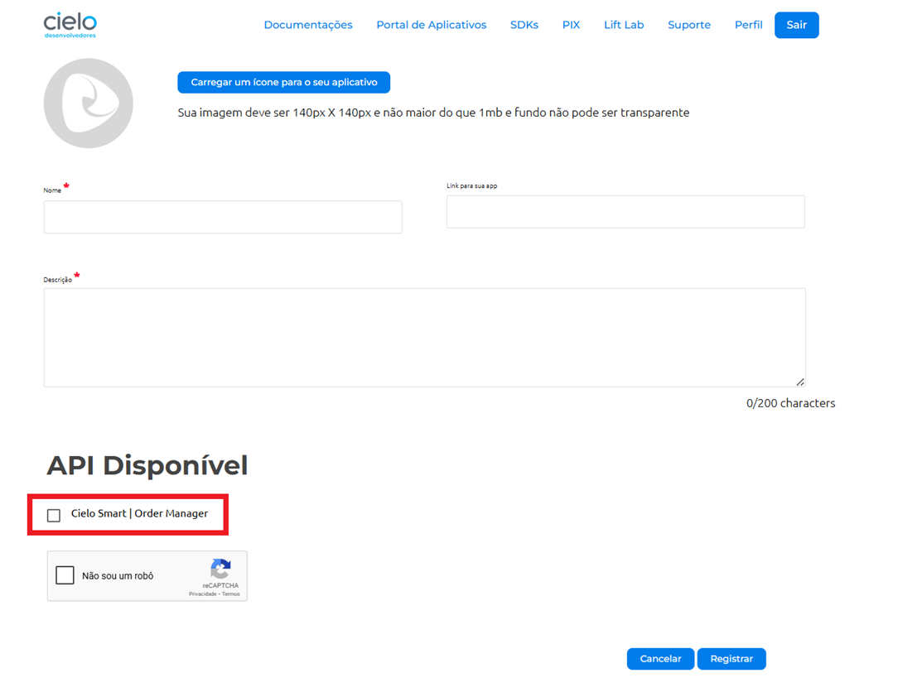

**Consultando credenciais de autenticação**

Agora que você registrou suas credenciais de autenticação, você pode consultá-las clicando em **Perfil > Client-IDs Cadastrados**.

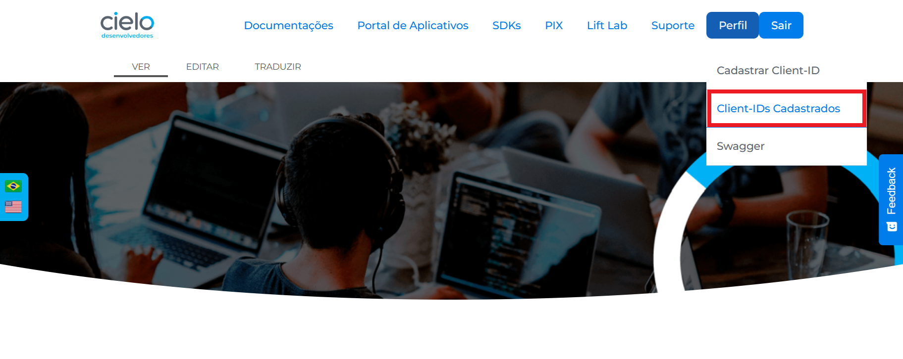

Você será redirecionado para uma tela que exibirá o **Client-ID** e o **Access Token**. 

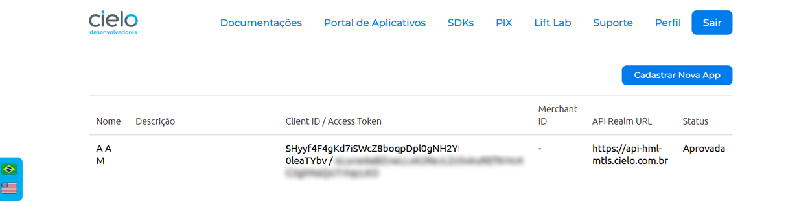

## Configurando o AndroidManifest

Para utilizar o serviço no aplicativo de integração, é necessário realizar duas configurações obrigatórias no arquivo AndroidManifest.xml:
 
**1**. Primeiro, declare a visibilidade do pacote (Android 11+). A partir do Android 11 (API 30), é obrigatório declarar explicitamente a visibilidade do pacote `com.ads.lio.uriappclient` para que seu aplicativo consiga interagir com o serviço de integração UriApp. Essa exigência surgiu devido às novas restrições de visibilidade de pacotes introduzidas no Android 11, com o objetivo de reforçar a privacidade e a segurança do sistema. Sem a declaração explícita em queries, o sistema operacional não permitirá que seu aplicativo:

- Detecte a presença do serviço `com.ads.lio.uriappclient`;
- Envie intents para o pacote especificado. <br/>
<br/>
 
Para fazer isso, adicione a seguinte declaração dentro da tag **manifest**, no mesmo nível de **application**:

```html
<manifest xmlns:android="http://schemas.android.com/apk/res/android"
    package="com.seu.pacote">

    <!-- Obrigatório para Android 11+ (API 30+) -->
    <queries>
        <package android:name="com.ads.lio.uriappclient" />
    </queries>

    <application>
        <!-- Seu código aqui -->
    </application>
</manifest>
```

**2**. Em seguida, defina o contrato de resposta ao fluxo de integração. É necessário definir um contrato de resposta com a Cielo Smart para que ela possa responder após o fluxo de pagamento, cancelamento e/ou impressão. Esse contrato deve ser definido no manifest.xml da aplicação conforme o exemplo abaixo:

```html
<activity android:name=".ResponseActivity">
  <intent-filter>
    <action android:name="android.intent.action.VIEW" />
    <category android:name="android.intent.category.DEFAULT" />
    <data android:host="response" android:scheme="order" />
  </intent-filter>
</activity>
```

Os nomes utilizados nos campos, como `response` e `order`, são apenas exemplos e podem ser adaptados conforme a estrutura e a lógica do seu aplicativo. No entanto, é importante garantir que os mesmos nomes sejam utilizados na chamada de pagamento para que o callback da Cielo Smart funcione corretamente.

## Códigos de erro

Durante o envio de requisições via deep link, o uso de parâmetros incorretos ou incompletos pode resultar em falhas. Quando isso ocorre, o sistema retorna mensagens de erro como resposta, com o objetivo de ajudar na identificação e correção do problema. 

Aqui, reunimos os principais códigos de erro que podem surgir durante o uso de deep links e suas causas.  

Os erros retornados aparecem no formato Base64, como no exemplo abaixo: 

```html
order://response?response=eyJjb2RlIjoxLCJyZWFzb24iOiJDQU5DRUxBRE8gUEVMTyBVU1XDgVJJTyJ9&responsecode=0
```

Após a decodificação da string Base64, o conteúdo é convertido em um objeto JSON estruturado, que facilita a interpretação do erro: 

```json
{ 
   "code":1, 
   "reason":"CANCELADO PELO USUÁRIO" 
}
```
Próximo ao código numérico de erro `code`, a chave `reason` explica de forma mais específica o que causou o erro. 

Entre os principais códigos de erro identificados na integração via deep link, destacam-se os seguintes:

| Código | Descrição               |
|--------|-------------------------|
| 1      | Cancelado pelo usuário  |
| 2      | Erro genérico           |
| 3      | Erro no pagamento       |
| 4      | Erro de autenticação    |

## Serviço em primeiro plano

<aside style="background-color: #d4edda; padding: 15px; border-left: 5px solid #28a745; color: #155724;margin-top: 20px; margin-bottom: 20px;"> Um serviço em primeiro plano é um tipo de serviço Android que continua executando tarefas mesmo quando o aplicativo não está visível na tela. A principal diferença entre um serviço comum e um serviço em primeiro plano é que o segundo exibe uma notificação persistente, informando ao usuário que está ativo. </aside>

Para executar tarefas críticas em segundo plano utilizando um serviço em primeiro plano e, em seguida, iniciar uma comunicação via deep link com outro aplicativo, siga estes passos:


 **1.** Primeiro, crie um serviço em primeiro plano. Ou seja, implemente um serviço que seja executado em primeiro plano com uma notificação persistente.

**Exemplo de implementação do serviço em primeiro plano** 

```json
import android.app.Notification
import android.app.NotificationChannel
import android.app.NotificationManager
import android.app.Service
import android.content.Intent
import android.os.Build
import android.os.IBinder
import androidx.core.app.NotificationCompat

class MyForegroundService : Service() {
  companion object {
    const val CHANNEL_ID = "ForegroundServiceChannel"
}

override fun onCreate() {
   super.onCreate()
   createNotificationChannel()
   val notification: Notification = NotificationCompat.Builder(this, CHANNEL_ID)
     .setContentTitle("Foreground Service")
     .setContentText("Performing critical tasks in the background")
     .setSmallIcon(android.R.drawable.ic_dialog_info)
      .build()
   startForeground(1, notification)
}

override fun onStartCommand(intent: Intent?, flags: Int, startId: Int): Int {
    // Perform critical background tasks here
   return START_NOT_STICKY
}

override fun onDestroy() {
  super.onDestroy()
  stopForeground(true)
}

override fun onBind(intent: Intent?): IBinder? = null

private fun createNotificationChannel() {
  if (Build.VERSION.SDK_INT >= Build.VERSION_CODES.O) {
      val serviceChannel = NotificationChannel(
        CHANNEL_ID,
        "Foreground Service Channel",
        NotificationManager.IMPORTANCE_DEFAULT
      )
      val manager = getSystemService(NotificationManager::class.java)
      manager?.createNotificationChannel(serviceChannel)
      }
  }
}

```
 **2.** Em seguida, inicie o serviço em primeiro plano antes de lançar o deep link.

 **3.** Então, lance o deep link usando um intent para iniciar o outro aplicativo através do seu deep link.
 
**Exemplo de como iniciar o serviço em primeiro plano e lançar o deep link**

```json
import android.content.Context
import android.content.Intent
import android.net.Uri

fun startForegroundServiceAndLaunchDeepLink(context: Context, deepLink: String) {
  // Start the foreground service
val serviceIntent = Intent(context, MyForegroundService::class.java)
context.startService(serviceIntent)

// Launch the other app using its deep link
try {
    val intent = Intent(Intent.ACTION_VIEW, Uri.parse(deepLink))
    intent.addFlags(Intent.FLAG_ACTIVITY_NEW_TASK)
    context.startActivity(intent)
} catch (e: Exception) {
    e.printStackTrace()
    // Handle the case where the deep link or app is not available
  }
}

```

**Observações** 

- Substitua `Foreground Service` e `Performing critical tasks in the background` por textos apropriados para o seu aplicativo.

- Certifique-se de que o serviço em primeiro plano seja encerrado quando não for mais necessário para evitar o uso desnecessário de recursos.

Adicione o serviço ao seu AndroidManifest.xml:

```json
<service
  android:name=".MyForegroundService"
  android:exported="false"
  android:foregroundServiceType="dataSync" />
```

## Funcionalidades

A integração via Deep link permite uma navegação fluida entre sistemas, fazendo com que aplicativos se comuniquem diretamente com funcionalidades do terminal por meio de deep links. Nesta seção, você encontra as principais funcionalidades disponíveis para potencializar essa experiência. 

### Pagamento

Para realizar um pedido de pagamento, é necessário criar um JSON seguindo o formato especificado e, em seguida, convertê-lo para Base64 antes de enviá-lo ao terminal.

```json
{
  "accessToken": "Seu Access-token",
  "clientID": "Seu Client-id",
  "reference": "Referência do pedido", /* Não obrigatório */
  "merchantCode": "Em caso de MULTI-EC", /* Não obrigatório */
  "email": "emaildocliente@email.com",
  "installments": 0,
  "items": [
    {
      "name": "Geral",
      "quantity": 1,
      "sku": "10",
      "unitOfMeasure": "unidade",
      "unitPrice": 10
    }
  ],
  "paymentCode": "DEBITO_AVISTA",
  "value": "10"
}
```

**Campos utilizados para envio** 

| Campo         | Tipo    | Obrigatório | Descrição                                                                 | Valor de exemplo |
|---------------|---------|-------------|---------------------------------------------------------------------------|------------------|
| `accessToken`   | string  | Sim         | Token de acesso fornecido pela Cielo para autenticação                    | WXMG95YK5Lp7     |
| `clientID`      | string  | Sim         | Identificador do Cliente na plataforma da Cielo                          | 1xa0tyQbJliVt    |
| `reference`     | string  | Não         | Referência do pedido, utilizada para controle interno                     | 91ccb5d9-ccf6-4471-bfe2-413d5bc48637 |
| `merchantCode`  | string  | Não         | Código do estabelecimento                                                 | 0012397373089400 |
| `email`         | string  | Não         | E-mail do cliente                                                         | teste@teste.com.br |
| `installments`  | string  | Não         | Número de parcelas (0 para pagamento à vista)                             | 2                |
| `items`         | array   | Sim         | Lista de itens da compra com nome, quantidade, SKU, unidade de medida e valor | [{"id":13856767883,"sku":"123654","name":"Teste", "unit_price":10000,"quantity":1,"unit_of_measure":"EACH"}] |
| `paymentCode`   | string  | Não         | Meio de pagamento. Veja abaixo os valores aceitos no campo paymentCode    | CREDITO_PARCELADO_LOJA |
| `value`         | string  | Sim         | Valor total da transação em centavos (ex: “1000” para R$10,00)            | 10000            |


#### Pedidos de subadquirente

Quando o pagamento for realizado por meio de um subadquirente, é necessário incluir as informações específicas no campo `subAcquirer` dentro do JSON de requisição. 

```json
{
  "accessToken": "Seu Access-token",
  "clientID": "Seu Client-id",
  "email": "emaildocliente@email.com",
  "installments": 0,
  "items": [
    	{
      		"name": "Geral",
      		"quantity": 1,
      		"sku": "10",
      		"unitOfMeasure": "unidade",
      		"unitPrice": 10
    	}
  ],
  "paymentCode": "DEBITO_AVISTA",
  "value": "10",
  "subAcquirer": {
  	"softDescriptor": "softDescriptorValue",
  	"terminalId": "terminalIdValue",
 	 "merchantCode": "merchantCodeValue",
  	"city": "cityValue",
  	"telephone": "telephoneValue",
  	"state": "stateValue",
  	"postalCode": "postalCodeValue",
  	"address": "addressValue",
  	"identifier": "identifierValue",
  	"merchantCategoryCode": "merchantCategoryCodeValue",
  	"countryCode": "countryCodeValue",
  	"informationType": "informationTypeValue",
  	"document": "documentValue",
  	"businessName": "businessName",
	"ibgeCode": "00000000"
  }
}
```
**Campos utilizados para envio**

Todos os campos dentro do objeto `subAcquirer` devem ser preenchidos com valores do tipo texto (string). O preenchimento completo é obrigatório. 

| Campo                  | Tipo     | Obrigatório | Descrição                                                                 | Valor de exemplo       |
|------------------------|----------|-------------|---------------------------------------------------------------------------|------------------------|
| `softDescriptor`       | string   | Sim         | Texto que será exibido na fatura do cliente                              | TESTE123               |
| `terminalId`           | string   | Sim         | Identificador do terminal de pagamento                                   | 4AC12345               |
| `merchantCode`         | string   | Sim         | Código do estabelecimento do subadquirente                               | 1234567890             |
| `city`                 | string   | Sim         | Cidade do subadquirente                                                  | Sao Paulo              |
| `telephone`            | string   | Sim         | Telefone de contato do subadquirente                                     | 011999999999           |
| `state`                | string   | Sim         | Estado do subadquirente                                                  | SP                     |
| `postalCode`           | string   | Sim         | Código postal (CEP) do subadquirente                                     | 08022300               |
| `address`              | string   | Sim         | Endereço completo do subadquirente                                       | Rua Joao Bello 29      |
| `identifier`           | string   | Sim         | Identificador único do subadquirente                                     | 1234567898             |
| `merchantCategoryCode` | string   | Sim         | Código da categoria do estabelecimento                                   | 5441                   |
| `countryCode`          | string   | Sim         | Código do país (O código do país do Brasil é 0076)                       | 0076                   |
| `informationType`      | string   | Sim         | Tipo de informação adicional fornecida. (J = Pessoa Jurídica; F = Pessoa Física)                                   | J                      |
| `document`             | string   | Sim         | Documento de identificação do subadquirente (ex: CNPJ ou CPF)           | 01027058000191         |
| `businessName`         | string   | Sim         | Nome comercial do subadquirente                                          | Cielo                  |
| `ibgeCode`             | string   | Sim         | Código IBGE do município do subadquirente                                | 0000000                |

Caso algum campo esteja ausente, o terminal retornará um erro, conforme demonstrado abaixo:

```json
{
    "code": 2,
    "reason": " Parâmetros inválidos: Json inválido"
}
```


##### Valores aceitos no campo paymentCode

Abaixo, você encontra a lista completa de valores aceitos no campo `paymentCode`, que devem ser utilizados na configuração da requisição de pagamento conforme o tipo de transação desejada.


| Campo                              | Descrição                                                                                                      |
|-----------------------------------|----------------------------------------------------------------------------------------------------------------|
| CARTAO_LOJA_AVISTA               | Pagamento com cartão da loja à vista.                                                                         |
| CARTAO_LOJA_PAGTO_FATURA_CHEQUE  | Pagamento de fatura do cartão da loja efetuado via cheque.                                                   |
| CARTAO_LOJA_PAGTO_FATURA_DINHEIRO| Pagamento de fatura do cartão da loja efetuado em dinheiro.                                                  |
| CARTAO_LOJA_PARCELADO            | Parcelamento no cartão da loja em modalidade genérica quando não há distinção do administrador.              |
| CARTAO_LOJA_PARCELADO_BANCO      | Parcelamento do cartão da loja administrado por banco parceiro.                                              |
| CARTAO_LOJA_PARCELADO_LOJA       | Parcelado no cartão da loja com condições definidas pelo próprio varejista.                                  |
| CREDIARIO_SIMULACAO              | Simulação de crediário com cálculo de parcelas sem efetivar a venda.                                         |
| CREDIARIO_VENDA                  | Venda realizada via crediário com registro da transação a prazo no sistema do lojista.                       |
| CREDITO_AVISTA                   | Cartão de crédito, cobrança em uma única parcela na fatura do portador.                                      |
| CREDITO_CREDIARIO_CREDITO        | Venda a prazo via crediário com instrumento de crédito, com análise e financiamento pelo lojista.            |
| CREDITO_PARCELADO_ADM            | Crédito parcelado administrado pela administradora.                                                          |
| CREDITO_PARCELADO_BNCO           | Crédito parcelado financiado pelo banco emissor.                                                             |
| CREDITO_PARCELADO_LOJA           | Crédito parcelado com condições definidas pela loja.                                                         |
| DEBITO_AVISTA                    | Cartão de débito, liquidado à vista diretamente na conta do portador.                                        |
| DEBITO_PAGTO_FATURA_DEBITO       | Indica uma transação de débito utilizada para quitar a fatura de cartões da própria loja. Pode ter taxas diferenciadas para o Estabelecimento Comercial (EC). |
| FROTAS                           | Transações com cartões de frotas com regras específicas de uso corporativo.                                   |
| PIX                              | Transferência/recebimento instantâneo via Pix.                                                                |
| PRE_AUTORIZACAO                  | Reserva de limite com autorização pendente de captura.                                                       |
| VOUCHER_ALIMENTACAO              | Benefício de cartão vale alimentação, restrita a estabelecimentos elegíveis.                                  |
| VOUCHER_AUTO                     | Voucher automotivo, um benefício relacionado a veículos e transporte.                                         |
| VOUCHER_AUTOMOTIVO               | Benefício automotivo conforme regras do programa.                                                             |
| VOUCHER_BENEFICIOS               | Cartão de multibenefícios conforme regras do programa.                                                        |
| VOUCHER_CONSULTA_SALDO           | Operação de consulta de saldo de benefício, sem movimentação financeira.                                      |
| VOUCHER_CULTURA                  | Benefício de cultura conforme elegibilidade do benefício.                                                     |
| VOUCHER_PEDAGIO                  | Benefício de pedágio.                                                                                        |
| VOUCHER_REFEICAO                 | Benefício de cartão vale refeição para consumo em restaurantes e afins.                                       |
| VOUCHER_VALE_PEDAGIO             | Benefício Vale-Pedágio, específico para transporte de cargas conforme regulamentação.                         |


**Configurando a URI de pagamento**

Para realizar uma chamada de pagamento utilizando a Cielo Smart, é necessário configurar corretamente a URI de pagamento. 

Defina o contrato de resposta (**host** e **scheme**). Aqui será utilizada essa configuração no parâmetro `urlCallback`. A chamada de pagamento deve ser feita da seguinte forma:

```java
var base64 = getBase64(jsonString)
var checkoutUri = "lio://payment?request=$base64&urlCallback=order://response"
```

Após preparar a URI, basta realizar a chamada de intent do Android utilizando o comando específico da linguagem híbrida.

```java
var intent = Intent(Intent.ACTION_VIEW, Uri.parse(checkoutUri))
intent.addFlags(Intent.FLAG_ACTIVITY_CLEAR_TOP)
startActivity(intent)
```

### Recuperando dados do pagamento

Para recuperar os dados do pagamento, na activity de resposta, acesse a intent recebida. Então, use o parâmetro `data` da intent para obter a URI com as informações da transação.

```java
val responseIntent = intent
if (Intent.ACTION_VIEW == responseIntent.action) {
   val uri = responseIntent.data
   val response = uri.getQueryParameter("response")
   val data = Base64.decode(response, Base64.DEFAULT)
   val json = String(data)
}
```

<aside style="background-color: #d4edda; padding: 15px; border-left: 5px solid #28a745; color: #155724;margin-top: 20px; margin-bottom: 20px;"> O parâmetro 'response' é o mesmo que foi configurado como resposta na chamada de pagamento. </aside> 

Assim que o pagamento é concluído, a Cielo Smart envia uma resposta para a URI configurada previamente. Essa resposta será um JSON contendo os dados da transação, seguindo o formato exemplificado abaixo:


```json
{
   "createdAt":"Jun 8, 2018 1:51:58 PM",
   "id":"ba583f85-9252-48b5-8fed-12719ff058b9",
   "items":[
      {
         "description":"",
         "details":"",
         "id":"898e7f40-fa21-42d0-94d4-b4e95c4fd615",
         "name":"cocacola",
         "quantity":2,
         "reference":"",
         "sku":"1234",
         "unitOfMeasure":"unidade",
         "unitPrice":250
      },
      {
         "description":"",
         "details":"",
         "id":"4baea4c2-5499-4783-accc-0f8904970861",
         "name":"pepsi",
         "quantity":2,
         "reference":"",
         "sku":"4321",
         "unitOfMeasure":"unidade",
         "unitPrice":280
      }
   ],
   "notes":"",
   "number":"",
   "paidAmount":1450,
   "payments":[
      {
         "accessKey":"XXXXXXXXXXXXXXX",
         "amount":1450,
         "applicationName":"com.ads.lio.uriappclient",
         "authCode":"140126",
         "brand":"Visa",
         "cieloCode":"799871",
         "description":"",
         "discountedAmount":0,
         "externalId":"6d5f6f86-7870-4aed-b79f-0a26d6c61743",
         "id":"bb9c6305-95e5-4024-8152-503d064c0224",
         "installments":0,
         "mask":"424242-4242",
         "merchantCode":"0000000000000003",
         "paymentFields":{
            "isDoubleFontPrintAllowed":"false",
            "hasPassword":"false",
            "primaryProductCode":"1000",
            "isExternalCall":"true",
            "primaryProductName":"CREDITO",
            "receiptPrintPermission":"1",
            "isOnlyIntegrationCancelable":"false",
            "upFrontAmount":"0",
            "creditAdminTax":"0",
            "firstQuotaDate":"0",
            "isFinancialProduct":"true",
            "hasSignature":"true",
            "hasPrintedClientReceipt":"false",
            "hasWarranty":"false",
            "applicationName":"com.ads.lio.uriappclient",
            "interestAmount":"0",
            "changeAmount":"0",
            "serviceTax":"0",
            "cityState":"Barueri - SP",
            "hasSentReference":"false",
            "secondaryProductName":"A VISTA",
            "paymentTransactionId":"6d5f6f86-7870-4aed-b79f0a26d6c61743",
            "avaiableBalance":"0",
            "pan":"424242-4242",
            "originalTransactionId":"0",
            "originalTransactionDate":"08/06/18",
            "secondaryProductCode":"1",
            "hasSentMerchantCode":"false",
            "documentType":"J",
            "statusCode":"1",
            "merchantAddress":"Alameda Grajau, 219",
            "merchantCode":"0000000000000003",
            "paymentTypeCode":"1",
            "hasConnectivity":"true",
            "productName":"CREDITO A VISTA - I",
            "merchantName":"POSTO ABC",
            "entranceMode":"141010104080",
            "firstQuotaAmount":"0",
            "cardCaptureType":"1",
            "totalizerCode":"0",
            "requestDate":"1528476655000",
            "boardingTax":"0",
            "applicationId":"cielo.launcher",
            "numberOfQuotas":"0",
            "document":"000000000000000"
         },
         "primaryCode":"1000",
         "requestDate":"1528476655000",
         "secondaryCode":"1",
         "terminal":"69000007"
      }
   ],
"pendingAmount":0,
"price":1060,
"reference":"Order",
"status":"ENTERED",
"type":"PAYMENT",
"updatedAt":"Jun 8, 2018 1:51:58 PM"
}
```

<aside style="background-color: #d4edda; padding: 15px; border-left: 5px solid #28a745; color: #155724;margin-top: 20px; margin-bottom: 20px;"> O campo 'statusCode' informa o tipo de operação realizada na transação. Quando o valor é 0 ou 1, significa que se trata de um pagamento, sendo que o código 0 é usado exclusivamente para pagamentos via Pix. Já quando o valor é 2, indica que houve um cancelamento da transação. </aside> 

<br/>

**Payment Fields: atributo do objeto Payment**

| Campo                      | Tipo  | Descrição                                                                 | Valor de exemplo                          |
|---------------------------|---------------|---------------------------------------------------------------------------|----------------------------------------|
| `clientName`                | string        | Nome do Portador                                                          | VISA ACQUIRER TEST CARD 03             |
| `hasPassword`               | boolean       | Validar se a operação pediu senha                                         | true                                   |
| `primaryProductCode`        | string        | Código do produto primário                                                | 1000                                      |
| `primaryProductName`        | string        | Nome do produto primário                                                  | CREDITO                                |
| `upFrontAmount`             | number        | Valor da entrada da transação                                             | 2500                                   |
| `creditAdminTax`            | number        | Valor da taxa de administração de crédito                                 | 0                                      |
| `firstQuotaDate`            | string        | Data de débito da primeira parcela                                        | 25/12/2018 (dd/MM/yyyy)                |
| `externalCallMerchantCode`  | string        | Número do Estabelecimento Comercial                                       | 0010000244470001                       |
| `hasSignature`              | boolean       | Validar se a operação pediu assinatura                                    | false                                  |
| `hasPrintedClientReceipt`   | boolean       | Validar se imprimiu a via do cliente                                      | false                                  |
| `applicationName`           | string        | Pacote da aplicação                                                       | cielo.launcher                         |
| `interestAmount`            | number        | Valor de juros                                                            | 5000                                   |
| `changeAmount`              | number        | Valor de troco                                                            | 4500                                   |
| `serviceTax`                | number        | Taxa de serviço                                                           | 2000                                   |
| `cityState`                 | string        | Cidade - Estado                                                           | Barueri - SP                           |
| `secondaryProductName`      | string        | Nome do produto secundário                                                | PARC. ADM                              |
| `paymentTransactionId`      | string        | ID da transação de pagamento                                              | 4c613b44-19b8-497c-b072-60d5dd6807e7   |
| `bin`                       | string        | Número cartão tokenizado (6 primeiros dígitos – 4 últimos dígitos ou 4 últimos) | 476173-0036 ou **********4242     |
| `originalTransactionId`     | string        | ID da transação original, nos casos de cancelamento                       | 729d32ac-6c8d-4b0c-b670-263552f07000   |
| `cardLabelApplication`      | string        | Tipo de aplicação utilizada pelo cartão na transação                      | CREDITO DE VISA                        |
| `secondaryProductCode`      | string        | Código do produto secundário                                              | 1                                    |
| `documentType`              | string        | (J) = Pessoa Jurídica (F) = Pessoa Física                                 | J                                      |
| `statusCode`                | string        | Status da transação: 0(PIX), 1 - Autorizada, 2 - Cancelada                | 1                                      |
| `merchantAddress`           | string        | Endereço do estabelecimento comercial (lojista)                           | Alameda Grajau, 219                    |
| `merchantCode`              | string        | Número do Estabelecimento Comercial                                       | 0010000244470001                       |
| `hasConnectivity`           | boolean       | Valida se a transação foi online                                          | true                                   |
| `productName`               | string        | Forma de pagamento compilada                                              | CREDITO PARCELADO ADM - I              |
| `merchantName`              | string        | Nome Fantasia do Estabelecimento Comercial                                | LOJA ON                                |
| `firstQuotaAmout`           | number        | Valor da primeira parcela                                                 | 0                                      |
| `cardCaptureType`           | string        | Códigos do tipo de captura do cartão (EMV = 0; DIGITADO: 1; TRILHA_1 e TRILHA_2 = 2; CTLS_EMV e CTLS_TRILHA = 3; QRCODE = 6; NONE, TIBC_10, TIBC_30 e EASY_ENTRY = -1.                              |     1      |
| `requestDate`               | number        | Data da requisição em milisegundos                                        | 1293857600000                          |
| `boardingTax`               | number        | Taxa de embarque                                                          | 1200                                   |
| `applicationId`             | string        | Pacote de aplicação                                                       | cielo.launcher                         |
| `numberOfQuotas`            | number        | Número de parcelas                                                        | 2                                    | 

<br/>

**Valores aceitos nos campos de produto e código primário e secundário**

Abaixo, você encontra a lista completa de valores aceitos nos campos `primaryProductCode` e `primaryCode` bem como para `secondaryProductCode` e  `secondaryCode` que devem ser utilizados na configuração da requisição.

| **Nome do Produto**                     | **Produto Primário** | **Código Primário** | **Produto Secundário**         | **Código Secundário** |
|----------------------------------------|----------------------|---------------------|--------------------------------|------------------------|
| Débito à vista                         | DEBITO               | 2000                | VISTA                          | 1                      |
| Pagamento de fatura de débito          | DEBITO               | 2000                | PAGTO FATURA DEBITO            | 4                      |
| Crédito à vista                        | CREDITO              | 1000                | VISTA                          | 1                      |
| Crédito parcelado na loja              | CREDITO              | 1000                | PARCELADO LOJA                 | 2                      |
| Crédito parcelado pela administradora  | CREDITO              | 1000                | PARCELADO ADM                  | 3                      |
| Crédito parcelado pelo banco           | CREDITO              | 1000                | PARCELADO BANCO                | 6                      |
| Pré-autorização                        | CREDITO              | 1000                | PRE-AUTORIZACAO                | 5                      |
| Crediário no crédito                   | CREDITO              | 1000                | CREDIARIO NO CREDITO           | 7                      |
| Voucher alimentação                    | VOUCHER              | 3000                | ALIMENTACAO                    | 2                      |
| Voucher refeição                       | VOUCHER              | 3000                | REFEICAO                       | 1                      |
| Voucher automotivo                     | VOUCHER              | 3000                | AUTOMOTIVO                     | 3                      |
| Voucher cultura                        | VOUCHER              | 3000                | CULTURA                        | 4                      |
| Voucher pedágio                        | VOUCHER              | 3000                | PEDAGIO                        | 5                      |
| Voucher benefícios                     | VOUCHER              | 3000                | BENEFICIOS                     | 6                      |
| Voucher auto                           | VOUCHER              | 3000                | AUTO                           | 7                      |
| Consulta de saldo                      | VOUCHER              | 3000                | CONSULTA DE SALDO              | 8                      |
| Vale pedágio                           | VOUCHER              | 3000                | VALE PEDAGIO                   | 9                      |

#### Exemplos de retorno

Abaixo, você encontra exemplos de retorno com sucesso e erro nas operações via intent. Em ambos os cenários, o conteúdo da URI e o campo `response` estão em formato Base64.

**Retorno de sucesso**

```html
order://response?response=eyJjcmVhdGVkQXQiOiJKYW4gMzEsIDIwMjQgMTE6Mzc6MjYgQU0iLCJpZCI6IjFkYjU1NzdmLWZjZDAtNDllOC04Y2FjLTVlMjRhYWZiMjUxZiIsIml0ZW1zIjpbeyJkZXNjcmlwdGlvbiI6IiIsImRl
dGFpbHMiOiIiLCJpZCI6IjkzMzA5ODkyLWMyMGItNDUyYy1iYTZmLTY4Mjc5NmI0YTk2ZSIsIm5hbWUiOiJwcm9kdXRvIiwicXVhbnRpdHkiOjEsInJlZmVyZW5jZSI6IiIsInNrdSI6IjQ2ODIiLCJ1bml0T2ZNZWFzdXJlIjoidW5pZGFkZSIsInVuaXRQcmljZSI6OTI1fV0sIm5vdGVzIjoiIiwibnVtYmVyIjoiIiwicGFpZEFtb3VudCI6OTI1LCJwYXltZW50cyI6W3siYWNjZXNzS2V5IjoiclNBcU5QR3ZGUEpJIiwiYW1vdW50Ijo5MjUsImFwcGxpY2F0aW9uTmFtZSI6ImNvbS5hZHMubGlvLnVyaWFwcGNsaWVudCIsImF1dGhDb2RlIjoiMTEzNzMwIiwiYnJhbmQiOiIiLCJjaWVsb0NvZGUiOiI4NDcyNjIiLCJkZXNjcmlwdGlvbiI6IiIsImRpc2NvdW50ZWRBbW91bnQiOjAsImV4dGVybmFsSWQiOiI0OGZhNjNjOS05NWVlLTQ4M2UtOWU3Yi1jZTMyNjMzZjEyOWIiLCJpZCI6IjgwY2U1MjhjLTJjY2MtNDgwMC1iZGMxLTViNWRkZGU1OGZiMSIsImluc3RhbGxtZW50cyI6MCwibWFzayI6IioqKioqKioqKioqKjAwMDAiLCJtZXJjaGFudENvZGUiOiIwMDAwMDAwMDAwMDAwMDAzIiwicGF5bWVudEZpZWxkcyI6eyJpc0RvdWJsZUZvbnRQcmludEFsbG93ZWQiOiJmYWxzZSIsImJpbiI6IjAiLCJoYXNQYXNzd29yZCI6ImZhbHNlIiwicHJpbWFyeVByb2R1Y3RDb2RlIjoiNCIsImlzRXh0ZXJuYWxDYWxsIjoidHJ1ZSIsInByaW1hcnlQcm9kdWN0TmFtZSI6IkNSRURJVE8iLCJyZWNlaXB0UHJpbnRQZXJtaXNzaW9uIjoiMSIsImlzT25seUludGVncmF0aW9uQ2FuY2VsYWJsZSI6ImZhbHNlIiwidXBGcm9udEFtb3VudCI6IjAiLCJjcmVkaXRBZG1pblRheCI6IjAiLCJleHRlcm5hbENhbGxNZXJjaGFudENvZGUiOiIwMDAwMDAwMDAwMDAwMDAzIiwiZmlyc3RRdW90YURhdGUiOiIwIiwiaXNGaW5hbmNpYWxQcm9kdWN0IjoidHJ1ZSIsImhhc1ByaW50ZWRDbGllbnRSZWNlaXB0IjoiZmFsc2UiLCJoYXNTaWduYXR1cmUiOiJmYWxzZSIsImFwcGxpY2F0aW9uTmFtZSI6ImNvbS5hZHMubGlvLnVyaWFwcGNsaWVudCIsImhhc1dhcnJhbnR5IjoiZmFsc2UiLCJpbnRlcmVzdEFtb3VudCI6IjAiLCJjaGFuZ2VBbW91bnQiOiIwIiwic2VydmljZVRheCI6IjAiLCJjaXR5U3RhdGUiOiJCYXJ1ZXJpIC0gU1AiLCJoYXNTZW50UmVmZXJlbmNlIjoiZmFsc2UiLCJ2NDBDb2RlIjoiNCIsInNlY29uZGFyeVByb2R1Y3ROYW1lIjoiQSBWSVNUQSIsInBheW1lbnRUcmFuc2FjdGlvbklkIjoiNDhmYTYzYzktOTVlZS00ODNlLTllN2ItY2UzMjYzM2YxMjliIiwiYXZhaWFibGVCYWxhbmNlIjoiMCIsInBhbiI6IioqKioqKioqKioqKjAwMDAiLCJvcmlnaW5hbFRyYW5zYWN0aW9uSWQiOiIwIiwib3JpZ2luYWxUcmFuc2FjdGlvbkRhdGUiOiIzMS8wMS8yNCIsInNlY29uZGFyeVByb2R1Y3RDb2RlIjoiMjA0IiwiZG9jdW1lbnRUeXBlIjoiSiIsImhhc1NlbnRNZXJjaGFudENvZGUiOiJmYWxzZSIsInN0YXR1c0NvZGUiOiIxIiwibWVyY2hhbnRBZGRyZXNzIjoiQWxhbWVkYSBHcmFqYXUsIDIxOSIsIm1lcmNoYW50Q29kZSI6IjAwMDAwMDAwMDAwMDAwMDMiLCJwYXltZW50VHlwZUNvZGUiOiIxIiwiaGFzQ29ubmVjdGl2aXR5IjoidHJ1ZSIsInByb2R1Y3ROYW1lIjoiQ1JFRElUTyBBIFZJU1RBIC0gSSIsIm1lcmNoYW50TmFtZSI6IlBPU1RPIEFCQyIsImVudHJhbmNlTW9kZSI6IjY2MTAxMDEwNzA4MCIsImNhcmRDYXB0dXJlVHlwZSI6IjYiLCJmaXJzdFF1b3RhQW1vdW50IjoiMCIsInRvdGFsaXplckNvZGUiOiIwIiwicmVxdWVzdERhdGUiOiIxNzA2NzEwMzg0NDAyIiwiYXBwbGljYXRpb25JZCI6ImNpZWxvLmxhdW5jaGVyIiwiYm9hcmRpbmdUYXgiOiIwIiwibnVtYmVyT2ZRdW90YXMiOiIwIiwiZG9jdW1lbnQiOiIwMDAwMDAwMDAwMDAwMCJ9LCJwcmltYXJ5Q29kZSI6IjQiLCJyZXF1ZXN0RGF0ZSI6IjE3MDY3MTAzODQ0MDIiLCJzZWNvbmRhcnlDb2RlIjoiMjA0IiwidGVybWluYWwiOiI2MjAwMDExMiJ9XSwicGVuZGluZ0Ftb3VudCI6MCwicHJpY2UiOjkyNSwicmVmZXJlbmNlIjoiUmVmZXJlbmNlIiwic3RhdHVzIjoiRU5URVJFRCIsInR5cGUiOiJQQVlNRU5UIiwidXBkYXRlZEF0IjoiSmFuIDMxLCAyMDI0IDExOjM3OjMxIEFNIn0=&responsecode=0
```

**Retorno de erro**

Se houver algum erro no pagamento, seja ele cancelado por usuário ou por saldo insuficiente, o campo `response` retornará um Base64 com o motivo do erro. 


```html
order://response?response=eyJjb2RlIjoxLCJyZWFzb24iOiJDQU5DRUxBRE8gUEVMTyBVU1XDgVJJTyJ9&responsecode=0
```
Após a decodificação da string Base64, o conteúdo é convertido em um objeto JSON estruturado, que facilita a interpretação do erro:

```json
{
   "code":1,
   "reason":"CANCELADO PELO USUÁRIO"
}
```

### Listagem de pedidos

Na listagem de pedidos, é possível obter os pedidos (orders) abertos na Cielo Smart pelo aplicativo do parceiro. 
Cada pedido contém informações detalhadas, como os itens adquiridos e as transações associadas. Para isso, basta definir o JSON abaixo e formata-lo para Base64:

```json
{
“pageSize”: 5,
“page”: 0,
“clientID”: “seu cliente ID”,
“accessToken”: “seu access token”
}
```

Os campos `pageSize` e `page` são usados para controlar a paginação dos dados retornados. Enquanto `pageSize` define quantos itens serão exibidos por página, `page` indica qual página está sendo acessada, começando do zero. Por exemplo, com `pageSize`: 5 e `page`: 0, você recebe os primeiros 5 pedidos. 

<aside style="background-color: #f8d7da; padding: 15px; border-left: 5px solid #dc3545; color: #721c24;margin-top: 20px; margin-bottom: 20px;"> A princípio, será possível recuperar, no máximo, cinco pedidos devido ao tamanho das informações. Portanto, o valor máximo a ser inserido em `pageSize` é 5. </aside> 

A chamada deve ser feita da seguinte forma:

```java
var base64 = getBase64(jsonString)
var checkoutUri = "lio://orders?request=$base64&urlCallback=order://response"
```

Para recuperar os dados da transação após o pagamento, basta acessar a intent recebida na activity de resposta, que deve estar registrada no seu AndroidManifest.xml. Em seguida, utilize o parâmetro `data` da intent para obter a URI com as informações da transação:


```java
val responseIntent = intent
if (Intent.ACTION_VIEW == responseIntent.action) {
   val uri = responseIntent.data
   val response = uri.getQueryParameter("response")
   val data = Base64.decode(response, Base64.DEFAULT)
   val json = String(data)
}
```

#### Exemplos de retorno

**Retorno de sucesso**

```java
orders://response?response=eyJjdXJyZW50UGFnZSI6MCwicmVzdWx0cyI6W3siY3JlYXRlZEF0IjoiQXByIDgsIDIwMjQgNDowNzo1OSBQTSIsImlkIjoiNTEyZjdjNjEtMjkzYy00NDY4LWJkM2UtMjk4Mjg2ZDA0ZjBiIiwiaXRlbXMiOlt7ImRlc2NyaXB0aW9uIjoiIiwiZGV0YWlscyI6IiIsImlkIjoiNjMyOWRiMTYtMzY4Ny00MmJjLTgzNWYtZmUwZGYxMGZjZGRmIiwibmFtZSI6InByb2R1dG8iLCJxdWFudGl0eSI6MywicmVmZXJlbmNlIjoiIiwic2t1IjoiNzg5NzIiLCJ1bml0T2ZNZWFzdXJlIjoidW5pZGFkZSIsInVuaXRQcmljZSI6NTY2fV0sIm5vdGVzIjoiIiwibnVtYmVyIjoiIiwicGFpZEFtb3VudCI6MTY5OCwicGF5
bWVudHMiOlt7ImFjY2Vzc0tleSI6InJTQXFOUEd2RlBKSSIsImFtb3VudCI6MTY5OCwiYXBwbGlj
YXRpb25OYW1lIjoiY29tLmFkcy5saW8udXJpYXBwY2xpZW50IiwiYXV0aENvZGUiOiIxNjA4NTEi
LCJicmFuZCI6IiIsImNpZWxvQ29kZSI6IjEwODE0NCIsImRlc2NyaXB0aW9uIjoiIiwiZGlzY291
bnRlZEFtb3VudCI6MCwiZXh0ZXJuYWxJZCI6IjZiYmI2ZDhhLTQ5NWYtNDY3MC04MzVmLWY4YWNlYjlkZTA2OCIsImlkIjoiNWU2MmFmNGMtNzM5ZC00Zjc4LWFhYjgtNWQxNDE5NmIwN2I2IiwiaW5zdGFsbG1lbnRzIjowLCJtYXNrIjoiKioqKioqKioqKjQyNDIiLCJtZXJjaGFudENvZGUiOiIwMDEw
MDAwMjQ0NDcwMDAxIiwicGF5bWVudEZpZWxkcyI6eyJpc0RvdWJsZUZvbnRQcmludEFsbG93ZWQiOiJ0cnVlIiwiYmluIjoiNDI0MjQyIiwiaGFzUGFzc3dvcmQiOiJ0cnVlIiwicHJpbWFyeVByb2R1
Y3RDb2RlIjoiNCIsImlzRXh0ZXJuYWxDYWxsIjoidHJ1ZSIsInByaW1hcnlQcm9kdWN0TmFtZSI6
IkNSRURJVE8iLCJyZWNlaXB0UHJpbnRQZXJtaXNzaW9uIjoiMSIsImlzT25seUludGVncmF0aW9u
Q2FuY2VsYWJsZSI6ImZhbHNlIiwidXBGcm9udEFtb3VudCI6IjAiLCJjcmVkaXRBZG1pblRheCI6
IjAiLCJleHRlcm5hbENhbGxNZXJjaGFudENvZGUiOiIwMDEwMDAwMjQ0NDcwMDAxIiwiZmlyc3RRdW90YURhdGUiOiIwIiwiaXNGaW5hbmNpYWxQcm9kdWN0IjoidHJ1ZSIsImhhc1ByaW50ZWRDbGllbnRSZWNlaXB0IjoiZmFsc2UiLCJoYXNTaWduYXR1cmUiOiJmYWxzZSIsImFwcGxpY2F0aW9uTmFtZSI6ImNvbS5hZHMubGlvLnVyaWFwcGNsaWVudCIsImhhc1dhcnJhbnR5IjoiZmFsc2UiLCJpbnRlcmVzdEFtb3VudCI6IjAiLCJjaGFuZ2VBbW91bnQiOiIwIiwic2VydmljZVRheCI6IjAiLCJjaXR5
U3RhdGUiOiJCYXJ1ZXJpIC0gU1AiLCJoYXNTZW50UmVmZXJlbmNlIjoiZmFsc2UiLCJ2NDBDb2Rl
IjoiNCIsInNlY29uZGFyeVByb2R1Y3ROYW1lIjoiQSBWSVNUQSIsInBheW1lbnRUcmFuc2FjdGlv
bklkIjoiNmJiYjZkOGEtNDk1Zi00NjcwLTgzNWYtZjhhY2ViOWRlMDY4IiwiYXZhaWFibGVCYWxh
bmNlIjoiMCIsInBhbiI6IioqKioqKioqKio0MjQyIiwib3JpZ2luYWxUcmFuc2FjdGlvbklkIjoi
MCIsIm9yaWdpbmFsVHJhbnNhY3Rpb25EYXRlIjoiMDgvMDQvMjQiLCJzZWNvbmRhcnlQcm9kdWN0Q29kZSI6IjIwNCIsImRvY3VtZW50VHlwZSI6IkoiLCJoYXNTZW50TWVyY2hhbnRDb2RlIjoiZmFsc2UiLCJzdGF0dXNDb2RlIjoiMSIsIm1lcmNoYW50QWRkcmVzcyI6IkFsYW1lZGEgR3JhamF1LCAy
MTkiLCJtZXJjaGFudENvZGUiOiIwMDEwMDAwMjQ0NDcwMDAxIiwicGF5bWVudFR5cGVDb2RlIjoiMSIsImhhc0Nvbm5lY3Rpdml0eSI6InRydWUiLCJwcm9kdWN0TmFtZSI6IkNSRURJVE8gQSBWSVNUQSAtIEkiLCJtZXJjaGFudE5hbWUiOiJMT0pBIE9OIiwiZW50cmFuY2VNb2RlIjoiNjQyMDE3MjA0
MDgwIiwiY2FyZENhcHR1cmVUeXBlIjoiMSIsImZpcnN0UXVvdGFBbW91bnQiOiIwIiwidG90YWxp
emVyQ29kZSI6IjAiLCJyZXF1ZXN0RGF0ZSI6IjE3MTI2MDMyNjcxMjgiLCJhcHBsaWNhdGlvbklk
IjoiY2llbG8ubGF1bmNoZXIiLCJib2FyZGluZ1RheCI6IjAiLCJudW1iZXJPZlF1b3RhcyI6IjAi
LCJkb2N1bWVudCI6IjcwOTU3ODk4MDAwMTc2In0sInByaW1hcnlDb2RlIjoiNCIsInJlcXVlc3RE
YXRlIjoiMTcxMjYwMzI2NzEyOCIsInNlY29uZGFyeUNvZGUiOiIyMDQiLCJ0ZXJtaW5hbCI6IjYy
MDAwMTQwIn1dLCJwZW5kaW5nQW1vdW50IjowLCJwcmljZSI6MTY5OCwicmVmZXJlbmNlIjoiUmVmZXJlbmNlIiwic3RhdHVzIjoiUEFJRCIsInR5cGUiOiJQQVlNRU5UIiwidXBkYXRlZEF0IjoiQXBy
IDgsIDIwMjQgNDowNzo1MyBQTSJ9LHsiY3JlYXRlZEF0IjoiQXByIDgsIDIwMjQgNDowNzo0MyBQ
TSIsImlkIjoiZjJlNGIxZDMtYWI2Ny00NzM2LWEzMDctYjM0ZWJkZGIyM2QwIiwiaXRlbXMiOlt7
ImRlc2NyaXB0aW9uIjoiIiwiZGV0YWlscyI6IiIsImlkIjoiZDBjOGE4MzYtOTM4OC00MTdiLThk
MzAtMmViOWQ0YzA2ODFmIiwibmFtZSI6InByb2R1dG8iLCJxdWFudGl0eSI6MSwicmVmZXJlbmNlIjoiIiwic2t1IjoiNzY2MTgiLCJ1bml0T2ZNZWFzdXJlIjoidW5pZGFkZSIsInVuaXRQcmljZSI6
ODM4fV0sIm5vdGVzIjoiIiwibnVtYmVyIjoiIiwicGFpZEFtb3VudCI6ODM4LCJwYXltZW50cyI6
W3siYWNjZXNzS2V5IjoiclNBcU5QR3ZGUEpJIiwiYW1vdW50Ijo4MzgsImFwcGxpY2F0aW9uTmFt
ZSI6ImNvbS5hZHMubGlvLnVyaWFwcGNsaWVudCIsImF1dGhDb2RlIjoiMTYwODE2IiwiYnJhbmQi
OiIiLCJjaWVsb0NvZGUiOiIxMDgxNDIiLCJkZXNjcmlwdGlvbiI6IiIsImRpc2NvdW50ZWRBbW91
bnQiOjAsImV4dGVybmFsSWQiOiI5M2NiYmUzOS1hNWI2LTQ4MmItODBhZi00MDgxOGYyZTQyMjEiLCJpZCI6ImNiZjMxY2M4LWMzMzgtNDUxMC1iMGY4LTA3NWFlNzM4ODNlYSIsImluc3RhbGxtZW50cyI6MCwibWFzayI6IioqKioqKioqKio0MjQyIiwibWVyY2hhbnRDb2RlIjoiMDAxMDAwMDI0NDQ3MDAwMSIsInBheW1lbnRGaWVsZHMiOnsiaXNEb3VibGVGb250UHJpbnRBbGxvd2VkIjoidHJ1ZSIsImJpbiI6IjQyNDI0MiIsImhhc1Bhc3N3b3JkIjoidHJ1ZSIsInByaW1hcnlQcm9kdWN0Q29kZSI
IjQiLCJpc0V4dGVybmFsQ2FsbCI6InRydWUiLCJwcmltYXJ5UHJvZHVjdE5hbWUiOiJDUkVESVRP
IiwicmVjZWlwdFByaW50UGVybWlzc2lvbiI6IjEiLCJpc09ubHlJbnRlZ3JhdGlvbkNhbmNlbGFi
bGUiOiJmYWxzZSIsInVwRnJvbnRBbW91bnQiOiIwIiwiY3JlZGl0QWRtaW5UYXgiOiIwIiwiZXh0
ZXJuYWxDYWxsTWVyY2hhbnRDb2RlIjoiMDAxMDAwMDI0NDQ3MDAwMSIsImZpcnN0UXVvdGFEYXRlIjoiMCIsImlzRmluYW5jaWFsUHJvZHVjdCI6InRydWUiLCJoYXNQcmludGVkQ2xpZW50UmVjZWlwdCI6ImZhbHNlIiwiaGFzU2lnbmF0dXJlIjoiZmFsc2UiLCJhcHBsaWNhdGlvbk5hbWUiOiJjb20u
YWRzLmxpby51cmlhcHBjbGllbnQiLCJoYXNXYXJyYW50eSI6ImZhbHNlIiwiaW50ZXJlc3RBbW91
bnQiOiIwIiwiY2hhbmdlQW1vdW50IjoiMCIsInNlcnZpY2VUYXgiOiIwIiwiY2l0eVN0YXRlIjoi
QmFydWVyaSAtIFNQIiwiaGFzU2VudFJlZmVyZW5jZSI6ImZhbHNlIiwidjQwQ29kZSI6IjQiLCJz
ZWNvbmRhcnlQcm9kdWN0TmFtZSI6IkEgVklTVEEiLCJwYXltZW50VHJhbnNhY3Rpb25JZCI6Ijkz
Y2JiZTM5LWE1YjYtNDgyYi04MGFmLTQwODE4ZjJlNDIyMSIsImF2YWlhYmxlQmFsYW5jZSI6IjAi
LCJwYW4iOiIqKioqKioqKioqNDI0MiIsIm9yaWdpbmFsVHJhbnNhY3Rpb25JZCI6IjAiLCJvcmln
aW5hbFRyYW5zYWN0aW9uRGF0ZSI6IjA4LzA0LzI0Iiwic2Vjb25kYXJ5UHJvZHVjdENvZGUiOiIy
MDQiLCJkb2N1bWVudFR5cGUiOiJKIiwiaGFzU2VudE1lcmNoYW50Q29kZSI6ImZhbHNlIiwic3Rh
dHVzQ29kZSI6IjEiLCJtZXJjaGFudEFkZHJlc3MiOiJBbGFtZWRhIEdyYWphdSwgMjE5IiwibWVy
Y2hhbnRDb2RlIjoiMDAxMDAwMDI0NDQ3MDAwMSIsInBheW1lbnRUeXBlQ29kZSI6IjEiLCJoYXNDb25uZWN0aXZpdHkiOiJ0cnVlIiwicHJvZHVjdE5hbWUiOiJDUkVESVRPIEEgVklTVEEgLSBJIiwi
bWVyY2hhbnROYW1lIjoiTE9KQSBPTiIsImVudHJhbmNlTW9kZSI6IjY0MjAxNzIwNDA4MCIsImNh
cmRDYXB0dXJlVHlwZSI6IjEiLCJmaXJzdFF1b3RhQW1vdW50IjoiMCIsInRvdGFsaXplckNvZGUi
OiIwIiwicmVxdWVzdERhdGUiOiIxNzEyNjAzMjY3ODQ1IiwiYXBwbGljYXRpb25JZCI6ImNpZWxv
LmxhdW5jaGVyIiwiYm9hcmRpbmdUYXgiOiIwIiwibnVtYmVyT2ZRdW90YXMiOiIwIiwiZG9jdW1l
bnQiOiI3MDk1Nzg5ODAwMDE3NiJ9LCJwcmltYXJ5Q29kZSI6IjQiLCJyZXF1ZXN0RGF0ZSI6IjE3
MTI2MDMyNjc4NDUiLCJzZWNvbmRhcnlDb2RlIjoiMjA0IiwidGVybWluYWwiOiI2MjAwMDE0MCJ9XSwicGVuZGluZ0Ftb3VudCI6MCwicHJpY2UiOjgzOCwicmVmZXJlbmNlIjoiUmVmZXJlbmNlIiwi
c3RhdHVzIjoiUEFJRCIsInR5cGUiOiJQQVlNRU5UIiwidXBkYXRlZEF0IjoiQXByIDgsIDIwMjQg
NDowNzo1NCBQTSJ9XSwidG90YWxJdGVtcyI6MzYyLCJ0b3RhbFBhZ2VzIjo3M30=
&responsecode=0
```

Quando o campo `ResponseCode` for igual a 0, isso indica que o pagamento foi realizado com sucesso. Após decodificar o conteúdo retornado, você terá acesso a um objeto JSON contendo os detalhes da transação.

```json
{
    "currentPage":0,
    "results":[],
    "totalItems":30,
    "totalPages":6
 }
```

Em `results` constará uma lista com os pedidos.

**Retorno de erro** 

Em caso de erro, o campo `response` retornará um Base64 com o motivo do erro.

```java
order://response?response=eyJjb2RlIjoxLCJyZWFzb24iOiJDQU5DRUxBRE8gUEVMTyBVU1XDgVJJTyJ9&responsecode=2
```

Depois de decodificar o resultado, você verá o código e a mensagem de erro:

```json
{ 
   "code":1, 
   "reason":"CANCELADO PELO USUÁRIO" 
}
```

### Listagem de produtos: paymentCode

É possível obter todos os tipos de pagamento (`paymentCode`), aqui chamados de produtos, que estão habilitados para o cliente. Para isso basta definir o JSON abaixo e formata-lo para Base64:


```json
{
  “clientID”: “seu cliente ID”,
  “accessToken”: “seu access token”
}
```

A chamada deve ser feita da seguinte forma:

```java
var base64 = getBase64(jsonString)
var checkoutUri = "lio://enabledproducts?request=$base64&urlCallback=order://response"
```

Para recuperar os dados basta acessar a intent na activity de resposta cadastrada em seu manifest e no parâmetro `data`, acessar a URI da seguinte forma:

```java
val responseIntent = intent
if (Intent.ACTION_VIEW == responseIntent.action) {
   val uri = responseIntent.data
   val response = uri.getQueryParameter("response")
   val data = Base64.decode(response, Base64.DEFAULT)
   val json = String(data)
}
```

#### Exemplos de retorno

**Retorno de sucesso** 
```java
uriappsample://products_response?response=WyJDUkVESVRPX0NSRURJQVJJT19DUkVESVRPIiwiQ1JFRElUT19QQVJDRUxBRE9fQk5DTyIsIkNSRURJVE9fUEFSQ0VMQURPX0FETSIsIkNSRURJVE9fUEFSQ0VMQURPX0xPSkEiLCJERUJJVE9fUEFHVE9fRkFUVVJBX0RFQklUTyIsIkRFQklUT19BVklTVEEiLCJWT1VDSEVSX1JFRkVJQ0FPIiwiVk9VQ0hFUl9BTElNRU5UQUNBTyIsIlZPVUNIRVJfQVVUT01PVElWTyIsIlZPVUNIRVJfQ1VMVFVSQSIsIlZPVUNIRVJfUEVEQUdJTyIsIlZPVUNIRVJfQkVORUZJQ0lPUyIsIlZPVUNIRVJfQVVUTyIsIlZPVUNIRVJfQ09OU1VMVEFfU0FMRE8iLCJWT1VDSEVSX1ZBTEVfUEVEQUdJTyIsIkNBUlRBT19MT0pBX0FWSVNUQSIsIkNBUlRBT19MT0pBX1BBUkNFTEFET19MT0pBIiwiQ0FSVEFPX0xPSkFfUEFSQ0VMQURPX0JBTkNPIiwiQ0FSVEFPX0xPSkFfUEFHVE9fRkFUVVJBX0NIRVFVRSIsIkNBUlRBT19MT0pBX1BBR1RPX0ZBVFVSQV9ESU5IRUlSTyIsIlBSRV9BVVRPUklaQUNBTyIsIlBJWCJd&responsecode=0
```

Depois de decodificar o resultado, será obtido uma lista com todos os produtos que estão habilitados para o EC.

```java
["CREDITO_AVISTA","CREDITO_PARCELADO_BNCO","CREDITO_PARCELADO_ADM","CREDITO_PARCELADO_LOJA","DEBITO_PAGTO_FATURA_DEBITO","DEBITO_AVISTA","VOUCHER_REFEICAO","VOUCHER_ALIMENTACAO","VOUCHER_AUTOMOTIVO","VOUCHER_CULTURA","VOUCHER_PEDAGIO","VOUCHER_BENEFICIOS","VOUCHER_AUTO","VOUCHER_CONSULTA_SALDO","VOUCHER_VALE_PEDAGIO","CARTAO_LOJA_AVISTA","CARTAO_LOJA_PARCELADO_LOJA","CARTAO_LOJA_PARCELADO_BANCO","CARTAO_LOJA_PAGTO_FATURA_CHEQUE","CARTAO_LOJA_PAGTO_FATURA_DINHEIRO","PRE_AUTORIZACAO","PIX"]
```

**Retorno de erro**

Em caso de falha, será retornado um Base64 que, após decodificado, será semelhante a este:

```json
{
    "code": 2,
    "reason": "Parâmetros inválidos",
}
```

### Consulta de pedido avulso

É possível realizar a consulta de pedido avulso de duas maneiras diferentes.
- Consultando um pedido pelo seu identificador (ID).
- Consultando um pedido por valor, nsu (Cielo code) e código de autorização. <br/>
<br/>

Os dados de entrada são os JSONs abaixo:

**JSON de busca por Identificador (ID)**

```json
{
    "orderId": "orderId",
    "clientID": "clientidtest",
    "accessToken": "accesstokentest"
}
```

**JSON de busca por valor, nsu e código de autorização**

```json
{
    "amount": amount,
    "authCode": "authCode",
    "cieloCode": "cieloCode(nsu)",
    "orderId": "orderId",
    "clientID": "clientidtest",
    "accessToken": "accesstokentest"
}
```

Defina um dos JSONs acima e o formate para Base64. A chamada deve ser feita da seguinte forma:

```java
var base64 = getBase64(jsonString)
var checkoutUri = "lio://order?request=$base64&urlCallback=order://response"
```

Para recuperar os dados, acesse a intent na activity de resposta registrada no seu AndroidManifest.xml. Em seguida, utilize o parâmetro `data` para acessar a URI da seguinte forma:

```java
val responseIntent = intent
if (Intent.ACTION_VIEW == responseIntent.action) {
   val uri = responseIntent.data
   val response = uri.getQueryParameter("response")
   val data = Base64.decode(response, Base64.DEFAULT)
   val json = String(data)
}
```

#### Exemplos de retorno 

**Retorno de sucesso**

```java
order://responseresponse=eyJhY2Nlc3NLZXkiOiJyU0FxTlBHdkZQSkkiLCJhbW91bnQiOjExMTYsImNyZWF0ZWRBdCI6IkFwciA0LCAyMDI0IDEwOjE4OjE4IEFNIiwiaWQiOiJkYTI1NzE2Ny1lODJhLTRjN2MtYjVlMC1mMDc2OWQ4MTg0M2MiLCJpdGVtcyI6W3siYW1vdW50IjoxMTE2LCJkZXNjcmlwdGlvbiI6InByb2R1dG8iLCJkZXRhaWxzIjoicHJvZHV0byIsImlkIjoiM2U4YjNjOGYtNDdlMC00YjNkLWFiMTQtNWYxNzY0ZjczN2FhIiwibmFtZSI6InByb2R1dG8iLCJxdWFudGl0eSI6MiwicmVmZXJlbmNlIjoicHJvZHV0byIsInNrdSI6IjY4NzU5IiwidW5pdE9mTWVhc3VyZSI6InVuaWRhZGUiLCJ1bml0UHJpY2UiOjU1OH1dLCJsYXN0TW9kaWZpY2F0aW9uRGF0ZSI6IkFwciA0LCAyMDI0IDEwOjE4OjE4IEFNIiwibm90ZXMiOiIiLCJudW1iZXIiOiIiLCJwYWlkQW1vdW50IjowLCJwZW5kaW5nQW1vdW50IjoxMTE2LCJyZWZlcmVuY2UiOiJSZWZlcmVuY2UiLCJyZWxlYXNlRGF0ZSI6IkFwciA0LCAyMDI0IDEwOjE4OjE4IEFNIiwic2VjcmV0QWNjZXNzS2V5IjoiWFpldm9VWUtta1ZyIiwic3RhdHVzIjoiRU5URVJFRCIsInRyYW5zYWN0aW9ucyI6W10sInR5cGUiOiJQQVlNRU5UIn0=&responsecode=0
```

Depois de decodificar o resultado, será obtida uma lista com o pedido encontrado.

```json
{
    "accessKey": "rSAqNPGvFPJI",
    "amount": 1116,
    "createdAt": "Apr 4, 2024 10:18:18 AM",
    "id": "da257167-e82a-4c7c-b5e0-f0769d81843c",
    "items": [
        {
            "amount": 1116,
            "description": "produto",
            "details": "produto",
            "id": "3e8b3c8f-47e0-4b3d-ab14-5f1764f737aa",
            "name": "produto",
            "quantity": 2,
            "reference": "produto",
            "sku": "68759",
            "unitOfMeasure": "unidade",
            "unitPrice": 558
        }
    ],
    "lastModificationDate": "Apr 4, 2024 10:18:18 AM",
    "notes": "",
    "number": "",
    "paidAmount": 0,
    "pendingAmount": 1116,
    "reference": "Reference",
    "releaseDate": "Apr 4, 2024 10:18:18 AM",
    "secretAccessKey": "XZevoUYKmkVr",
    "status": "ENTERED",
    "transactions": [],
    "type": "PAYMENT"
}
```

Em `transactions`, haverá uma lista com os pagamentos feitos para o pedido.

**Retorno de erro**

Caso não encontre o pedido, o retorno será:

```java
order://response?response=eyJjb2RlIjoxLCJyZWFzb24OiJDQU5DRUxBRE8gUEVMTyBVU1XDgVJJTyJ9&responsecode=2
```

Depois de decodificar o resultado, você verá o código e a mensagem de erro:

```json
{
    "code": 2,
    "reason": "Order not found",
}
```

### Informações do terminal

É possível obter diversas informações do terminal, como o nível da bateria, o modelo do dispositivo, Merchant, número lógico, Serial Number e o Número do IMEI do dispositivo. Para isso, basta realizar a chamada da seguinte forma:

```java
var base64 = getBase64(jsonString)
var checkoutUri = "lio://terminalinfo?urlCallback=order://response"
```

Para recuperar os dados, acesse a intent na activity de resposta registrada no seu AndroidManifest.xml. Em seguida, utilize o parâmetro `data` para acessar a URI da seguinte forma:

```java
val responseIntent = intent
if (Intent.ACTION_VIEW == responseIntent.action) {
   val uri = responseIntent.data
   val response = uri.getQueryParameter("response")
   val data = Base64.decode(response, Base64.DEFAULT)
   val json = String(data)
}
```

#### Exemplos de retorno 

**Retorno de sucesso**

```java
order://response?response=eyJiYXR0ZXJ5TGV2ZWwiOjEuMCwiZGV2aWNlTW9kZWwiOiJEWDgwMDAiLCJpbWVpTnVtYmVyIjoi\nODY2MzcyMDU0OTgwNzk4IiwibG9naWNOdW1iZXIiOiI5MzAwMDA2OS0wIiwibWVyY2hhbnRDb2Rl\nIjoiMDAyMDAwMDIzNDU3MDAwMiIsInNlcmlhbE51bWJlciI6IjI0MTlGRDhRODU3NyJ9&responsecode=0
```

Depois de decodificar o resultado, os dados retornados terão a seguinte estrutura:

```json
{
   "batteryLevel":1.0,
   "deviceModel":"DX8000",
   "imeiNumber":"866372054980798",
   "logicNumber":"93000069-0",
   "merchantCode":"0020000234570002",
   "serialNumber":"2419FD8Q8577"
}
```

**Retorno de erro**

Em caso de falha, o retorno será: 

```java
order://response?response=eyAiY29kZSI6IDIsICJyZWFzb24iOiAiUGFyYW3DrXJldHJvcyBpw6F2YWxpZG9zIiB9&responsecode=0
```

Depois de decodificar o resultado, você verá o código e a mensagem de erro:

```json
{
    "code": 2,
    "reason": "Parâmetros inválidos",
}
```

### Consulta de estabelecimentos (ECs)

Siga o modelo abaixo para consultar a lista de ECs disponíveis no terminal:

```java
data class EstablishmentsRequest(val clientID: String, val accessToken: String)

private fun listEstablishments() {
val request = EstablishmentsRequest("clientId", "accessToken")
val json: String = Gson().toJson(request).toString()
Log.d(TAG, "checkout JSON STRING = $json")
val base64 = getBase64(json)

val checkoutUri = "lio://establishments?request=$base64&urlCallback=$scheme://$establishmentsHost"
val i = Intent(Intent.ACTION_VIEW, Uri.parse(checkoutUri))
i.addFlags(Intent.FLAG_ACTIVITY_CLEAR_TOP)
try {
startActivity(i)
} catch (e: Exception) {
Log.e(TAG, "ERROR", e)
logView.addText("ERROR=$e ${e.message}")
}
}
```

A resposta será entregue na activity que tiver como parâmetro o intent filter com os dados passado pelo integrador na `urlCallback`. O formato da resposta será uma lista de estabelecimentos, contendo os campos nome e código. O código retornado é o identificador que deve ser utilizado no momento do pagamento.


#### Exemplos de retorno

**Retorno de sucesso**

```java
uriappsample://establishments_response?response=W3siY29kZSI6IjAwMTAwMDAyNDQ0NzAwMDEiLCJuYW1lIjoiTE9KQSBPTiJ9XQ==&responsecode=0
```

Após realizar a decodificaçao será obtido um objeto JSON:

```json
{
"code":"0000000000000000",
"name":"EC NAME"
}
```

**Retorno de erro**

Caso ocorra algum erro durante o processo de consulta, será retornado um Base64 com o código e motivo do erro:

```java
uriappsample://establishments_response?response=eyJjb2RlIjoyLCJyZWFzb24iOiJFcnJvIGFvIGJ1c2NhciBvcyBlc3RhYmVsZWNpbWVudG9zOiBFcnJvciB0byBnZXQgZXN0YWJsaXNobWVudHMifQ==
```

Depois de decodificar o resultado, os dados retornados terão a seguinte estrutura:

```json
{
"code":1,
"reason":"Erro ao buscar os estabelecimentos: motivo do erro"
}
```

### Cancelamento


Para realizar um cancelamento, crie um JSON seguindo o formato definido abaixo e converta-o para Base64:

```json
{
  "id": "id da ordem",
  "clientID": "seu client-ID",
  "accessToken": "seu access token",
  "cieloCode": "123",
  "authCode": "123",
  "value": 1000
}
```

É preciso definir o contrato de resposta. Aqui, será utilizada essa configuração no parâmetro `urlCallback`. A chamada de cancelamento deve ser feita da seguinte forma:

```java
var base64 = getBase64(jsonString)
var checkoutUri ="lio://payment-reversal?request=$base64&urlCallback=order://response"
```

Para recuperar os dados, basta acessar a intent recebida na activity de resposta, que deve estar registrada no seu AndroidManifest.xml. Em seguida, utilize o parâmetro `data` da intent para acessar a URI:

```java
val responseIntent = intent
if (Intent.ACTION_VIEW == responseIntent.action) {
   val uri = responseIntent.data
   val response = uri.getQueryParameter("response")
   val data = Base64.decode(response, Base64.DEFAULT)
   val json = String(data)
}
```

#### Exemplos de retorno

**Retorno de sucesso**

```html
order://response?response=eyJjcmVhdGVkQXQiOiJGZWIgOSwgMjAyNCAyOjI5OjE2IFBNIiwiaWQiOiJmN2E4ZjIyNi0yOTQ5LTQwMGItOTc3OC05MTNiMGQxNjkzODkiLCJpdGVtcyI6W3siZGVzY3JpcHRpb24iOiIiLCJkZXRhaWxzIjoiIiwiaWQiOiI0MmQwNTg2Yi1mOWViLTQwNjYtYmQxZi1jNTQyMTg2MzJmMmUiLCJuYW1lIjoicHJvZHV0byIsInF1YW50aXR5Ijo1LCJyZWZlcmVuY2UiOiIiLCJza3UiOiI0OTQ3MyIsInVuaXRPZk1lYXN1cmUiOiJ1bmlkYWRlIiwidW5pdFByaWNlIjo3MjR9XSwibm90ZXMiOiIiLCJudW1iZXIiOiIiLCJwYWlkQW1vdW50IjowLCJwYXltZW50cyI6W3siYWNjZXNzS2V5IjoiclNBcU5QR3ZGUEpJIiwiYW1vdW50IjozNjIwLCJhcHBsaWNhdGlvbk5hbWUiOiJjb20uYWRzLmxpby51cmlhcHBjbGllbnQiLCJhdXRoQ29kZSI6IjE0Mjk0MSIsImJyYW5kIjoiIiwiY2llbG9Db2RlIjoiOTEwNzkyIiwiZGVzY3JpcHRpb24iOiIiLCJkaXNjb3VudGVkQW1vdW50IjowLCJleHRlcm5hbElkIjoiNDFmYzNlZDItYjc4MS00Y2M0LWEyM2EtYWExYTdiN2JjNWQwIiwiaWQiOiIyZTc3YTI3OC0wY2M1LTQ3ODQtYTljNy01Y2Y3M2I5OWRiZjYiLCJpbnN0YWxsbWVudHMiOjAsIm1hc2siOiIqKioqKioqKioqKiowMDAwIiwibWVyY2hhbnRDb2RlIjoiMDAxMDAwMDI0NDQ3MDAwMSIsInBheW1lbnRGaWVsZHMiOnsiaXNEb3VibGVGb250UHJpbnRBbGxvd2VkIjoidHJ1ZSIsImJpbiI6IjAiLCJoYXNQYXNzd29yZCI6ImZhbHNlIiwicHJpbWFyeVByb2R1Y3RDb2RlIjoiNCIsImlzRXh0ZXJuYWxDYWxsIjoidHJ1ZSIsInByaW1hcnlQcm9kdWN0TmFtZSI6IkNSRURJVE8iLCJyZWNlaXB0UHJpbnRQZXJtaXNzaW9uIjoiMSIsImlzT25seUludGVncmF0aW9uQ2FuY2VsYWJsZSI6ImZhbHNlIiwidXBGcm9udEFtb3VudCI6IjAiLCJjcmVkaXRBZG1pblRheCI6IjAiLCJleHRlcm5hbENhbGxNZXJjaGFudENvZGUiOiIwMDEwMDAwMjQ0NDcwMDAxIiwiZmlyc3RRdW90YURhdGUiOiIwIiwiaXNGaW5hbmNpYWxQcm9kdWN0IjoidHJ1ZSIsImhhc1ByaW50ZWRDbGllbnRSZWNlaXB0IjoiZmFsc2UiLCJoYXNTaWduYXR1cmUiOiJmYWxzZSIsImFwcGxpY2F0aW9uTmFtZSI6ImNvbS5hZHMubGlvLnVyaWFwcGNsaWVudCIsImhhc1dhcnJhbnR5IjoiZmFsc2UiLCJpbnRlcmVzdEFtb3VudCI6IjAiLCJjaGFuZ2VBbW91bnQiOiIwIiwic2VydmljZVRheCI6IjAiLCJjaXR5U3RhdGUiOiJCYXJ1ZXJpIC0gU1AiLCJoYXNTZW50UmVmZXJlbmNlIjoiZmFsc2UiLCJ2NDBDb2RlIjoiNCIsInNlY29uZGFyeVByb2R1Y3ROYW1lIjoiQSBWSVNUQSIsInBheW1lbnRUcmFuc2FjdGlvbklkIjoiNDFmYzNlZDItYjc4MS00Y2M0LWEyM2EtYWExYTdiN2JjNWQwIiwiYXZhaWFibGVCYWxhbmNlIjoiMCIsInBhbiI6IioqKioqKioqKioqKjAwMDAiLCJvcmlnaW5hbFRyYW5zYWN0aW9uSWQiOiIwIiwib3JpZ2luYWxUcmFuc2FjdGlvbkRhdGUiOiIwOS8wMi8yNCIsInNlY29uZGFyeVByb2R1Y3RDb2RlIjoiMjA0IiwiZG9jdW1lbnRUeXBlIjoiSiIsImhhc1NlbnRNZXJjaGFudENvZGUiOiJmYWxzZSIsInN0YXR1c0NvZGUiOiIxIiwibWVyY2hhbnRBZGRyZXNzIjoiQWxhbWVkYSBHcmFqYXUsIDIxOSIsIm1lcmNoYW50Q29kZSI6IjAwMTAwMDAyNDQ0NzAwMDEiLCJwYXltZW50VHlwZUNvZGUiOiIxIiwiaGFzQ29ubmVjdGl2aXR5IjoidHJ1ZSIsInByb2R1Y3ROYW1lIjoiQ1JFRElUTyBBIFZJU1RBIC0gSSIsIm1lcmNoYW50TmFtZSI6IkxPSkEgT04iLCJlbnRyYW5jZU1vZGUiOiI2NjEwMTAxMDcwODAiLCJjYXJkQ2FwdHVyZVR5cGUiOiI2IiwiZmlyc3RRdW90YUFtb3VudCI6IjAiLCJ0b3RhbGl6ZXJDb2RlIjoiMCIsInJlcXVlc3REYXRlIjoiMTcwNzQ5OTc2MDI5OSIsImFwcGxpY2F0aW9uSWQiOiJjaWVsby5sYXVuY2hlciIsImJvYXJkaW5nVGF4IjoiMCIsIm51bWJlck9mUXVvdGFzIjoiMCIsImRvY3VtZW50IjoiMDAwMDAwMDAwMDAwMDAifSwicHJpbWFyeUNvZGUiOiI0IiwicmVxdWVzdERhdGUiOiIxNzA3NDk5NzYwMjk5Iiwic2Vjb25kYXJ5Q29kZSI6IjIwNCIsInRlcm1pbmFsIjoiNjIwMDAxMTIifSx7ImFjY2Vzc0tleSI6IiIsImFtb3VudCI6MzYyMCwiYXBwbGljYXRpb25OYW1lIjoiY29tLmFkcy5saW8udXJpYXBwY2xpZW50IiwiYXV0aENvZGUiOiIxNDMwMDUiLCJicmFuZCI6IiIsImNpZWxvQ29kZSI6IjkxMDc5NCIsImRlc2NyaXB0aW9uIjoiIiwiZGlzY291bnRlZEFtb3VudCI6MCwiZXh0ZXJuYWxJZCI6IjczNTFkZWI1LTlkYTgtNGQ4ZC1iN2E5LWRlYWQyZjY3M2RkMSIsImlkIjoiODkwNjliNzEtMTE5ZS00MjFjLTgyODUtYmNjODNlZWU0ZWViIiwiaW5zdGFsbG1lbnRzIjowLCJtYXNrIjoiKioqKioqKioqKioqMjgxMCIsIm1lcmNoYW50Q29kZSI6IjAwMTAwMDAyNDQ0NzAwMDEiLCJwYXltZW50RmllbGRzIjp7ImlzRG91YmxlRm9udFByaW50QWxsb3dlZCI6InRydWUiLCJiaW4iOiIwIiwiaGFzUGFzc3dvcmQiOiJmYWxzZSIsInByaW1hcnlQcm9kdWN0Q29kZSI6IjQiLCJpc0V4dGVybmFsQ2FsbCI6InRydWUiLCJwcmltYXJ5UHJvZHVjdE5hbWUiOiJDUkVESVRPIiwicmVjZWlwdFByaW50UGVybWlzc2lvbiI6IjEiLCJpc09ubHlJbnRlZ3JhdGlvbkNhbmNlbGFibGUiOiJmYWxzZSIsInVwRnJvbnRBbW91bnQiOiIwIiwiY3JlZGl0QWRtaW5UYXgiOiIwIiwiZXh0ZXJuYWxDYWxsTWVyY2hhbnRDb2RlIjoiMDAxMDAwMDI0NDQ3MDAwMSIsImZpcnN0UXVvdGFEYXRlIjoiMCIsImlzRmluYW5jaWFsUHJvZHVjdCI6InRydWUiLCJoYXNQcmludGVkQ2xpZW50UmVjZWlwdCI6ImZhbHNlIiwiaGFzU2lnbmF0dXJlIjoiZmFsc2UiLCJhcHBsaWNhdGlvbk5hbWUiOiJjb20uYWRzLmxpby51cmlhcHBjbGllbnQiLCJoYXNXYXJyYW50eSI6ImZhbHNlIiwiaW50ZXJlc3RBbW91bnQiOiIwIiwiY2hhbmdlQW1vdW50IjoiMCIsInNlcnZpY2VUYXgiOiIwIiwiY2l0eVN0YXRlIjoiQmFydWVyaSAtIFNQIiwiaGFzU2VudFJlZmVyZW5jZSI6ImZhbHNlIiwidjQwQ29kZSI6IjI4Iiwic2Vjb25kYXJ5UHJvZHVjdE5hbWUiOiJBIFZJU1RBIiwicGF5bWVudFRyYW5zYWN0aW9uSWQiOiI0MWZjM2VkMi1iNzgxLTRjYzQtYTIzYS1hYTFhN2I3YmM1ZDAiLCJhdmFpYWJsZUJhbGFuY2UiOiIwIiwicGFuIjoiKioqKioqKioqKioqMjgxMCIsIm9yaWdpbmFsVHJhbnNhY3Rpb25JZCI6IjkxMDc5MiIsIm9yaWdpbmFsVHJhbnNhY3Rpb25EYXRlIjoiMDkvMDIvMjQiLCJzZWNvbmRhcnlQcm9kdWN0Q29kZSI6IjIwNCIsImRvY3VtZW50VHlwZSI6IkoiLCJoYXNTZW50TWVyY2hhbnRDb2RlIjoiZmFsc2UiLCJzdGF0dXNDb2RlIjoiMiIsIm1lcmNoYW50QWRkcmVzcyI6IkFsYW1lZGEgR3JhamF1LCAyMTkiLCJtZXJjaGFudENvZGUiOiIwMDEwMDAwMjQ0NDcwMDAxIiwicGF5bWVudFR5cGVDb2RlIjoiMSIsImhhc0Nvbm5lY3Rpdml0eSI6InRydWUiLCJwcm9kdWN0TmFtZSI6IkNSRURJVE8gQSBWSVNUQSAtIEkiLCJtZXJjaGFudE5hbWUiOiJMT0pBIE9OIiwiZW50cmFuY2VNb2RlIjoiNjYxMDEwMTA3MDgwIiwiY2FyZENhcHR1cmVUeXBlIjoiNiIsImZpcnN0UXVvdGFBbW91bnQiOiIwIiwidG90YWxpemVyQ29kZSI6IjAiLCJyZXF1ZXN0RGF0ZSI6IjE3MDc0OTk3ODA1NTMiLCJhcHBsaWNhdGlvbklkIjoiY29tLmFkcy5saW8udXJpYXBwY2xpZW50IiwiYm9hcmRpbmdUYXgiOiIwIiwibnVtYmVyT2ZRdW90YXMiOiIwIiwiZG9jdW1lbnQiOiIwMDAwMDAwMDAwMDAwMCJ9LCJwcmltYXJ5Q29kZSI6IjQiLCJyZXF1ZXN0RGF0ZSI6IjE3MDc0OTk3ODA1NTMiLCJzZWNvbmRhcnlDb2RlIjoiMjA0IiwidGVybWluYWwiOiI2MjAwMDExMiJ9XSwicGVuZGluZ0Ftb3VudCI6MzYyMCwicHJpY2UiOjM2MjAsInJlZmVyZW5jZSI6IlJlZmVyZW5jZSIsInN0YXR1cyI6IkVOVEVSRUQiLCJ0eXBlIjoiUEFZTUVOVCIsInVwZGF0ZWRBdCI6IkZlYiA5LCAyMDI0IDI6Mjk6NDEgUE0ifQ==&responsecode=0
```

<aside style="background-color: #d4edda; padding: 15px; border-left: 5px solid #28a745; color: #155724;margin-top: 20px; margin-bottom: 20px;"> O campo statusCode=1 indica uma transação de pagamento, enquanto o statusCode=2, um cancelamento. Utilize esse campo para identificar a transação de cancelamento no JSON recebido. </aside> 

**Retorno de erro**

Em caso de falha, o retorno virá como no exemplo abaixo:

```html
order://response?response=eyJjb2RlIjoxLCJyZWFzb24iOiJDQU5DRUxBRE8gUEVMTyBVU1XDgVJJTyJ9&responsecode=0
```

Após a decodificação da string Base64, o conteúdo é convertido em um objeto JSON estruturado, que facilita a interpretação do erro: 

```json
{ 
   "code":1, 
   "reason":"CANCELADO PELO USUÁRIO" 
}
```

### Cashless: Mifare

A Cielo Smart oferece a solução de pagamento cashless via integração. Suportamos os cartões Mifare 1k, que possuem uma pequena antena que armazena dados e permite a comunicação com os leitores quando estão próximos. Atualmente, oferecemos suporte ao modelo Mifare 1k, que tem a memória dividida em setores e blocos: cada setor possui 4 blocos, e cada bloco armazena até 16 bytes, totalizando 64 bytes de dados.

Para utilizar o serviço no aplicativo de integração, siga os passos abaixo:

**1**. Comece adicionando no arquivo AndroidManifest.xml a seguinte permissão:

```java
<uses-permission android:name="cielo.lio.permission.CASHLESS"/>
```

**2**. Em seguida, declare a visibilidade do pacote. A partir do Android 11 (API 30), tornou-se obrigatório declarar explicitamente a visibilidade do pacote `cielo.lio.cashless` para que o aplicativo possa interagir com o serviço Cashless Mifare. Essa exigência surgiu devido às novas restrições de visibilidade de pacotes introduzidas no Android 11, com o objetivo de reforçar a privacidade e a segurança do sistema. Sem essa declaração no bloco <queries> do AndroidManifest.xml, o sistema impedirá que o aplicativo:

- Detecte a presença do serviço `cielo.lio.cashless`;
- Inicie o serviço usando `startService()` ou `startForegroundService()`;
- Envie intents direcionadas ao pacote mencionado. <br/>
<br/>

Para declarar a visibilidade do pacote, adicione a seguinte declaração dentro da tag **manifest**, no mesmo nível de **application**:

```java
<manifest xmlns:android="http://schemas.android.com/apk/res/android"
    package="com.seu.pacote">

    <uses-permission android:name="cielo.lio.permission.CASHLESS"/>
    
    <!-- Obrigatório para Android 11+ (API 30+) -->
    <queries>
        <package android:name="cielo.lio.cashless" />
    </queries>

    <application>
        <!-- Seu código aqui -->
    </application>
</manifest>
```

<aside style="background-color: #f8d7da; padding: 15px; border-left: 5px solid #dc3545; color: #721c24;margin-top: 20px; margin-bottom: 20px;"> Sem essa configuração, você receberá erros como: "IllegalStateException: Not allowed to start service", "SecurityException: Permission Denial", ou falhas silenciosas ao tentar iniciar o serviço. </aside>

**3**. Nossa integração funciona sem depender do SDK, então, basta criar uma intent e passá-la como parâmetro no método `startService`, que pode ser acessado via o context da aplicação.

```java
  Intent(action)
    .setPackage("cielo.lio.cashless")
    .putExtra("cbType", 'B')
    .putExtra("cbPackage", packageName)
    .putExtra("cbAction", cbAction)
    .let(::startService)
```

Abaixo, você encontra a descrição dos parâmetros utilizados na operação:


| ATRIBUTO  | DESCRIÇÃO                                       | DOMÍNIO                                      |
|-----------|-------------------------------------------------|----------------------------------------------|
| `action`    | Operação que deseja realizar.                   | cielo.lio.cashless.mifare.DETECT             |
|           |                                                 | cielo.lio.cashless.mifare.AUTHENTICATE       |
|           |                                                 | cielo.lio.cashless.mifare.READ               |
|           |                                                 | cielo.lio.cashless.mifare.WRITE              |
|           |                                                 | cielo.lio.cashless.mifare.INCREMENT          |
|           |                                                 | cielo.lio.cashless.mifare.DECREMENT          |
| `cbType`    | Forma que deseja receber o retorno da operação  | A - Activity                                   |
|           | (callback).                                     | B - Broadcast Reciver                        |
|           | É de responsabilidade do integrador             | S - Service                                  |
|           | implementar a funcionalidade que irá tratar a   |                                              |
|           | resposta do serviço.                            |                                              |
| `cbPackage` | PackageName do app que está realizando a        | <seu_package_name>                           |
|           | integração.                                     |                                              |
| `cbAction`  | Atributo que enviamos no retorno da operação.   | AUTH_CALLBACK_READ                           |
|           | Serve para o integrador descobrir, na resposta, | AUTH_CALLBACK_WRITE                          |
|           | qual foi a operação executada.                  | AUTH_CALLBACK_INCR                           |
|           |                                                 | AUTH_CALLBACK_DECR                           |
|           |                                                 | DETECT_CALLBACK                              |
|           |                                                 | AUTHENTICATE_CALLBACK                        |

Por fim, chamamos o método `startService` para iniciarmos o serviço Mifare na Cielo Smart.

#### Parâmetros de leitura e escrita via intent

| ATRIBUTO          | DESCRIÇÃO                               | DOMÍNIO                 |
|-------------------|-----------------------------------------|-------------------------|
| `sector`            | O setor de cartões (inicia do zero)      | Byte                    |
| `block`             | O bloco no setor (inicia do zero)        | Byte                    |
| `data`              | Os dados a serem inseridos no bloco     | ByteArray               |
| `value`             | O valor para incrementar ou decrementar | Byte                    |
| `keyType`           | O tipo de chave para autenticar no setor (A ou B) | Char            |
| `key`               | A chave para autenticar no setor        | ByteArray               |
| `destinationBlock`  | O bloco para backup ou restaurar        | Byte                    |

#### Operações suportadas pelo Mifare

Para realizar operações com cartão Mifare, basta criar uma intent seguindo nossa especificação e utilizá-la como parâmetro do método `startService`, disponível na classe `context`.

As operações suportadas pelo Mifare são as seguintes:

- Detect
- Authenticate
- Read
- Write
- Increment
- Decrement
- Deactivate
- Backup
- Restore

##### Detect

Operação responsável por ativar a antena e aguardar a aproximação de um cartão. 

- **Retorno de sucesso**: A intent de retorno conterá o parâmetro `result`, que é uma String com o valor "R00", e o parâmetro `data`, que é um ByteArray contendo o identificador do cartão. 
- **Retorno de erro**: O parâmetro `result` retornará uma String com um valor diferente de "R00", e o identificador do cartão não será retornado no parâmetro `data`. <br/>
<br/>

Exemplo de chamada **detect**:

```java
  Intent("cielo.lio.cashless.mifare.DETECT")
    .setPackage("cielo.lio.cashless")
    .putExtra("cbType", 'B')
    .putExtra("cbPackage", packageName)
    .putExtra("cbAction", cbAction)
    .let(::startService)
```

O parâmetro `cbType` é customizável e pode ser personalizado conforme a necessidade. A resposta da intent não precisa, obrigatoriamente, ser tratada via Broadcast. Você pode escolher entre as seguintes opções:

- B: Broadcast
- S: Service
- A: Activity

##### Authenticate

Operação responsável por autenticar-se no setor para que possa operar. É importante que a intent contenha as informações de setor, chave e tipo de chave (`sector`, `key`, `keyType`).

Exemplo de chamada **authenticate**:

```java
  Intent("cielo.lio.cashless.mifare.AUTHENTICATE")
    .setPackage("cielo.lio.cashless")
    .putExtra("cbType", 'B')
    .putExtra("cbPackage", packageName)
    .putExtra("cbAction", cbAction)
    .putExtra("sector", "1".toByte())
    .putExtra("key", MifareClassic.KEY_DEFAULT)
    .putExtra("keyType", 'A')
    .let(::startService)
```

##### Read

Operação responsável por realizar a leitura nos blocos e setores. É importante que a intent tenha as informações de setor e bloco (`sector`, `block`).

Exemplo de chamada **read**:

```java
  Intent("cielo.lio.cashless.mifare.READ")
    .setPackage("cielo.lio.cashless")
    .putExtra("cbType", 'B')
    .putExtra("cbPackage", packageName)
    .putExtra("cbAction", cbAction)
    .putExtra("sector", "1".toByte())
    .putExtra("block", "0".toByte())
    .let(::startService)
```

##### Write

Operação responsável por escrever em um setor e bloco específico. É importante adicionar na intent as informações de setor, bloco e data (`sector`, `block` e `data`).

Exemplo de chamada **write**:

```java
  Intent("cielo.lio.cashless.mifare.WRITE")
    .setPackage("cielo.lio.cashless")
    .putExtra("cbType", 'B')
    .putExtra("cbPackage", packageName)
    .putExtra("cbAction", cbAction)
    .putExtra("sector", "1".toByte())
    .putExtra("block", "0".toByte())
    .putExtra("data", "100".toByteArray())
    .let(::startService)
```

##### Increment

Operação responsável pelo incremento de valor em um bloco específico. É importante conter na intent as informações de setor, do bloco e valor (`sector`, `block` e `value`).

Exemplo de chamada **increment**:

```java
  Intent("cielo.lio.cashless.mifare.INCREMENT")
    .setPackage("cielo.lio.cashless")
    .putExtra("cbType", 'B')
    .putExtra("cbPackage", packageName)
    .putExtra("cbAction", cbAction)
    .putExtra("sector", "1".toByte())
    .putExtra("block", "0".toByte())
    .putExtra("value", "5".toByte())
    .let(::startService)
```

##### Decrement

Operação responsável pelo decremento de valor em um bloco específico. É importante conter na intent as informações de setor, do bloco e valor (`sector`, `block` e `value`).

Exemplo de chamada **decrement**:

```java
  Intent("cielo.lio.cashless.mifare.DECREMENT")
    .setPackage("cielo.lio.cashless")
    .putExtra("cbType", 'B')
    .putExtra("cbPackage", packageName)
    .putExtra("cbAction", cbAction)
    .putExtra("sector", "1".toByte())
    .putExtra("block", "0".toByte())
    .putExtra("value", "5".toByte())
    .let(::startService)
```

##### Deactivate

Operação responsável pelo encerramento do serviço. Use quando estiver terminado. 

Exemplo de chamada **deactivate**:

```java
Intent("cielo.lio.cashless.mifare.DEACTIVATE")
 .setPackage("cielo.lio.cashless")
 .putExtra("cbType", 'B')
 .putExtra("cbPackage", packageName)
 .putExtra("cbAction", cbAction)
 .let(::startService)
```

##### Backup e Restore

Operações de transferência dos dados de um bloco para outro, também conhecida em algumas documentações do Mifare como *transfer*. É importante  que a intent contenha informações de setor, bloco e bloco de destino (`sector`, `block` e `destinationBlock`).

Exemplo de chamada:

```java
  Intent("cielo.lio.cashless.mifare.BACKUP")
    .setPackage("cielo.lio.cashless")
    .putExtra("cbType", 'B')
    .putExtra("cbPackage", packageName)
    .putExtra("cbAction", cbAction)
  .putExtra("block", "1".toByte())
  .putExtra("destinationBlock", "2".toByte())
    .let(::startService)

  Intent("cielo.lio.cashless.mifare.RESTORE")
    .setPackage("cielo.lio.cashless")
    .putExtra("cbType", 'B')
    .putExtra("cbPackage", packageName)
    .putExtra("cbAction", cbAction)
  .putExtra("block", "1".toByte())
  .putExtra("destinationBlock", "2".toByte())
    .let(::startService)
```

#### Retorno das operações

Os componentes responsáveis por tratar os retornos das [operações](https://developercielo.github.io/manual/cielo-lio#opera%C3%A7%C3%B5es-suportadas-pelo-mifare) podem variar, como broadcasts, services ou intents. Apesar das diferenças, todos compartilham um ponto em comum: o uso de uma intent como parâmetro. Essa intent deve conter os seguintes atributos:

| ATRIBUTO | DESCRIÇÃO                                       | DOMÍNIO      |
|----------|-------------------------------------------------|--------------|
| result   | R00 significa sucesso, qualquer outro valor significa falha. | String |
| detail   | Mensagem de retorno.                            | String       |
| data     | Em caso de operação de leitura, o parâmetro retorna o que foi lido do cartão, para outras operações o retorno é nulo. | byteArray |

**Exemplo de classe para tratamento do retorno utilizando Broadcast**

Apresentamos uma classe de exemplo implementada em Kotlin que realiza o consumo da API do Mifare. Para essa demonstração, optamos por disponiblizar um exemplo de solução que trata o retorno das operações Mifare utilizando Broadcast. [Clique aqui](https://gist.github.com/vitorxsilva/ce74101755f4b3acc77c2dc988b4d60f) para ver exemplo de solução.

### Impressão

Para realizar a impressão, basta montar uma URL com o seguinte formato:

```java
lio://print?request=$base64&urlCallback=order://response
```

Abaixo, você encontra exemplos de impressão aplicados aos seguintes cenários:

- [Texto](https://developercielo.github.io/manual/cielo-lio#texto)
- [Imagem](https://developercielo.github.io/manual/cielo-lio#imagem)
- [Múltiplas colunas](https://developercielo.github.io/manual/cielo-lio#m%C3%BAltiplas-colunas)


#### Texto

Para otimizar a performance ao usar o Printer Manager para imprimir textos com múltiplas linhas, é aconselhável evitar a invocação do método de impressão para cada linha individualmente. Em vez disso, recomenda-se a formatação do texto completo, incluindo todas as linhas, e a realização de uma única chamada a operação `PRINT_TEXT`. Isso reduz o número de chamadas ao método de impressão, melhorando a eficiência do processo.

```json
{
  "operation": "PRINT_TEXT",
  "styles": [{}],
  "value": ["TEXTO PARA IMPRIMIR NA PRIMEIRA LINHA\nTEXTO PARA IMPRIMIR NA SEGUNDA LINHA\nTEXTO PARA IMPRIMIR NA TERCEIRA LINHA\n\n"]
}
```

Neste exemplo, o conteúdo textual é estruturado como uma única string, onde cada linha é separada pelo caractere de quebra de linha ("\n").

#### Imagem

Para imprimir imagens, é necessário informar o caminho completo do arquivo armazenado no dispositivo. O exemplo abaixo demonstra como realizar essa operação utilizando o comando PRINT_IMAGE:

<aside style="background-color: #d4edda; padding: 15px; border-left: 5px solid #28a745; color: #155724;margin-top: 20px; margin-bottom: 20px;"> A imagem enviada para impressão deve ter largura de 384 px para garantir a qualidade de impressão. </aside> 

```json
{
  "operation": "PRINT_IMAGE",
  "styles": [{}],
  "value": ["/storage/emulated/0/saved_images/Image-5005.jpg"]
}
```

<aside style="background-color: #d4edda; padding: 15px; border-left: 5px solid #28a745; color: #155724;margin-top: 20px; margin-bottom: 20px;"> Para permitir o salvamento de arquivos, é necessário incluir o atributo android:requestLegacyExternalStorage="true" na tag application do arquivo Manifest.xml do Android. </aside> 

#### Múltiplas Colunas

Quando há necessidade de imprimir conteúdos organizados em colunas, é possível utilizar o comando PRINT_MULTI_COLUMN_TEXT. Cada coluna pode ser personalizada com estilos específicos, como alinhamento, tamanho da fonte e tipo de letra.

```json
{
  "operation": "PRINT_MULTI_COLUMN_TEXT",
  "styles": [
    {
      "key_attributes_align": 1,
      "key_attributes_textsize": 30,
      "key_attributes_typeface": 0
    },
    {
      "key_attributes_align": 0,
      "key_attributes_textsize": 20,
      "key_attributes_typeface": 1
    },
    {
      "key_attributes_align": 2,
      "key_attributes_textsize": 15,
      "key_attributes_typeface": 2
    }
  ],
  "value": [
    "Texto alinhado à esquerda.\n\n\n",
    "Texto centralizado\n\n\n",
    "Texto alinhado à direita\n\n\n"
  ]
}
```

#### Mapa de estilos de impressão

Você pode formatar a sua impressão criando mapas de estilos utilizando os parâmetros disponíveis:


| Atributo                     | Descrição                                                                                   | Valores                                       |
|------------------------------|---------------------------------------------------------------------------------------------|-----------------------------------------------|
| `key_attributes_align`       | Alinhamento da impressão                                                                    | 0 - Center<br>1 - Left<br>2 - Right           |
| `key_attributes_textsize`    | Tamanho do texto                                                                            | Valores inteiros                              |
| `key_attributes_typeface`    | Fonte do texto (de 0 a 8, cada número representando uma fonte diferente)                  | 0 a 8                                         |
| `key_attributes_marginleft`  | Margem esquerda                                                                             | Valores inteiros                              |
| `key_attributes_marginright` | Margem direita                                                                              | Valores inteiros                              |
| `key_attributes_margintop`   | Margem superior                                                                             | Valores inteiros                              |
| `key_attributes_marginbottom`| Margem inferior                                                                             | Valores inteiros                              |
| `key_attributes_linespace`   | Espaçamento entre as linhas                                                                 | Valores inteiros                              |
| `key_attributes_weight`      | Peso da coluna em impressão com múltiplas colunas                                           | Valores inteiros                              |
| `form_feed`                  | Espaçamento após impressão de imagem para plataformas que não sejam a LIO                   | 0 - sem espaçamento<br>1 - com espaçamento    |


**Exemplo de mapas de estilos**

```json
HashMap<String, Integer> alignLeft =  new HashMap<>();
alignLeft.put("key_attributes_align", 1);
alignLeft.put("key_attributes_typeface", 0);
alignLeft.put("key_attributes_textsize", 20);

HashMap<String, Integer> alignCenter =  new HashMap<>();
alignCenter.put("key_attributes_align", PrinterAttributes.VAL_ALIGN_CENTER);
alignCenter.put("key_attributes_typeface", 1);
alignCenter.put("key_attributes_textsize", 20);

HashMap<String, Integer> alignRight =  new HashMap<>();
alignRight.put("key_attributes_align", PrinterAttributes.VAL_ALIGN_RIGHT);
alignRight.put("key_attributes_typeface", 2);
alignRight.put("key_attributes_textsize", 20);

HashMap<String, Integer> withFormFeed =  new HashMap<>();
withFormFeed.put("form_feed", 1);

HashMap<String, Integer> withoutFormFeed =  new HashMap<>();
withoutFormFeed.put("form_feed", 0);
```

Em plataformas diferentes da Cielo Smart, ao realizar a impressão de imagens, pode ocorrer de parte da imagem permanecer dentro da impressora após o término da impressão. Para evitar esse comportamento, é possível utilizar o atributo `form_feed` dentro da propriedade `styles`. Se esse parâmetro não for especificado, o valor padrão será 0, o que significa que não haverá espaço adicional após a imagem. Para garantir que a imagem seja completamente ejetada da impressora, basta definir o valor como 1. [Consulte exemplos na seção Mapa de estilos de impressão](https://developercielo.github.io/manual/cielo-lio#mapa-de-estilos-de-impress%C3%A3o).


# INTEGRAÇÃO REMOTA

A integração remota da Cielo Smart tem como objetivo permitir que o lojista continue utilizando sua própria solução de frente de caixa (como sistemas de Automação Comercial ou PDV) e a conecte ao módulo de pedidos e pagamentos da Cielo Smart por meio de uma API desenvolvida com o padrão RESTful. 

Dessa forma, toda a gestão do estabelecimento permanece sob responsabilidade da Automação Comercial. No momento do pagamento, a solução da Cielo Smart é acionada para realizar a transação de forma integrada e segura. 

Siga o passo-a-passo abaixo para completar a integração remota com sucesso:


## Fluxo de integração do pedido 

Abaixo, estão descritas as etapas necessárias para que um pedido seja criado, transmitido e processado até seu recebimento na Cielo Smart. 

**1**. **Montagem do pedido**: O cliente ou sistema inicia a criação do pedido com todos os itens e informações necessárias. 

**2**. **Envio do pedido**: O pedido é finalizado e transmitido para o sistema central via API. 

**3**. **Processamento na nuvem**:  A API recebe o pedido e o envia para a nuvem, onde ele é armazenado e preparado para distribuição. 

**4**. **Recebimento na Cielo Smart**: O dispositivo acessa a nuvem, recupera o pedido e o exibe para processamento ou finalização. 


É assim que um pedido será enviado para a Cielo Smart utilizando a API Order Manager: 

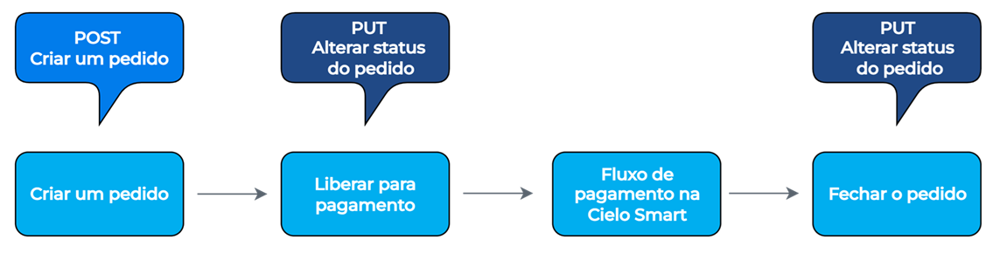

A API Order Manager da Cielo oferece os seguintes recursos: 

- Utiliza semântica REST, permitindo acesso via chamadas HTTP padrão. 
- Retorna [códigos de status HTTP](https://developercielo.github.io/manual/cielo-lio#c%C3%B3digos-http) para indicar sucesso ou erro nas requisições. 
- Todas as [requisições e respostas](https://developercielo.github.io/manual/cielo-lio#api-docs) são estruturadas no formato JSON, garantindo simplicidade e compatibilidade.

### Status do pedido

Durante o ciclo de vida de um pedido, ele pode assumir os seguintes status:

| **Código** | **Status**    | **Descrição**                                                                 |
|------------|---------------|--------------------------------------------------------------------------------|
| 0        | `Draft`       | Pedido criado, mas ainda não finalizado ou enviado.                           |
| 1        | `Entered`     | Pedido registrado no sistema e aguardando processamento.                      |
| 2        | `Paid`        | Pedido foi pago e está pronto para ser processado ou entregue.                |
| 3        | `Closed`      | Pedido finalizado, sem ações pendentes.                                       |
| 4        | `Re-entered`  | Pedido foi modificado ou reenviado após uma alteração. Foi marcado como Paid ou Closed e voltou para Entered.  |


  

## Exemplo de código 

Você pode acessar o [exemplo de código](https://github.com/cielolabsbr/SampleAutomacaoComercial1.2) da integração entre a Automação Comercial e a API Order Manager da Cielo diretamente no GitHub. Esse exemplo demonstra como conectar sistemas de automação de vendas com a plataforma da Cielo, permitindo o gerenciamento de pedidos de forma eficiente e integrada. 


## API Docs

Aqui, você encontra todas as informações necessárias sobre endpoints, entidades e recursos disponíveis na API Order Manager da Cielo. É possível consultar os dados de entrada, exemplos de requisições e os dados de saída, além de compreender o fluxo básico de utilização da API.

### Ambientes: Produção e Sandbox

Para realizar testes com a API da Cielo Smart, você pode utilizar o ambiente Sandbox, que não exige o número do estabelecimento nem a posse de um terminal. Basta criar uma conta no portal da Cielo e [gerar seu Client-ID para obter os tokens de acesso](https://developercielo.github.io/manual/cielo-lio#autentica%C3%A7%C3%A3o-e-credenciais96).  

Já o ambiente de Produção é integrado ao sistema da Cielo, sendo utilizado para operações reais que não podem ser desfeitas. 

Já fez os testes em Sandbox e deseja solicitar os tokens? [Acesse esse link](https://devcielo.zendesk.com/hc/pt-br/requests/new?ticket_form_id=526108) e selecione a opção **Token Integração Remota**. Você deve preencher o formulário com seus dados pessoais e o número do estabelecimento, além de possuir uma Cielo Smart ativa. 

| Ambiente   | URL Base                                                                 |
|------------|--------------------------------------------------------------------------|
| Sandbox    | `https://api.cielo.com.br/sandbox-lio/order-management/v1`              |
| Produção   | `https://api.cielo.com.br/order-management/v1`                          |

Todas as chamadas devem ser executadas utilizando as respectivas credenciais dos ambientes de Sandbox e Produção.


### Arquitetura da API

O modelo empregado na integração das APIs é simples. Para executar uma operação: 

**1**. Combine a base da URL do ambiente com o endpoint da operação desejada.<br/>
<br/>
Ex.: `https://api.cielo.com.br/order-management/v1/orders` 

**2**. Envie a requisição para a URL utilizando o método HTTP adequado à operação.

| **Método HTTP** | **Descrição**                                                                 |
|-----------------|--------------------------------------------------------------------------------|
| GET         | Retorna recursos já existentes, ex.: consulta de um pedido.                   |
| POST        | Cria um novo recurso, ex.: criação de um pedido.                              |
| PUT         | Atualiza um recurso existente, ex.: atualiza um item em um pedido.            |
| DELETE      | Exclui um recurso, ex.: exclui um item de um pedido.                          |


Todas a operações requerem as credenciais de acesso Client-ID, Merchant ID e Access token, que devem ser enviadas no [cabeçalho da requisição](https://developercielo.github.io/manual/cielo-lio#http-headers). 

Cada envio de requisição irá retornar um código de [Status HTTP](https://developercielo.github.io/manual/cielo-lio#c%C3%B3digos-http), indicando se ela foi realizada com sucesso ou não. 


### HTTP Headers

Todas as chamadas da API Integração Remota Order Manager necessitam que as informações abaixo estejam presentes no header na requisição:

- **Client-ID**: Identificador único de acesso à API. É gerado automaticamente no momento da criação do Client-ID no painel do desenvolvedor.  
- **Access Token**: Token que define as permissões de acesso associadas ao Client-ID. Também é gerado durante a criação do Client-ID no painel do desenvolvedor.   
- **Merchant ID**: Identificador do estabelecimento comercial no servidor da Cielo Order Manager. É gerado junto com o cadastro do Client-ID. <br/>
<br/>

A seguir, você aprende como registrar e consultar credenciais de autenticação. 

### Autenticação e credenciais

Para integrar sua aplicação com os serviços da Cielo, é necessário obter credenciais de autenticação, como o Client-ID, Merchant ID e o Access Token. Essas credenciais são essenciais para garantir a segurança e a identificação da sua aplicação durante a comunicação com as APIs da Cielo. 

<aside style="background-color: #d4edda; padding: 15px; border-left: 5px solid #28a745; color: #155724;margin-top: 20px; margin-bottom: 20px;"> As credenciais de autenticação da integração remota geradas no Portal de Desenvolvedores funcionam apenas no ambiente Sandbox. Para usar em Produção, será preciso gerar o token (merchant ID) de cada estabelecimento comercial (EC), já que cada um tem seu próprio identificador. Para gerar um merchant ID, entre em contato com o time de suporte e faça sua solicitação. </aside>

Todo o processo de cadastro é feito pelo Portal de Desenvolvedores da Cielo. Siga os passos abaixo: 

**1**. Acesse o [Portal de desenvolvedores](https://desenvolvedores.cielo.com.br/) e [clique aqui](https://desenvolvedores.cielo.com.br/api-portal/pt-br/myapps/new) para ir diretamente para a página de cadastro de aplicativo.

**2**. Preencha os campos obrigatórios, incluindo: **Ícone do aplicativo**, **Nome**, **Descrição**. <br/>

**3**. No campo **API Disponível**, selecione **Cielo Smart - Order Manager** para realizar a integração remota.    

**4**. Clique em **Registrar** para concluir o processo. 


**Consultando credenciais de autenticação**

Agora que você registrou suas credenciais de autenticação, você pode consultá-las clicando em **Perfil > Client-IDs Cadastrados**.


Você será redirecionado para uma tela que exibirá o **Client-ID** e o **Access Token**. 


### Códigos HTTP 

Os códigos do padrão HTTP, retornados como resposta à requisição feita para a API, informam se as informações enviadas à API estão de fato obtendo sucesso ao atingir nossos endpoints.

| Código | Erro                  | Descrição                                                                                |
| ------ | --------------------- | ---------------------------------------------------------------------------------------- |
| 200    | OK                    | Operação realizada com sucesso                                                          |
| 201    | Created               | A solicitação foi realizada, resultando na criação de um novo recurso                   |
| 204    | Empty                 | Operação realizada com sucesso, mas nenhuma resposta foi retornada                      |
| 400    | Bad Request           | A requisição possui parâmetro(s) inválido(s)                                            |
| 401    | Unauthorized          | O token de acesso não foi informado ou não possui acesso às APIs                        |
| 403    | Forbidden             | O acesso ao recurso foi negado                                                          |
| 404    | Not Found             | O recurso informado no request não foi encontrado                                       |
| 413    | Request is to Large   | A requisição está ultrapassando o limite permitido para o perfil do seu token de acesso |
| 422    | Unprocessable Entity  | A requisição possui parâmetros obrigatórios não informados                              |
| 429    | Too Many Requests     | O limite de requisições por tempo foi ultrapassado                                 |
| 500    | Internal Server Error | Erro não esperado. Algo está quebrado na API                                             |

### Entidades

As entidades representam os principais objetos de dados utilizados na comunicação com a API da Integração Remota da Cielo Smart. Elas definem a estrutura das informações que são enviadas e recebidas durante as operações de pedidos e pagamentos. 

Em seguida, você aprende os atributos específicos de cada entidade. 

#### Order

A Order é uma representação de um pedido para a venda de um ou mais produtos e/ou serviços. É fundamental que exista uma Order para que um pagamento seja realizado na Cielo Smart.

| Campo        | Tipo                | Descrição                                                                                                                                 | Obrigatório     |
| ------------ | ------------------- | ----------------------------------------------------------------------------------------------------------------------------------------- | --------------- |
| `id`           | String               | UUID que identifica unicamente o pedido                                                                                                  | Criado pela API |
| `number`       | String               | Número do pedido. Geralmente, esse número representa o identificador do pedido em um sistema externo através da integração com parceiros | Não             |
| `reference`    | String               | Referência do pedido. Utilizada para facilitar seu acesso ou localização                                                        | Não             |
| `status`       | String               | Status do pedido (ENTERED, RE-ENTERED, PAID, CANCELED e CLOSED)                                                                          | Sim             |
| `created_at`   | String               | Data de criação do pedido. A data deve estar no formato: YYYY-MM-DDThh:mm:ssZ (Exemplo: 20151020T13:13:29.000Z)                          | Criado pela API |
| `updated_at`   | String               | Data da última atualização do pedido. A data deve estar no formato: YYYY-MM-DDThh:mm:ssZ (Exemplo: 20151020T13:13:29.000Z)               | Criado pela API |
| `items`        | Array - [Order Item](https://developercielo.github.io/manual/cielo-lio#order-item)  | Lista de itens contidos no pedido                                                                                                        | Sim             |
| `notes`        | String               | Campo disponível para uso do Merchant                                                                                   | Não             |
| `transactions` | Array - [Transaction](https://developercielo.github.io/manual/cielo-lio#transaction) | Lista de transações de pagamento (ou outros tipos) efetuadas no pedido                                                                   | Sim             |
| `price`        | Number              | Valor total do pedido em centavos. Exemplo: O valor R$ 10,00 é representado como 1000                                                            | Sim             |
| `remaining`    | Number              | Valor restante do pagamento do pedido em centavos. Exemplo: O valor R$ 10,00 é representado como 1000                                             | Sim             |
| `payment_code`    | String              |  Forma de pagamento estabelecida na criação do pedido. Caso não seja informado, será necessário escolher a forma no POS. Funcionalidade indisponível para LIO                                           | Não             |

#### Order Item

O Order Item é uma representação dos itens presentes em uma [Order](https://developercielo.github.io/manual/cielo-lio#order). 

<aside style="background-color: #f8d7da; padding: 15px; border-left: 5px solid #dc3545; color: #721c24;margin-top: 20px; margin-bottom: 20px;"> É obrigatória a existência de, no mínimo, um item para uma Order. </aside>


| Campo           | Tipo   | Descrição                                                                                                                   | Obrigatório |
| --------------- | ------ | --------------------------------------------------------------------------------------------------------------------------- | ----------- |
| `sku`             | String  | SKU do produto. Exemplo: c2f5fb9a-5542-406e-8b79-17892329cda8                                                              | Sim         |
| `name`            | String  | Nome do produto                                                                                                            | Não         |
| `description`     | String  | Descrição do produto                                                                                                       | Não         |
| `unit_price`      | Number | Valor unitário do produto em centavos. Exemplo: O valor R$ 10,00 é representado como 1000                                           | Sim         |
| `quantity`        | Number | Quantidade de itens. Caso não seja informado, será considerado o valor 1                                                   | Não         |
| `unit_of_measure` | String  | Unidade de medida (EACH, HOURS, DAYS, SECONDS, CRATE_OF_12, SIX_PACK, GALLON e LITRE)                                      | Sim         |
| `details`         | String  | Detalhes do produto                                                                                                        | Não         |
| `created_at`      | String  | Data de criação do pedido. A data deve estar no formato: YYYY-MM-DDThh:mm:ssZ (Exemplo: 20151020T13:13:29.000Z)            | Não         |
| `updated_at`      | String  | Data de última atualização do pedido. A data deve estar no formato: YYYY-MM-DDThh:mm:ssZ (Exemplo: 20151020T13:13:29.000Z) | Sim         |

#### Transaction

A Transaction é uma representação com todos os pagamentos que foram realizados em uma Order. O objetivo é utilizá-la para consultar os pagamentos (transactions) que foram efetuados em uma Order.

| Campo              | Tipo   | Descrição                                                                  | Obrigatório |
| ------------------ | ------ | -------------------------------------------------------------------------- | ----------- |
| `id`                 | String  | UUID que identifica unicamente a transação                              | Sim         |
| `external_id`        | String  | Identificador unico ordem                                                 | Sim         |
| `status`             | String  | Status da transação (CONFIRMED, PENDING e CANCELLED)                      | Sim         |
| `terminal_number`    | Number | Número do terminal da Cielo Smart em que o pagamento foi realizado          | Sim         |
| `authorization_code` | Number | Código de autorização da transação                                        | Sim         |
| `number`             | String  | Número Sequencial Único (NSU) da transação                                | Sim         |
| `amount`             | Number | Valor da transação em centavos. Exemplo: O valor de R$ 10,00 é representado como 1000 | Sim         |
| `transaction_type`   | String  | Tipo da transação (PAYMENT e CANCELLATION)                                | Sim         |

#### Card

O Card é uma representação do cartão que foi utilizado para realizar o pagamento/transação.

| Campo | Tipo   | Descrição                           | Obrigatório |
| ----- | ------ | ----------------------------------- | ----------- |
| `brand` | String  | Bandeira do cartão (VISA e MASTER). | Sim         |
| `mask`  | Number | Número do cartão mascarado          | Sim         |

#### Payment Product

O Payment Product é uma representação da forma de pagamento utilizada para realizar um pagamento.
Ex.: Crédito, Débito, etc.

| Campo                  | Tipo   | Descrição                                                    | Obrigatório |
| ---------------------- | ------ | ------------------------------------------------------------ | ----------- |
| `primary_product_name`   | String  | Forma de pagamento (CREDITO ou DEBITO)                       | Sim         |
| `secondary_product_name` | String  | Tipo de pagamento (A VISTA, PARCELADO LOJA ou PARCELADO ADM) | Sim         |
| `number_of_quotas`       | Number | Número de parcelas (0 para pagamentos à vista)               | Sim         |

### Recursos

Antes de mergulhar na documentação das APIs, abaixo você encontra um diagrama que ilustra como cada elemento se conecta e interage. Isso facilita a compreensão do fluxo e acelera a integração com os recursos disponíveis.

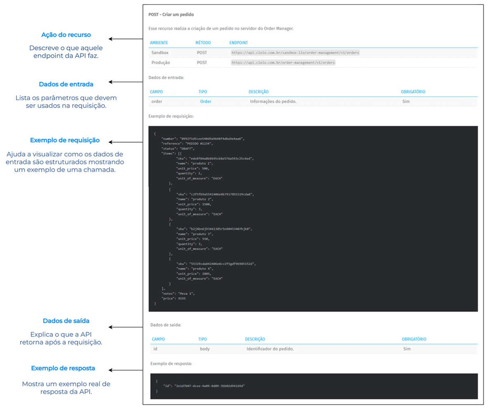

A seguir, você explora os recursos disponíveis para realizar operações como vendas, cancelamentos e consultas.

#### POST - Criar um pedido

Esse recurso realiza a criação de um pedido no servidor do Order Manager.

| Ambiente | Método | Endpoint                                                                |
|----------|--------|-------------------------------------------------------------------------|
| Sandbox  | POST   | `https://api.cielo.com.br/sandbox-lio/order-management/v1/orders`       |
| Produção | POST   | `https://api.cielo.com.br/order-management/v1/orders`                   |


Dados de entrada:

| Campo | Tipo  | Descrição              | Obrigatório |
| ----- | ----- | ---------------------- | ----------- |
| `order` | [Order](https://developercielo.github.io/manual/cielo-lio#order) | Informações do pedido. | Sim         |

Exemplo de requisição:

```
{
    "number": "0992f1d5cee540d9a9648f4d6a9e4aa6",
    "reference": "PEDIDO #1234",
    "status": "DRAFT",
    "items": [{
            "sku": "ede8f84a8b8645cb8e576a593c25c6ed",
            "name": "produto 1",
            "unit_price": 500,
            "quantity": 2,
            "unit_of_measure": "EACH"
        },
        {
            "sku": "c2f5fb9a5542406e8b7917892329cda8",
            "name": "produto 2",
            "unit_price": 1500,
            "quantity": 3,
            "unit_of_measure": "EACH"
        },
        {
            "sku": "b2j4bn6j93461385r5n90453407hjk0",
            "name": "produto 3",
            "unit_price": 550,
            "quantity": 3,
            "unit_of_measure": "EACH"
        },
        {
            "sku": "55329cda842406e8cv2f5gdf96985152d",
            "name": "produto 4",
            "unit_price": 2005,
            "unit_of_measure": "EACH"
        }
    ],
    "notes": "Mesa 1",
    "price": 9155
}
```

Dados de saída:

| Campo | Tipo | Descrição                | Obrigatório |
| ----- | ---- | ------------------------ | ----------- |
| `id`    | body | Identificador do pedido | Sim         |

Exemplo de resposta:

```
{
    "id": "2e1d7b07-dcee-4a09-8d09-3bb02d94169d"
}
```

#### POST - Criar um pedido novo (parâmetro PaymentCode)


Na maioria dos terminais Cielo Smart, ao criar um pedido, é possível enviar a forma de pagamento previamente definida para ele. 

<aside style="background-color: #d4edda; padding: 15px; border-left: 5px solid #28a745; color: #155724;margin-top: 20px; margin-bottom: 20px;"> Na interface da LIO, o pedido será exibido com a forma de pagamento já selecionada, facilitando o processo e reduzindo erros. </aside>

A forma de pagamento é envida no campo `payment_code`. Abaixo, você encontra a lista completa dos tipos de pagamento.

| Ambiente | Método | Endpoint                                                                |
|----------|--------|-------------------------------------------------------------------------|
| Sandbox  | POST   | `https://api.cielo.com.br/sandbox-lio/order-management/v1/orders`       |
| Produção | POST   | `https://api.cielo.com.br/order-management/v1/orders`                   |

Exemplo de requisição:

```
{
    "number": "0992f1d5cee540d9a9648f4d6a9e4aa6",
    "reference": "PEDIDO #1234",
    “payment_code”: "DEBITO_AVISTA",
    "status": "DRAFT",
    "items": [{
            "sku": "ede8f84a8b8645cb8e576a593c25c6ed",
            "name": "produto 1",
            "unit_price": 500,
            "quantity": 2,
            "unit_of_measure": "EACH"
        },
        {
            "sku": "c2f5fb9a5542406e8b7917892329cda8",
            "name": "produto 2",
            "unit_price": 1500,
            "quantity": 3,
            "unit_of_measure": "EACH"
        },
        {
            "sku": "b2j4bn6j93461385r5n90453407hjk0",
            "name": "produto 3",
            "unit_price": 550,
            "quantity": 3,
            "unit_of_measure": "EACH"
        },
        {
            "sku": "55329cda842406e8cv2f5gdf96985152d",
            "name": "produto 4",
            "unit_price": 2005,
            "unit_of_measure": "EACH"
        }
    ],
    "notes": "Mesa 1",
    "price": 9155
}
```

Dados de saída:

| Campo | Tipo | Descrição                | Obrigatório |
| ----- | ---- | ------------------------ | ----------- |
| `id`    | body | Identificador do pedido | Sim         |

Exemplo de resposta:

```
{
    "id": "2e1d7b07-dcee-4a09-8d09-3bb02d94169d"
}
```

**Valores aceitos no campo paymentCode**

[Clique aqui](https://developercielo.github.io/manual/cielo-lio#valores-aceitos-no-campo-paymentcode) para conferir a lista completa de valores aceitos no campo paymentCode, que devem ser utilizados na configuração da requisição de pagamento conforme o tipo de transação desejada.

#### GET - Consultar um pedido

Esse recurso é utilizado para obter informações sobre um pedido específico. O id do pedido é utilizado para realizar a chamada.

| Ambiente | Método | Endpoint                                                                |
|----------|--------|-------------------------------------------------------------------------|
| Sandbox  | GET   | `https://api.cielo.com.br/sandbox-lio/order-management/v1/orders/{id}`       |
| Produção | GET   | `https://api.cielo.com.br/order-management/v1/orders/{id}`                   |


Dados de entrada:

| Campo | Tipo           | Descrição                | Obrigatório |
| ----- | -------------- | ------------------------ | ----------- |
| `id`    | path parameter | Identificador do pedido | Sim         |

Exemplo de requisição:

> **GET** https://api.cielo.com.br/order-management/v1/orders/c393ce9f-3741-413f-8ad5-2f142eaed51f

Dados de saída:

| Campo | Tipo  | Descrição                              | Obrigatório |
| ----- | ----- | -------------------------------------- | ----------- |
| `order` | [Order](https://developercielo.github.io/manual/cielo-lio#order) | Informações sobre o pedido consultado. | Não         |

Exemplo de resposta:

```
{
    {
    "id": "b4d8a7dc-4250-48a3-bf18-d560d4508368",
    "number": "0992f1d5-cee5-40d9-a964-8f4d6a9e4aa6",
    "reference": "LOJA SUCO #1",
    "status": "ENTERED",
    "notes": "Mesa 6",
    "price": 5250,
    "created_at": "2016-09-06T19:09:49Z",
    "updated_at": "2016-09-06T19:09:49Z",
    "order_type": "PAYMENT",
    "merchant": "0010920335960001",
    "source_id": "4QeQD63ZeKsz",
    "items": [{
            "id": "0687f00a-0aea-48f7-85d0-64bc31977734",
            "sku": "0000001",
            "name": "Suco Detox",
            "unit_price": 800,
            "quantity": 1,
            "unit_of_measure": "EACH"
        },
        {
            "id": "cf561196-4e4c-436b-816b-80190e9a705f",
            "sku": "0000010",
            "name": "Suco de Uva",
            "unit_price": 450,
            "quantity": 5,
            "unit_of_measure": "EACH"
        },
        {
            "id": "16b4b10b-9967-477b-91a2-ecc02e6ff40c",
            "sku": "0000011",
            "name": "Suco de Tomate",
            "unit_price": 500,
            "quantity": 2,
            "unit_of_measure": "EACH"
        },
        {
            "id": "8500c747-1740-47cf-908a-3ab0f8b44193",
            "sku": "0000100",
            "name": "Suco de Abacaxi",
            "unit_price": 400,
            "quantity": 3,
            "unit_of_measure": "EACH"
        }
    ],
    "transactions": []
    }
}
```

#### GET - Consultar todos os pedidos

Esse recurso é utilizado para obter a lista e as informações de todos os pedidos cadastrados no Order Manager.


| Ambiente | Método | Endpoint                                                                |
|----------|--------|-------------------------------------------------------------------------|
| Sandbox  | GET   | `https://api.cielo.com.br/sandbox-lio/order-management/v1/orders`       |
| Produção | GET   | `https://api.cielo.com.br/order-management/v1/orders`                   |

Dados de entrada:

| Campo           | Tipo            | Descrição                                                       | Obrigatório |
| --------------- | --------------- | --------------------------------------------------------------- | ----------- |
| `merchant_id`     | query parameter | Token que identifica o estabelecimento comercial                | Não         |
| `number`          | query parameter | Número do pedido                                                | Não         |
| `reference`       | query parameter | Referência definida na criação do pedido                        | Não         |
| `status`          | query parameter | Status do pedido (ENTERED, RE-ENTERED, PAID, CANCELED e CLOSED) | Não         |
| `terminal_number` | query parameter | Número lógico                                                   | Não         |
| `page`            | query parameter | Número da página requistada (iniciando em 0)                    | Não         |
| `page_size`       | query parameter | Quantidade de items por página                                  | Não         |
| `last_query_date` | query parameter | Data inicial                                                    | Não         |

Exemplo de requisição:

> **GET** https://api.cielo.com.br/order-management/v1/orders/

Dados de saída:

| Campo | Tipo  | Descrição                              | Obrigatório |
| ----- | ----- | -------------------------------------- | ----------- |
| order | [Order](https://developercielo.github.io/manual/cielo-lio#order) | Informações sobre o pedido consultado. | Não         |

Exemplo de resposta:

```
{
    "id": "b4d8a7dc-4250-48a3-bf18-d560d4508368",
    "number": "0992f1d5-cee5-40d9-a964-8f4d6a9e4aa6",
    "reference": "LOJA SUCO #1",
    "status": "ENTERED",
    "notes": "Mesa 6",
    "price": 5250,
    "created_at": "2016-09-06T19:09:49Z",
    "updated_at": "2016-09-06T19:09:49Z",
    "order_type": "PAYMENT",
    "merchant": "0010920335960001",
    "source_id": "4QeQD63ZeKsz",
    "items": [{
            "id": "0687f00a-0aea-48f7-85d0-64bc31977734",
            "sku": "0000001",
            "name": "Suco Detox",
            "unit_price": 800,
            "quantity": 1,
            "unit_of_measure": "EACH"
        },
        {
            "id": "cf561196-4e4c-436b-816b-80190e9a705f",
            "sku": "0000010",

            "name": "Suco de Uva",
            "unit_price": 450,
            "quantity": 5,
            "unit_of_measure": "EACH"
        },
        {
            "id": "16b4b10b-9967-477b-91a2-ecc02e6ff40c",
            "sku": "0000011",
            "name": "Suco de Tomate",
            "unit_price": 500,
            "quantity": 2,
            "unit_of_measure": "EACH"
        },
        {
            "id": "8500c747-1740-47cf-908a-3ab0f8b44193",
            "sku": "0000100",
            "name": "Suco de Abacaxi",
            "unit_price": 400,
            "quantity": 3,
            "unit_of_measure": "EACH"
        }
    ],
    "transactions": []
}
```

Na consulta de pedidos, é possível informar os parâmetro acima citados, para identificar as ordens criadas conforme mostrado no exemplo abaixo:

```
https://api.cielo.com.br/order-management/v1/orders/?reference=EXEMPLO_DE_REFERENCE
```

#### PUT - Alterar status de um pedido

Esse recurso realiza a alteração do status de um pedido criado. O `id` do pedido é utilizado para realizar a chamada.

As possíveis alterações de status são:

- **PLACE**: Liberar um pedido para pagamento, exibindo pedido na Cielo Smart.
- **PAY**: Alterar um pedido para pago.
- **CLOSE**: Fechar um pedido.<br/>
<br/>

| Ambiente | Método | Endpoint                                                                |
|----------|--------|-------------------------------------------------------------------------|
| Sandbox  | PUT   | `https://api.cielo.com.br/sandbox-lio/order-management/v1/orders/{id}?operation={operation}`       |
| Produção | PUT   | `https://api.cielo.com.br/order-management/v1/orders/{id}?operation={operation}`                   |

Dados de entrada:

| Campo     | Tipo            | Descrição                                                                                                                                                           | Obrigatório |
| --------- | --------------- | ------------------------------------------------------------------------------------------------------------------------------------------------------------------- | ----------- |
| `id`        | path parameter  | Identificador do pedido                                                                                                                                            | Sim         |
| `operation` | query parameter | Operação que deve ser executada. As possíveis operações são: PLACE (liberar um pedido para pagamento), PAY (alterar um pedido para pago) e CLOSE (fechar um pedido) | Sim         |

Exemplo de requisição:

> **PUT** https://api.cielo.com.br/order-management/v1/orders/db815e66-e5b6-497c-8444-2120cc87d33a?operation=PLACE

Dados de saída:

| Campo | Tipo | Descrição | Obrigatório |
| ----- | ---- | --------- | ----------- |
| N/A   |      |           |             |

Exemplo de resposta:

```
N/A
```

O retorno 200 dessa operação representa sucesso na requisição.

#### DELETE - Excluir um pedido

Esse recurso é utilizado para excluir um pedido do servidor do Order Manager. O `id` do pedido é utilizado para realizar a chamada.

<aside style="background-color: #d4edda; padding: 15px; border-left: 5px solid #28a745; color: #155724;margin-top: 20px; margin-bottom: 20px;"> Somente os pedidos com status Draft podem ser excluídos. </aside>


| Ambiente | Método | Endpoint                                                                |
|----------|--------|-------------------------------------------------------------------------|
| Sandbox  | DELETE   | `https://api.cielo.com.br/sandbox-lio/order-management/v1/orders/{id}`       |
| Produção | DELETE   | `https://api.cielo.com.br/order-management/v1/orders/{id}`                   |


Dados de entrada:

| Campo | Tipo           | Descrição                | Obrigatório |
| ----- | -------------- | ------------------------ | ----------- |
| `id`    | path parameter | Identificador do pedido | Sim         |

Exemplo de requisição:

> **DELETE** https://api.cielo.com.br/order-management/v1/orders/db815e66-e5b6-497c-8444-2120cc87d33a

Dados de saída:

| Campo | Tipo | Descrição | Obrigatório |
| ----- | ---- | --------- | ----------- |
| N/A   |      |           |             |

Exemplo de resposta:

```
N/A
```

O retorno 200 dessa operação representa sucesso na requisição.

#### POST - Adicionar itens em um pedido

Esse recurso é utilizado para adicionar um ou mais itens em um pedido já criado. O `id` do pedido é utilizado para realizar a chamada.

<aside style="background-color: #d4edda; padding: 15px; border-left: 5px solid #28a745; color: #155724;margin-top: 20px; margin-bottom: 20px;"> Somente os pedidos com status Draft podem ter adição de itens. </aside>

| Ambiente | Método | Endpoint                                                                |
|----------|--------|-------------------------------------------------------------------------|
| Sandbox  | POST   | `https://api.cielo.com.br/sandbox-lio/order-management/v1/orders/{id}/items`       |
| Produção | POST   | `https://api.cielo.com.br/order-management/v1/orders/{id}/items`                   |

Dados de entrada:

| Campo | Tipo           | Descrição                | Obrigatório |
| ----- | -------------- | ------------------------ | ----------- |
| `id`    | path parameter | Identificador do pedido | Sim         |

Exemplo de requisição:

```
{
    "sku": "ede8f84a8b8645cb8e576a593c25c6ed",
    "name": "produto 1"
    "unit_price": 500,
    "quantity": 2,
    "unit_of_measure": "EACH"
}
```

Dados de saída:

| Campo | Tipo | Descrição | Obrigatório |
| ----- | ---- | --------- | ----------- |
| N/A   |      |           |             |

Exemplo de resposta:

```
N/A
```

O retorno 200 dessa operação representa sucesso na requisição.

#### GET - Consultar os itens de um pedido

Esse recurso é utilizado para consultar os itens presentes em um pedido. O `id` do pedido é utilizado para realizar a chamada.

| Ambiente | Método | Endpoint                                                                |
|----------|--------|-------------------------------------------------------------------------|
| Sandbox  | GET   | `https://api.cielo.com.br/sandbox-lio/order-management/v1/orders/{id}/items`       |
| Produção | GET   | `https://api.cielo.com.br/order-management/v1/orders/{id}/items`                   |

Dados de entrada:

| Campo | Tipo           | Descrição                | Obrigatório |
| ----- | -------------- | ------------------------ | ----------- |
| `id`    | path parameter | Identificador do pedido | Sim         |

Exemplo de requisição:

> **GET** https://api.cielo.com.br/order-management/v1/orders/c393ce9f-3741-413f-8ad5-2f142eaed51f/items

Dados de saída:

| Campo      | Tipo              | Descrição                    | Obrigatório |
| ---------- | ----------------- | ---------------------------- | ----------- |
| `orderItems` | Array - [OrderItem](https://developercielo.github.io/manual/cielo-lio#order-item) | Lista de itens de um pedido. | Sim         |

Exemplo de resposta:

```
[
   {
        "id": 1,
        "sku": "ede8f84a8b8645cb8e576a593c25c6ed",
        "name": "produto 1"
        "unit_price": 500,
        "quantity": 2,
        "unit_of_measure": "EACH"
    },
    {
        "id": 2,
        "sku": "c2f5fb9a5542406e8b7917892329cda8",
        "name": "produto 1"
        "unit_price": 1500,
        "quantity": 3,
        "unit_of_measure": "EACH"
    }
]
```

#### PUT - Alterar um item em um pedido

Esse recurso permite alterar informações de um item de um pedido. O `id` do pedido e o `id_item` são utilizados para realizar a chamada.

<aside style="background-color: #d4edda; padding: 15px; border-left: 5px solid #28a745; color: #155724;margin-top: 20px; margin-bottom: 20px;"> Somente os pedidos com status Draft podem ter itens alterados. </aside>

| Ambiente | Método | Endpoint                                                                |
|----------|--------|-------------------------------------------------------------------------|
| Sandbox  | PUT   | `https://api.cielo.com.br/sandbox-lio/order-management/v1/orders/{id}/items/{id_item}`       |
| Produção | PUT   | `https://api.cielo.com.br/order-management/v1/orders/{id}/items/{id_item}`                   |

Dados de entrada:

| Campo   | Tipo           | Descrição                        | Obrigatório |
| ------- | -------------- | -------------------------------- | ----------- |
| `id`      | path parameter | Identificador do pedido         | Sim         |
| `id_item` | path parameter | Identificador do item do pedido | Sim         |

Exemplo de requisição:

> **PUT** https://api.cielo.com.br/order-management/v1/orders/a9398720-9f78-4fa4-a5d4-ba54ba8009e7
> /items/8484df74-eca6-4850-8e4c-35653af0bd31

```
{
    "sku": "ede8f84a8b8645cb8e576a593c25c6ed",
    "unit_price": 500,
    "quantity": 2,
    "unit_of_measure": "EACH"
}
```

Dados de saída:

| Campo | Tipo | Descrição | Obrigatório |
| ----- | ---- | --------- | ----------- |
| N/A   |      |           |             |

O retorno 200 dessa operação representa sucesso na requisição.

#### DELETE - Excluir item de um pedido

Esse recurso é utilizado para excluir um item presente em um pedido. O `id` do pedido e o `id_item` são utilizados para realizar a chamada.

<aside style="background-color: #d4edda; padding: 15px; border-left: 5px solid #28a745; color: #155724;margin-top: 20px; margin-bottom: 20px;"> Somente os pedidos com status Draft podem ter itens alterados. </aside>

| Ambiente | Método | Endpoint                                                                |
|----------|--------|-------------------------------------------------------------------------|
| Sandbox  | DELETE   | `https://api.cielo.com.br/sandbox-lio/order-management/v1/orders/{id}/items/{id_item}`       |
| Produção | DELETE   | `https://api.cielo.com.br/order-management/v1/orders/{id}/items/{id_item}`                   |


Dados de entrada:

| Campo   | Tipo           | Descrição                        | Obrigatório |
| ------- | -------------- | -------------------------------- | ----------- |
| `id`      | path parameter | Identificador do pedido         | Sim         |
| `id_item` | path parameter | Identificador do item do pedido | Sim         |

Exemplo de requisição:

> **DELETE** https://api.cielo.com.br/order-management/v1/orders/a9398720-9f78-4fa4-a5d4-ba54ba8009e7/items/8484df74-eca6-4850-8e4c-35653af0bd31

Dados de saída:

| Campo | Tipo | Descrição | Obrigatório |
| ----- | ---- | --------- | ----------- |
| N/A   |      |           |             |

O retorno 200 dessa operação representa sucesso na requisição.

#### POST - Adicionar uma transação

<aside style="background-color: #d4edda; padding: 15px; border-left: 5px solid #28a745; color: #155724;margin-top: 20px; margin-bottom: 20px;"> Recurso utilizado somente para Ambiente de Sandbox. </aside>

Esse recurso permite que o desenvolvedor simule as transações financeiras, adicionando-as manualmente, sendo possível entender o funcionamento em uma Order.

| Ambiente | Método | Endpoint                                                                |
|----------|--------|-------------------------------------------------------------------------|
| Sandbox  | POST   | `https://api.cielo.com.br/sandbox-lio/order-management/v1/orders/{id}/transactions`       |
| Produção | POST   | `https://api.cielo.com.br/order-management/v1/orders/{id}/transactions}`                   |


Dados de entrada:

| Campo        | Tipo                | Descrição                | Obrigatório |
| ------------ | ------------------- | ------------------------ | ----------- |
| `transactions` | Array - [Transaction](https://developercielo.github.io/manual/cielo-lio#transaction) | Informações da Transação | Sim         |

Exemplo de requisição:

> **POST** https://api.cielo.com.br/order-management/v1/orders/a9398720-9f78-4fa4-a5d4-ba54ba8009e7/transactions

```
{
  "external_id": "0b37f0d8-017a-4b11-91b9-ec1bb3e8fed3",
  "status": "CONFIRMED",
  "terminal_number": "12345678",
  "authorization_code": "008619",
  "number": "672836",
  "amount": 2000,
  "transaction_type": "PAYMENT",
  "paymentFields": {
    "primaryProductName": "CREDITO",
    "secondaryProductName": "A VISTA",
    "numberOfQuotas": 0
  },
  "card": {
  "brand": "VISA",
  "mask": "******5487"
  }
}
```

Dados de saída:

| Campo | Tipo   | Descrição                  | Obrigatório |
| ----- | ------ | -------------------------- | ----------- |
| `id`    | number | Identificador da transação | Sim         |

```
{
id: "00219dd0-1c13-46da-91e5-1c313f0d2e83"
}
```

Em ambiente de Sandbox não há necessidade de utilizar um terminal Cielo Smart. Consequentemente, não é obrigatório possuir um número do estabelecimento. Nesse contexto, faz sentido realizar a chamada deste recurso. Já em ambiente de Produção, as transações são criadas automaticamente pela própria Cielo Smart, à medida que os pagamentos são efetuados.

#### GET - Consultar as transações de um pedido

Esse recurso é utilizado para obter as informações de todas as transações realizadas em um pedido. O `id` do pedido é utilizado para realizar a chamada.

Em ambiente de produção, uma vez que um pagamento for realizado na Cielo Smart, a `transactions` será adicionada automaticamente no pedido e então, será possível obter as informações do pagamento realizado a partir da chamada deste recurso.

| Ambiente | Método | Endpoint                                                                |
|----------|--------|-------------------------------------------------------------------------|
| Sandbox  | GET   | `https://api.cielo.com.br/sandbox-lio/order-management/v1/orders/{id}/transactions`       |
| Produção | GET   | `https://api.cielo.com.br/order-management/v1/orders/{id}/transactions}`                   |


Dados de entrada:

| Campo | Tipo           | Descrição                | Obrigatório |
| ----- | -------------- | ------------------------ | ----------- |
| `id`    | path parameter | Identificador do pedido | Sim         |

Exemplo de requisição:

> **GET** https://api.cielo.com.br/order-management/v1/orders/c393ce9f-3741-413f-8ad5-2f142eaed51f/transactions

Dados de saída:

| Campo        | Tipo                | Descrição                         | Obrigatório |
| ------------ | ------------------- | --------------------------------- | ----------- |
| `transactions` | Array - [Transaction](https://developercielo.github.io/manual/cielo-lio#transaction) | Lista de transações de um pedido | Sim         |

Exemplo de resposta:

```
[
{
  "id": "442bbdbe-41c8-4e22-83ee-e1a849ed3cb5",
  "external_id": "0b37f0d8-017a-4b11-91b9-ec1bb3e8fed3",
  "status": "CONFIRMED",
  "terminal_number": "77102648",
  "authorization_code": "008619",
  "number": "672836",
  "amount": 2000,
  "transaction_type": "PAYMENT",
  "payment_fields": {
  "primary_product_name": "CREDITO",
  "secondary_product_name": "A VISTA",
    "number_of_quotas": 0
  },
  "card": {
    "brand": "VISA",
    "mask": "************3542"
  }
}
]
```

#### GET - Consultar as transações canceladas de um pedido

Esse recurso é utilizado para obter as informações de todas as transações canceladas em um pedido. O `id` do pedido é utilizado para realizar a chamada.

Em ambiente de Produção, uma vez que o cancelamento for realizado na Cielo Smart, a `transactions` será adicionada automaticamente no pedido juntamente com a transaction do pagamento original.

| Ambiente | Método | Endpoint                                                                |
|----------|--------|-------------------------------------------------------------------------|
| Sandbox  | GET   | `https://api.cielo.com.br/sandbox-lio/order-management/v1/orders/{id}/transactions`       |
| Produção | GET   | `https://api.cielo.com.br/order-management/v1/orders/{id}/transactions}`                   |


Dados de entrada:

| Campo | Tipo           | Descrição                | Obrigatório |
| ----- | -------------- | ------------------------ | ----------- |
| `id`    | path parameter | Identificador do pedido | Sim         |

Exemplo de requisição:

> **GET** https://api.cielo.com.br/order-management/v1/orders/c393ce9f-3741-413f-8ad5-2f142eaed51f/transactions

Dados de saída:

| Campo        | Tipo                | Descrição                         | Obrigatório |
| ------------ | ------------------- | --------------------------------- | ----------- |
	| `transactions` | Array - [Transaction](https://developercielo.github.io/manual/cielo-lio#transaction) | Lista de transações de um pedido | Sim         |

Exemplo de resposta:

```
[
  {
    "id": "46019c39-989e-46e9-aa7d-d8e9414396b4",
    "external_id": "95185.99407021694",
    "status": "CONFIRMED",
    "terminal_number": "77102648",
    "authorization_code": "008619",
    "number": "672837",
    "amount": 2000,
    "transaction_type": "CANCELLATION",
    "payment_fields": {
    "primary_product_name": "CREDITO",
    "secondary_product_name": "A VISTA",
    "number_of_quotas": 0
  },
    "card": {
      "brand": "VISA",
      "mask": "************3542"
    }
  },
  {
    "id": "442bbdbe-41c8-4e22-83ee-e1a849ed3cb5",
    "external_id": "0b37f0d8-017a-4b11-91b9-ec1bb3e8fed3",
    "status": "CONFIRMED",
    "terminal_number": "77102648",
    "authorization_code": "008619",
    "number": "672836",
    "amount": 2000,
    "transaction_type": "PAYMENT",
    "payment_fields": {
    "primary_product_name": "CREDITO",
    "secondary_product_name": "A VISTA",
    "number_of_quotas": 0
   },
    "card": {
    "brand": "VISA",
    "mask": "************3542"
    }
  }
]
```

### Notificações 

A seguir, você encontra tudo o que precisa para configurar e receber notificações sobre pedidos e transações.

#### Notificações de mudanças na Order

Para receber notificações automáticas sobre alterações no status de uma Order, é necessário cadastrar a URL do seu endpoint. Para isso, [entre em contato](https://developercielo.github.io/manual/cielo-lio#suporte-t%C3%A9cnico) com nosso time de Suporte a Desenvolvimento informando o seu endpoint. 

A principal razão para disponibilizarmos a API RESTful do Order Manager é permitir que aplicações parceiras se integrem à plataforma Cielo na nuvem. No entanto, como os pagamentos são realizados localmente na Cielo Smart, é essencial que essas aplicações recebam atualizações sobre o status dos pedidos e transações.

Para isso, você deve expor um backend RESTful capaz de receber notificações no formato especificado abaixo. Após o recebimento, o tratamento das informações pode ser feito conforme o modelo de negócio da aplicação.

<aside style="background-color: #f8d7da; padding: 15px; border-left: 5px solid #dc3545; color: #721c24;margin-top: 20px; margin-bottom: 20px;">  Os campos podem sofrer alterações sem aviso prévio. Recomendamos que o PARSE do JSON seja dinâmico, permitindo a aceitação de novos valores em campos existentes. Por exemplo, o campo brand, que pode vir a receber novas bandeiras no futuro, de forma que o seu backend precisa estar pronto para essa alteração. </aside>

 
##### POST - Notificação de mudança de status

A cada modificação de status em um pedido, o servidor do Order Manager envia, via comando, as informações para o backend do parceiro.

<aside style="background-color: #d4edda; padding: 15px; border-left: 5px solid #28a745; color: #155724;margin-top: 20px; margin-bottom: 20px;"> O backend do parceiro deve possuir o status anterior. </aside>

**Requisição do Order Manager**

> **POST**/url_cadastrada

Exemplo de informação enviada pelo Order Manager

```json
{
	"id":"943f2276-5e2b-44bb-a68a-fd9b6418afa4",
	"items":[
		{
			"id":4389df04-ef19-4217-a969-22cb6e86d8cf",
			""sku"":"1",
			""name"":""TESTE CALLBACK"",
			""uuid"":"438232f04-ef19-4217-a969-22cb6e86d8cf",
			""details"":null,
			""order_id"":943f2276-5e2b-44bb-a68a-fd9b6418afa4",
			"quantity":1,
			"sku_type":null,
			"reference":null,
			"created_at":"2023-01-04T14:20:28Z",
			"unit_price":2392,
			"updated_at":"2023-01-04T14:20:24Z",
			"description":"TESTE CALLBACK",
			"unit_of_measure":"EACH"
		}
	],
	"notes":"TESTE",
	"price":2898,
	"number":"1078069",
	"status":"CLOSED",
	"reference":"REFERENCIA DO PEDIDO",
	"created_at":"2023-04-04T14:33:28Z",
	"updated_at":"2023-04-04T16:19:37Z",
	"transactions":[
		{
			"id":"d7d5cab9-f5b0-4a14-8593-9793a0aae193",
			"card":{
				"mask":"************3026",
				"brand":"MASTERCARD"
			},
			"uuid":"d7d5cab9-f5b0-4a14-8593-9793a0aae193",
			"amount":2392,
			"number":"044976",
			"status":"CONFIRMED",
			"created_at":"2023-04-04T14:34:24Z",
			"updated_at":"2023-04-04T16:19:37Z",
			"description":"",
			"external_id":"7d7d5cab9-f5b0-4a14-8593-9793a0aae193",
			"payment_fields":{
				"pan":"************3332",
				"typeName":"VENDA A DEBITO",
				"cityState":"SAO PAULO SP",
				"serviceTax":0,
				"statusCode":1,
				"boardingTax":0,
				"hasPassword":false,
				"hasWarranty":false,
				"productName":"DEBITO A VISTA",
				"requestDate":1680618831267,
				"changeAmount":0,
				"documentType":"J",
				"entranceMode":"691010107080",
				"hasSignature":false,
				"merchantCode":"0010225646149400",
				"merchantName":"NOME DO ESTABELECIMENTO",
				"applicationId":"cielo.launcher",
				"totalizerCode":92,
				"upFrontAmount":0,
				"creditAdminTax":0,
				"firstQuotaDate":0,
				"interestAmount":0,
				"isExternalCall":true,
				"numberOfQuotas":0,
				"applicationName":"cielo.launcher.ORDER",
				"avaiableBalance":0,
				"cardCaptureType":3,
				"finalCryptogram":"21FDEF2548665F36",
				"hasConnectivity":true,
				"merchantAddress":"QNM 17 CJH LT28",
				"paymentTypeCode":1,
				"firstQuotaAmount":0,
				"hasSentReference":false,
				"isFinancialProduct":true,
				"primaryProductCode":2000,
				"primaryProductName":"DEBITO",
				"hasSentMerchantCode":false,
				"cardLabelApplication":"Debito Nubank",
				"paymentTransactionId":"d7d5cab9-f5b0-4a14-8593-9793a0aae193",
				"secondaryProductCode":1,
				"secondaryProductName":"A VISTA",
				"originalTransactionId":"0",
				"receiptPrintPermission":1,
				"hasPrintedClientReceipt":false,
				"isDoubleFontPrintAllowed":false,
				"isOnlyIntegrationCancelable":false
			},
			"terminal_number":"238232",
			"transaction_type":"PAYMENT",
			"authorization_code":"123562"
		}
	]
}
```

##### POST - Notificação de transação realizada

A cada transação realizada em um pedido, o servidor do Order Manager envia, via comando, as informações para o backend do parceiro.

**Requisição do Order Manager**

> **POST**/url_cadastrada

Exemplo de informação enviada pelo Order Manager

```json
{
  "id": "f0f0f0f0-f0f0-f0f0-f0f0-f0f0f0f0f0f0",
  "order_id": "f0f0f0f0-f0f0-f0f0-f0f0-f0f0f0f0f0f0",
  "trasaction": {
    "id": "f0f0f0f0-f0f0-f0f0-f0f0-f0f0f0f0f0f0",
    "external_id": "f0f0f0f0-f0f0-f0f0-f0f0-f0f0f0f0f0f0",
    "description": "",
    "status": "CONFIRMED",
    "terminal_number": "###324625",
    "authorization_code": "0#1#133",
    "number": "##50##",
    "amount": "1",
    "transaction_type": "PAYMENT",
    "payment_fields": {
      "primary_product_name": "CREDITO",
      "secondary_product_name": "A VISTA",
      "number_of_quotas": "0"
    },
    "card": {
      "brand": "MASTERCARD",
      "mask": "************0566"
    }
  }
}
```

#### Notificações dos pedidos

A seguir, você encontra as regras de envio, retentativas e bloqueios das notificações dos pedidos. 

**Política de retentativa**

O envio da notificação para um pedido será retentado a cada 15 minutos, durante um período total de 7 horas. Em caso de falha em todas as retentativas neste período, as notificações deste pedido serão bloqueadas.

Haverá tentativa de notificação para um pedido, mesmo que as notificações de outro pedido tenham sido bloqueadas.

**Bloqueio e desbloqueio de notificações para o EC**

O EC deixará de receber notificações caso o percentual de pedidos bloqueados seja igual ou superior a 80% nas últimas 24 horas.

Para solicitar o desbloqueio de notificações para o EC, [entre em contato conosco](https://developercielo.github.io/manual/cielo-lio#suporte-t%C3%A9cnico) e informe o número do EC e o endereço do serviço, caso haja alteração.

# PIX

O Pix é o meio de pagamento criado pelo Banco Central em que os recursos são transferidos entre contas em poucos segundos, a qualquer hora ou dia. O Pix é um novo jeito de vender de forma instantânea, segura e simples pelas soluções da Cielo.

## Habilitando o pagamento Pix

Para que seja possivel efetivar um pagamento utilizando a forma de pagamento Pix, é necessário que o estabelecimento tenha esse tipo de pagamento habilitado. Para realizar essa ação, siga as instruções abaixo.

**1**. Entre no [site Cielo](https://minhaconta2.cielo.com.br/site/login) com seu login e senha.

**2**. Clique em **Meu cadastro**.

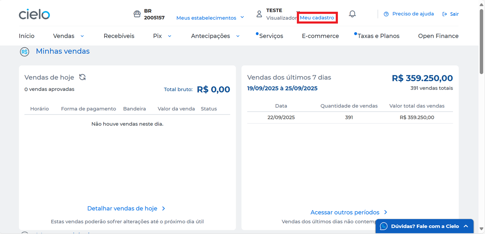

**3**. Clique em **Autorizações** e selecione a opção **Pix**.

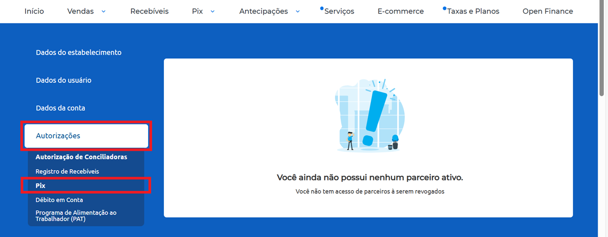

**4**. Clique em **Iniciar habilitação**. 

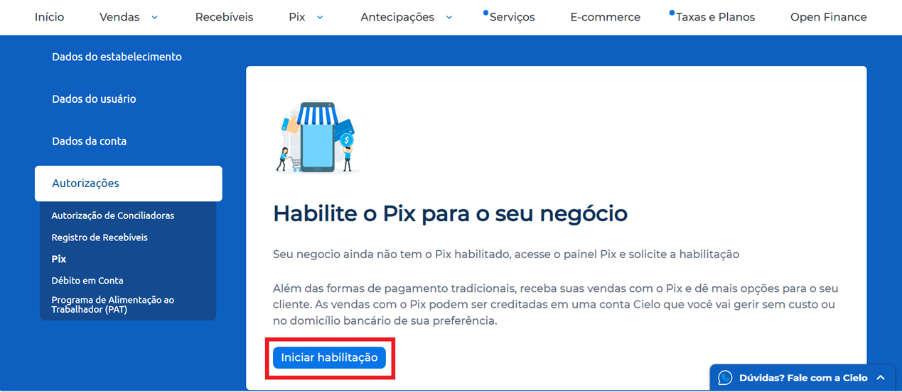

**5**. Na opção **Habilitação simplificada**, clique em **Selecionar**. 

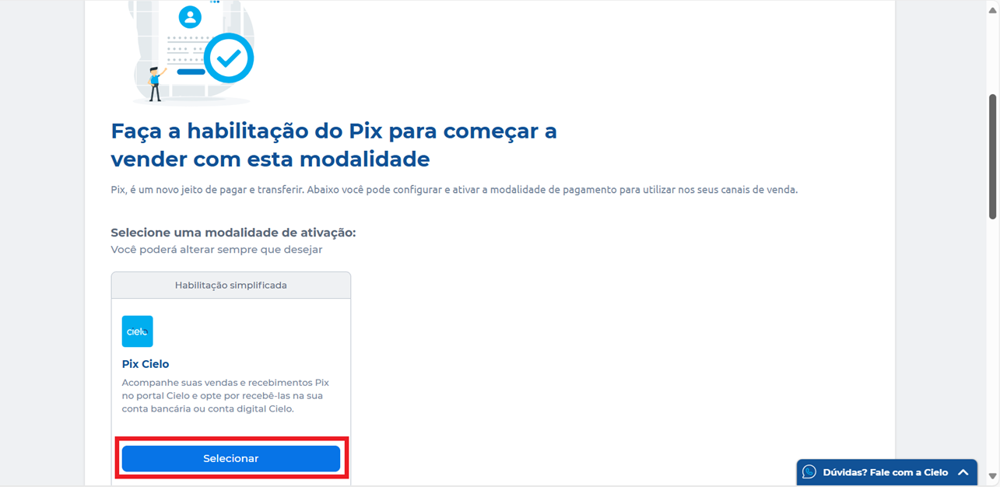

**6**. Marque a caixa de aceite , e clique em **Enviar solicitação**.

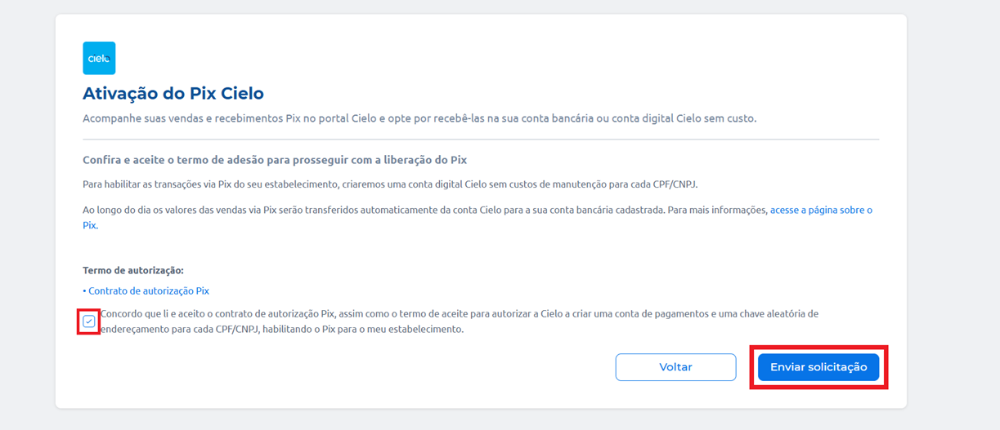

Após essa habilitação via Site Cielo, o estabelecimento estará apto a trabalhar com a modalidade Pix!

# PERGUNTAS FREQUENTES (FAQ)

Aqui, você encontra as respostas para as perguntas mais frequentes sobre a Cielo Smart para facilitar sua jornada com a gente!

## Terminais Cielo Smart 

**Como solicito uma Cielo Smart para testes?** 

[Clique aqui](https://developercielo.github.io/manual/cielo-lio#solicitando-uma-cielo-smart) para aprender como solicitar uma Cielo Smart para testes. 

**Como faço para integrar com a Cielo Smart?** 

A Cielo oferece um [Portal exclusivo para desenvolvedores](http://desenvolvedores.cielo.com.br), criado para facilitar a integração de soluções com a Cielo Smart.   

Nesse portal, você pode: 
- Acessar a documentação completa das APIs disponíveis; 
- Utilizar SDKs que agilizam o processo de integração; 
- Criar sua conta para obter as chaves de acesso (tokens); 
- Realizar testes e desenvolver sua aplicação utilizando emuladores ou ambiente Sandbox. <br/>
<br/>

**Quais são as formas de comunicação da Cielo Smart?** 

A Cielo Smart conta com entrada para SIM Card, permitindo conexão via rede móvel 4G, com fallback automático para 3G, 2G e GPRS, conforme a disponibilidade da rede. Além disso, o terminal também oferece conectividade via Wi-Fi, garantindo flexibilidade na comunicação. 

**Se eu trocar o terminal Cielo Smart, o catálogo cadastrado migra automaticamente para a nova máquina recebida?** 

Não. Para que o catálogo fique na nuvem, é preciso de um aplicativo que tenha essa funcionalidade. 

**Minha Cielo Smart não está baixando um aplicativo. O que fazer?** 

Verifique se o terminal está com mais de 50% de bateria e confirme se está conectado à internet via 4G ou Wi-Fi. Se todos esses requisitos estiverem atendidos e o problema persistir, [entre em contato com o suporte técnico](https://developercielo.github.io/manual/cielo-lio#suporte-t%C3%A9cnico).  

**Posso bloquear a impressão do comprovante de pagamento?** 
 
Sim. Você pode solicitar o bloqueio dos comprovantes de pagamento. No entanto, essa configuração é aplicada ao estabelecimento como um todo (EC), ou seja, todas as máquinas do local seguirão essa regra. Não é possível configurar individualmente por terminal. 


**Posso personalizar a tela “Escolha a forma de pagamento” presente nos terminais?** 

A aplicação financeira nativa dos terminais não permite personalizações visuais dessa tela. Porém, é possível tornar o fluxo de pagamento mais direto ao informar previamente o tipo de pagamento como parâmetro. Com isso, o usuário é direcionado diretamente para a tela de captura dos dados do cartão ou do QR Code do Pix. 


**Posso usar a câmera dos terminais para ler códigos de barras?**

A Cielo não oferece uma API própria para acesso à câmera. Assim, a leitura de códigos de barras deve ser implementada usando as APIs nativas do Android, como CameraX ou Camera2, ou bibliotecas de leitura de códigos de barras compatíveis.

**Posso instalar um APK via ADB install nos terminais Cielo?** 

Existem dois tipos de terminais fornecidos aos desenvolvedores parceiros: 

Terminais de release (Lio On, L300)
- Não permitem uso de ADB; 
- Não permitem captura de transações fora do ambiente de produção; 
- Instalação de APK só ocorre via loja da Cielo. 
<br/>
<br/>
Terminais de debug (Cielo Smart, DX8000)
- Permitem uso de ADB. 
- Funcionam em ambiente de certificação (mock), sem cobrança de transações. 
- Instalação via ADB install é permitida apenas nesses modelos.
<br/>

Nos modelos de release, bloquear o ADB garante integridade, segurança e prevenção de instalações não autorizadas. 

## Cielo Store e aplicativos  

**Fiz o meu cadastro no Dev Console. E agora?** 

Agora, você deve escolher em que tipo de loja você deseja disponibilizar seu app. [Clique aqui](https://developercielo.github.io/manual/cielo-lio#tipos-de-loja-na-cielo-store) para entender as diferenças entre as lojas públicas e privadas. 

**Qual é a diferença entre loja pública e privada?** 

A diferença entre loja pública e loja privada está principalmente no alcance e na forma como os aplicativos são distribuídos. A loja pública é acessível a qualquer estabelecimento que utilize um terminal Cielo Smart. Depois de aprovada tecnicamente e em segurança, a aplicação fica visível na Cielo Store e pode ser instalada por qualquer cliente. É voltada para soluções de uso geral, como gestão de vendas, controle de estoque ou programas de fidelização, e permite que o desenvolvedor monetize o app. Já a loja privada é destinada apenas a um grupo específico de estabelecimentos comerciais autorizados. Nela, o aplicativo fica visível somente para os ECs selecionados, sendo ideal para soluções personalizadas, integradas a sistemas próprios ou voltadas para uso interno de parceiros. Em resumo, a loja pública oferece ampla visibilidade e distribuição aberta, enquanto a loja privada garante controle restrito de acesso. 

[Aprenda mais sobre estes dois tipos de loja disponíveis na Cielo Store](https://developercielo.github.io/manual/cielo-lio#tipos-de-loja-na-cielo-store).

**Qual é o prazo de aprovação da certificação de um aplicativo?**  

Assim que o envio para certificação é realizado, o aplicativo passa automaticamente para o status **Aguardando certificação**. O processo pode levar até 48 horas úteis. Você será notificado por e-mail assim que a certificação for concluída. 

**O que acontece se eu desativar um aplicativo?** 

Quando um app é desativado no [Dev Console](https://developercielo.github.io/manual/cielo-lio#cielo-store-dev-console), ele  aparece como **Desativado** e não pode mais ser instalado em novos terminais. No entanto, instalações já existentes não são afetadas e  permanecem funcionando normalmente, ou seja,  os lojistas que já tinham o app continuam a utilizá‑lo sem impacto. Caso uma nova versão seja publicada posteriormente, a plataforma altera automaticamente o status do app para **Ativado** novamente, permitindo novas instalações e atualizações. 


**Quais são os navegadores recomendados para upload de aplicativo na Cielo Store?** 

Recomendamos utilizar o Google Chrome ou Mozilla Firefox para realizar o upload de aplicativos na Cielo Store. 

**Como disponibilizo o meu aplicativo em loja privada e pública?**

A liberação do aplicativo para produção é feita pelo integrador após a conclusão do processo de certificação da Cielo. Após a aprovação na etapa de certificação, realizada pelo time especialista da Cielo, você será notificado e deverá promover o aplicativo para o ambiente de produção. Assim que a liberação é concluída, o aplicativo fica disponível para download.  

A publicação do aplicativo pode ser realizada em dois modelos: loja pública, onde o app fica disponível para todos os clientes Cielo; ou loja privada, que limita o acesso a um grupo específico de clientes, conforme definido pelo desenvolvedor do aplicativo. 

Para saber como realizar cada tipo de publicação, consulte os guias abaixo: 
- [Como publicar seu aplicativo em loja pública](https://developercielo.github.io/manual/cielo-lio#enviando-um-aplicativo-para-cielo-store) 
- [Como publicar seu aplicativo em loja privada](https://developercielo.github.io/manual/cielo-lio#enviando-um-aplicativo-privado-para-produ%C3%A7%C3%A3o)  <br/>
<br/>

**É necessário estar cadastrado na Cielo para receber pagamentos pelos aplicativos?** 

Sim. Para receber pagamentos, o desenvolvedor precisa ter uma conta ativa no [site da Cielo](http://www.cielo.com.br). Isso ocorre porque os repasses são feitos por meio de agenda financeira, e é necessário possuir um Estabelecimento Comercial (EC) cadastrado. 

Para se cadastrar: 

**1**. Acesse o [site da Cielo](www.cielo.com.br). 

**2**. No canto superior direito, clique em **Acessar minha conta**. 

**3**. Selecione a opção **Cadastre-se**. 

**4**. Clique em **Criar cadastro** e preencha os dados solicitados.

Após o cadastro, você poderá vincular seu aplicativo ao EC e receber os valores das transações realizadas. 

**Existe algum custo para publicar meu aplicativo na Cielo Store?** 

Não. A integração e publicação de aplicativos na Cielo Store são totalmente gratuitas. 

**Quais são as etapas para publicar meu aplicativo?**

Durante o processo de publicação de um aplicativo, ele passará pelos seguintes status no Dev Console: assinatura, desenvolvimento, certificação e piloto/produção. [Clique aqui](https://developercielo.github.io/manual/cielo-lio#status-de-um-aplicativo) para saber mais. 

**O que é a Cielo Store**

A Cielo Store é a loja de aplicativos disponível nos dispositivos Cielo Smart. Assim como você acessa a Play Store ou App Store para baixar aplicativos no seu celular, os estabelecimentos comerciais utilizam a Cielo Store para instalar soluções que atendem às suas necessidades operacionais.

Na Cielo Store, estão disponíveis mais de 50 aplicativos voltados para o varejo, permitindo que o lojista escolha e instale ferramentas para gestão de vendas, controle de estoque, administração de equipe, integração de sistemas, entre outras funcionalidades, tudo diretamente na maquininha, com apenas um clique.

**Como altero o nome do meu aplicativo?**

A alteração do nome de um aplicativo já cadastrado não é permitida. Caso seja necessário modificar o nome, será preciso criar um novo aplicativo com um package name diferente e seguir o processo padrão de envio e certificação na Cielo Store. 

**Posso editar as informações do meu aplicativo já publicado?** 

Sim. É possível atualizar as informações do aplicativo diretamente pelo Dev Console.   

Para saber como realizar cada tipo de publicação, consulte os guias abaixo: 
- [Como realizar alterações em seu aplicativo em loja pública](https://developercielo.github.io/manual/cielo-lio#fazendo-altera%C3%A7%C3%B5es-em-aplicativos-p%C3%BAblicos). 
- [Como realizar alterações em seu aplicativo em loja privada](https://developercielo.github.io/manual/cielo-lio#fazendo-altera%C3%A7%C3%B5es-em-aplicativos-privados). <br/>
<br/>

**Como baixo aplicativos?** 

Para aprender como fazer o download de aplicativos públicos e privados, consulte os guias abaixo: 
- [Como fazer download de aplicativos em loja pública](https://developercielo.github.io/manual/cielo-lio#compra-e-download-de-aplicativos-p%C3%BAblicos-na-cielo-store) 
- [Como fazer download de aplicativos em loja privada](https://developercielo.github.io/manual/cielo-lio#download-de-aplicativos-privados). <br/>
<br/>

**Como faço para consultar minha comissão referente a aplicativos de loja pública?**  

Entre no [site da Cielo](https://minhaconta2.cielo.com.br/site/acessos/login) com suas credenciais. Acesse o menu **Recebíveis > Detalhado > Selecionar uma ou duas datas**. Serão exibidos os valores pagos e a data com a descrição "Repasse ao desenvolvedor sobre a compra de aplicativo no Cielo Store". Cada linha exibida é referente a uma assinatura ativa. 

**Como cancelo a assinatura de um aplicativo?**

Com uma Cielo Smart em mãos, siga o passo-a-passo abaixo para cancelar a assinatura de um aplicativo:

**1**. Clique na opção **Apps**.

**2**. Selecione **Cielo Store**.

**3**. Escolha o aplicativo.

**4**. Clique em **Desinstalar**.

**5**. Preencha com usuário e senha criados no site Cielo.

**Quais são os erros mais comuns ao realizar o upload de uma nova versão do aplicativo?** 


| **Erro**                           | **Descrição**                                                                                                                                                                                                                     | **Solução**                                                                                                                                                                                                 |
|------------------------------------|-------------------------------------------------------------------------------------------------------------------------------------------------------------------------------------------|-------------------------------------------------------------------------------------------------------------------------------------------------------------------------------------------------------------|
| *Package name* alterado            | Ocorre quando o desenvolvedor tenta subir uma nova versão do aplicativo, mas o *package name* foi modificado em relação ao previamente cadastrado.                                       | Para solucionar esse erro, mantenha o *package name* consistente com o da versão original já registrada na plataforma.                                                                                      |
| Versão existente                   | A tentativa de submissão falha quando o *versionCode* informado já foi utilizado anteriormente.                                                                                          | Para solucionar esse erro, atualize o *versionCode* para um valor superior ao último registrado. A validação é feita exclusivamente com base no *versionCode*, independentemente do *versionName*.         |
| Versão inferior à última cadastrada| Ocorre quando o *versionCode* submetido é inferior ao de uma versão já cadastrada. Por exemplo, já existe uma versão com código 3 e o desenvolvedor tenta subir uma versão com código 2. | Para solucionar esse erro, utilize um *versionCode* sequencialmente superior ao último aprovado.                                                                                                            |
| Certificado alterado               | A submissão do aplicativo é rejeitada quando há mudança na assinatura digital (certificado) em relação à versão anteriormente cadastrada.                                               | Verifique se o certificado atual é o mesmo utilizado nas versões anteriores. Se houver alteração no *targetSdkVersion*, siga as orientações específicas para garantir compatibilidade com o novo SDK.      |
| Assinatura do app alterada         | Esse problema está relacionado à atualização do *targetSDK*. Antes, a extração dos dados do APK era feita com *keytool*, mas agora utiliza *apk-signer* para suportar o Signature Scheme v2 e posteriores. Quando o Android é atualizado sem ajustar o esquema de assinatura, ocorre incompatibilidade com o certificado previamente cadastrado. | Gere novamente o APK utilizando o esquema de assinatura v2 e realize o upload do arquivo novamente.                                                                                                     |

<br/>
<aside style="background-color: #f8d7da; padding: 15px; border-left: 5px solid #dc3545; color: #721c24;margin-top: 20px; margin-bottom: 20px;"> O package name é único dentro da loja Cielo e identifica de forma exclusiva o aplicativo.  Se você alterar o package name e enviar ao devConsole, isso será tratado como um novo aplicativo, e não como atualização do existente.  </aside>

## Integração via Deep Link

A [integração via Deep Link](https://developercielo.github.io/manual/cielo-lio#integra%C3%A7%C3%A3o-via-deeplink) permite que seu aplicativo embarcado na Cielo Smart utilize os recursos nativos do dispositivo, como pagamento, impressão e cancelamento. O app instalado na Smart se comunica com o módulo de pedidos e pagamentos por meio do Cielo Smart Order Manager SDK. 

**Quais são as linguagens suportadas?**  

Você pode desenvolver seu aplicativo utilizando Java ou Kotlin, integrando diretamente com o SDK.   
 
**Existe um aplicativo de exemplo?** 

Sim. Disponibilizamos um [aplicativo de exemplo no GitHub](https://github.com/DeveloperCielo/LIO-SDK-Sample-Integracao-Local) para que os desenvolvedores possam entender como funcionam as chamadas do SDK.  

**O emulador pode ser instalado nos terminais Smart?** 

Não. O emulador tem como finalidade simular o sistema dos terminais e, por isso, deve ser instalado apenas em dispositivos como tablets, celular ou em emuladores Android (AVD) com as versões 7.1 ou 10 do sistema operacional. 

<aside style="background-color: #f8d7da; padding: 15px; border-left: 5px solid #dc3545; color: #721c24;margin-top: 20px; margin-bottom: 20px;"> A instalação do emulador em terminais debug não é permitida em nenhuma hipótese, pois pode comprometer o funcionamento do equipamento. </aside>

**É necessário incluir todos os itens do pedido na ordem?** 

Sim. A Cielo Smart trabalha com o conceito de Order (pedido). O fluxo básico é: 

**1**. Criar uma ordem com status draft 

**2**. Adicionar os itens à ordem 

**3**. Preparar a ordem para pagamento (place order) 

**4**. Executar o checkout 

Se o seu app trabalha com diversos produtos, é recomendável criar itens separados para facilitar os relatórios do lojista no Cielo Smart. 

**Preciso de um terminal Cielo Smart para testar?** 

Não. A Cielo oferece um emulador que simula o ambiente do Smart em dispositivos Android. Com ele, você pode testar os métodos do SDK e fazer o debug da sua aplicação sem precisar do hardware físico. [Clique aqui](https://developercielo.github.io/manual/cielo-lio#emulador-cielo) para aprender mais sobre o emulador.  

**Preciso me cadastrar para realizar os testes?** 

Sim. É necessário se cadastrar no [Portal de desenvolvedores](https://desenvolvedores.cielo.com.br/) da Cielo para obter os tokens de acesso e testar sua aplicação. 

**Por que recebo o erro EACCES (permission denied) ao tentar imprimir imagens via Deep links no emulador da LIO?**  

Esse erro geralmente ocorre porque o aplicativo não possui as permissões necessárias para salvar a imagem no diretório: 

`/storage/emulated/0/saved_images/{nome-da-imagem}.jpg` 

Além disso, é importante lembrar que o emulador funciona corretamente apenas até a versão Android 10. Versões superiores podem apresentar incompatibilidades. Outro erro comum é o integrador salvar a imagem em um diretório e, no momento da impressão, informar um caminho (path) diferente no request. Isso faz com que o sistema não encontre a imagem. Para evitar esse problema, verifique se o caminho da imagem informado no request de impressão é exatamente o mesmo onde ela foi salva. E certifique-se de que não há aspas alteradas ou prefixos incorretos, como uri://, no path enviado. 

**Por que algumas transações realizadas nos terminais não retornam ao meu app ou não aparecem na agenda financeira da Cielo? Como resolver?** 

Em integrações locais, todas as transações realizadas nos terminais devem retornar ao aplicativo de integração. A exceção ocorre quando o terminal é desligado antes do retorno da transação, com o app de pagamento da Cielo em foreground. Um cenário comum é o encerramento do app de integração pelo Android durante o fluxo de pagamento, devido ao gerenciamento de memória, especialmente quando o app está em segundo plano. Para evitar esse problema, é essencial que a chamada de pagamento seja realizada dentro de um serviço Android com notificação ativa (foreground service). 

**Quais permissões são necessárias para que a impressão funcione na Cielo Smart? Existe diferença entre os modelos DX8000, L400 e L300?**  

Para que a funcionalidade de impressão funcione corretamente nos terminais Cielo Smart, é necessário incluir as seguintes permissões no aplicativo Android:  

`<uses-permission android:name="android.permission.MANAGE_EXTERNAL_STORAGE" />`  

A permissão `android:requestLegacyExternalStorage="true"` deve ser inserida na tag `application`. 

O contrato de impressão é o mesmo para todos os modelos de terminais Cielo (DX8000, L400 e L300). Basta aplicar as permissões acima e seguir a [implementação descrita aqui](https://developercielo.github.io/manual/cielo-lio#impress%C3%A3o).  

**Estou recebendo a mensagem de erro “metadata de integração não encontrado”. Como resolvo esse problema?**

Esse erro ocorre quando o app não declara o metadata obrigatório para apps de integração na loja Cielo. Para resolver este problema, inclua o seguinte bloco dentro do elemento `<application>` no AndroidManifest.xml: 

```html
<application> 

    ... 

    <meta-data 

        android:name="cs_integration_type" 

        android:value="uri" /> 

     

    <activity> 

        ... 

    </activity> 

</application>
```

Sem esse metadata, o mecanismo de integração da Cielo não consegue identificar o tipo de comunicação utilizado pelo aplicativo. 

## Integração remota

Na [Integração remota](https://developercielo.github.io/manual/cielo-lio#integra%C3%A7%C3%A3o-remota) você utiliza o seu PDV (Sistema Desktop ou Web) para gerar os pedidos e enviar para a Cielo Smart efetuar o recebimento.

**Preciso me cadastrar para realizar testes?**

Sim. É necessário se cadastrar no [Portal de desenvolvedores](https://desenvolvedores.cielo.com.br/) da Cielo para obter os tokens de acesso e testar sua aplicação. 

**Como envio um pedido aos terminais? Quais são os parâmetros e campos necessários?**  

[Clique aqui](https://developercielo.github.io/manual/cielo-lio#post-criar-um-pedido) para aprender como criar um pedido no servidor do Order Manager. O guia inclui os dados de entrada exigidos e um exemplo de requisição para facilitar o processo. 

**Como é estabelecido o vínculo entre uma credencial e o envio de pedidos aos terminais?** 

Esse vínculo ocorre por meio do Estabelecimento Comercial (EC). Ao ser cadastrado no banco de dados do order-manager, o EC recebe um identificador exclusivo chamado merchant-id. Tanto a Cielo Smart quanto o sistema responsável por enviar requisições à API do order-manager utilizam esse mesmo identificador para garantir a comunicação correta com os terminais. [Clique aqui](https://developercielo.github.io/manual/cielo-lio#fluxo-de-integra%C3%A7%C3%A3o-do-pedido) para saber mais.  


## Pix

**Como habilito o pagamento Pix?** 

Para que seja possível efetivar um pagamento utilizando a forma de pagamento Pix, é necessário que o estabelecimento tenha esse tipo de pagamento habilitado. [Siga estas instruções](https://developercielo.github.io/manual/cielo-lio#habilitando-o-pagamento-pix) para habilitar o pagamento Pix. Após essa habilitação via Site Cielo, o estabelecimento estará apto a trabalhar com a modalidade Pix.

**Qual é o formato de retorno de uma transação via Pix nos terminais Smart?** 

O retorno de transações via Pix segue o mesmo padrão das demais formas de pagamento. A única diferença está no código de autorização, que no caso do Pix é uma cadeia de caracteres maior. Para identificar se a transação foi Pix, basta verificar o campo `primaryProductName` dentro de `paymentFields`. 

**É possível simular pagamentos via Pix durante o desenvolvimento? Onde é exibido o identificador de autorização do Pix( End-to-End ID)?** 

Sim. Durante o desenvolvimento, é possível simular uma transação Pix nos terminais Cielo Smart informando o valor Pix no campo `paymentCode`. Se essa [forma de pagamento estiver habilitada](https://developercielo.github.io/manual/cielo-lio#habilitando-o-pagamento-pix) para o estabelecimento (EC), o QR Code será exibido na tela para pagamento. O código de autorização retornado será o End-to-End ID (E2E) do Pix, que pode ser utilizado para validações e rastreamento da transação. 

# RELEASE NOTES

Release notes fornecem uma visão detalhada das atualizações mais recentes, garantindo que você fique informado sobre os desenvolvimentos, otimizações e correções de bugs implementados para melhorar o desempenho, a usabilidade e a experiência geral. 

Aqui, dividimos as últimas atualizações por mês, especificando o modelo de terminal e sua versão. 

## Novembro de 2025

### L400 - CJ19 

*Data de lançamento: 14/11/2025* 

**NOVIDADES**

Adicionamos novas funcionalidades para melhorar o desempenho e a usabilidade. Confira as novidades desta atualização. 

**Pix** 

- Pix NFC, Pix Saque e Pix Troco agora disponíveis. 
- Seleção de Estabelecimento Comercial (EC) ao realizar transações Pix (MultiEC). 
- Relatório Pix por horário para análise detalhada. <br/>
<br/> 

**Relatórios e análises** 

- Inclusão de relatório por período para melhor acompanhamento. 
- Exibição de valores e quantidades no relatório detalhado. <br/>
<br/>

**QR Code** 

- Geração de QR Code na Função 11 (Dados do EC). 
- Impressão de QR Code no resultado da Função 87 (Script de Testes). <br/>
<br/>

**Experiência de pagamento** 

- Início da venda a partir da inserção do cartão, agilizando o processo. 
- Inclusão do botão “Pagamento”, direcionando o usuário para a jornada de pagamento com o valor calculado. 
- Operação em modo de subadquirência. 
- Prevenir que transações offline recusadas sobrescrevam dados de transações online. <br/>
<br/>

**Infraestrutura e conectividade** 

- Garantir visibilidade sobre rede e operadora para diagnóstico de conectividade. 
- Possibilidade de monitorar a versão do SO via Observabilidade. 
- Registrar tipo de conexão utilizada (Wi-Fi ou 3G/4G) para download ou atualização do app. 
- Exibição de informações da operadora: chip, rede e status de Mobile Roaming na opção “Rede Móvel” do app Configurações.
- Implementação da Onda II do BIT47, com envio estruturado de dados ao backend para apoiar modelos e análises logísticas. <br/>
<br/>

**MELHORIAS** 

Esta atualização também inclui aprimoramentos de recursos existentes, melhorando o desempenho e a eficiência. 

**Inicialização e configuração** 

- Melhoria na obtenção do número de série durante a inicialização. 
- Agora o sistema faz backup automático das configurações, garantindo que o terminal possa ser reinicializado com segurança. 
- Ajuste no fluxo de desbloqueio de terminal bloqueado via sinalização do autorizador. <br/>
<br/> 

**Tratamento de dados e arquivos** 

- Ajuste no processo de armazenamento de imagens para impressão via app integrado. 
- Alteração no formato de salvamento do APK, removendo caracteres especiais do caminho dos arquivos para evitar erros. <br/>
<br/>  

**Interface e experiência** 

- Agora o CV da Cielo Smart indica quando a transação foi feita via integração. 
- A leitura NFC é sinalizada na parte superior central da tela para melhor visibilidade. 
- A via do estabelecimento passa a ser opcional e não será impressa automaticamente. <br/>
<br/> 

**Pagamentos e Integrações** 

- Pedidos pagos pelo App de Pedidos serão fechados automaticamente. 
- Ajuste no retorno do campo de cartão na integração.  
- Alteração no fluxo DCC NFC para MasterCard e revisão das telas de exibição para DCC. 
- Ajustes no fluxo DCC para timeout na seleção da moeda e tratamento de transações Contactless com retorno da TAG de país. 
- Alteração no fluxo da função 86 (Teste de Leitura de Cartão). <br/>
<br/> 

**Conectividade** 

Substituição do modo avião pela função "Reiniciar comunicação”, que realiza o mesmo processo. <br/>
<br/> 

**Performance e estabilidade** 

Prevenção de vazamentos de memória usando WeakReference para Activity e limpeza do listener de exceção no método onDestroy. <br/>
<br/> 

**CORREÇÕES DE BUG**

Esta atualização corrige falhas para aprimorar a estabilidade e a confiabilidade. 

- Ajustes no fluxo de pagamento. 
- Atualização da biblioteca Positivo para corrigir falhas em pagamentos CTTLS no Apple Pay/TICKET. 
- Correção no acesso à device key em dispositivos com Android 11. 
- Correção do erro “Cartão Inválido” causado por divergência de timestamp. 
- Correção da perda de dados do terminal durante o processo de atualização. 
- Ajuste no incidente que que retornava valores em moeda estrangeira para o integrador em transações DCC. 
- Correção de falha no Cielo Router, que não listava o app padrão configurado no Dev Portal. 
- Ajuste para eliminar divergência de status do pedido entre a listagem e o banco de dados. 
- Correção de falha na ativação do Cashless via integração DeepLink/UriApp. 
- Ajuste para evitar perda de dados do terminal em caso de falha na inicialização pós-atualização. 
- Correção de falha na impressão por aplicativo integrado via DeepLink/UriApp. 
- Ajuste na ativação do serviço Cashless via URI App. <br/>
<br/> 

**PROBLEMAS CONHECIDOS** 

Identificamos um cenário que pode afetar o comportamento do sistema. Estamos trabalhando para resolvê-lo e garantir uma experiência ainda melhor no futuro. 

- A opção “Reiniciar comunicação” no app Configurações atualmente não apresenta feedback ao usuário, mas já está em processo de melhoria. <br/>
<br/> 

## Outubro de 2025

### DX800 - CH19 

*Data de lançamento: 28/10/2025* 

**NOVIDADES** 

Adicionamos novas funcionalidades para melhorar o desempenho e a usabilidade. Confira as novidades desta atualização. 

- Pagamentos: Agora é possível realizar transações em modo subadquirente. 
- Integração: Salvamento do package name de quem realiza pagamento via UriApp. 
- Impressão: Inclusão de form_feed nos estilos para impressão de imagens. 
- SDK: Atualização para a nova versão do SDK. 
- Otimização: Redução do tamanho do APK. 
- Pedidos: Na tela de pedidos, serão exibidos inicialmente apenas os pedidos “Em aberto”. 
- Service: Melhorias no processo de bind com serviços de fabricantes e alterações para suporte a transações de subadquirência. 
- Interface: Inclusão de atalhos de formas de pagamento na tela inicial. <br/>
<br/>  

**MELHORIAS** 

Esta atualização também inclui aprimoramentos de recursos existentes, melhorando o desempenho e a eficiência. 

- Calculadora: Melhoras na usabilidade e integração com o app de pagamentos. 
- Melhoria na conversão de bitmap para aprimorar o tratamento de imagens grandes na impressão. 
- Ajuste para retornar o modelo no terminal info. 
- Ajuste para gravar o nome do app que solicitou o checkout. 
- Melhorias no tratamento de arquivos para evitar perda de dados. 
- Ajuste de form_feed na impressão com múltiplas colunas. 
- Ajuste no campo de data da transação. <br/>
<br/> 

 **CORREÇÕES DE BUG**

 Esta atualização corrige falhas para aprimorar a estabilidade e a confiabilidade. 

- Esta atualização corrige falhas para aprimorar a estabilidade e a confiabilidade. 
- Correção do erro de “Cartão Inválido” causado por divergência de timestamp. 
- Correção da perda de dados do terminal durante o processo de atualização. 
- Correção do incidente que retornava o valor para o integrador na moeda estrangeira em caso de transação DCC. 
- Correção na gravação do Merchant-ID utilizado nas requisições ao Order. <br/>
<br/>

# DOWNLOAD DA DOCUMENTAÇÃO

[Clique aqui](https://github.com/DeveloperCielo/TapOnPhone/raw/main/25-03-2026-cielo-smart.zip) para fazer o download da documentação Cielo Smart.
