# IMPORTANTE: NOVO PORTAL DE DOCUMENTAÇÕES

*Junho de 2026*

Nossas documentações estão disponíveis em um novo portal!

[Acesse o novo portal de desenvolvedores](https://docs.cielo.com.br/pix-can-cbk/docs/conheca-api-pix).


O novo ambiente foi pensado para facilitar sua jornada como desenvolvedor proporcionando: 

✅ Interface mais intuitiva e moderna; <br/>
✅ Navegação simplificada; <br/>
✅ Referências de API mais completas e estruturadas; <br/>
✅ Maior padronização entre documentações; <br/>
✅ Melhor experiência de leitura, aprendizado e integração. <br/>

<aside style="background-color: #f8d7da; padding: 15px; border-left: 5px solid #dc3545; color: #721c24;margin-top: 20px; margin-bottom: 20px;"> O conteúdo deste portal não é atualizado desde 24/06/2026. </aside>

# INTRODUÇÃO 

## Conheça a API Pix 

A API Pix foi desenvolvida pela Cielo como prestadora de serviços de pagamento, provedora de conta transacional e participante direto do Pix. Esta API segue os padrões definidos pelo Banco Central do Brasil no Regulamento do Pix e demais documentos relacionados.  

<aside style="background-color: #d4edda; padding: 15px; border-left: 5px solid #28a745; color: #155724;margin-top: 20px; margin-bottom: 20px;"> O Pix é o meio de pagamento criado pelo Banco Central em que os recursos são transferidos entre contas e poucos segundos, a qualquer hora ou dia. O Pix é um novo jeito de vender de forma instantânea, segura e simples pelas soluções da Cielo. </aside>

Essa interface padronizada permite que aplicações automatizem a interação com os participantes do Pix, possibilitando uma experiência integrada e segura para o usuário final. As APIs de recebimento via Pix permitem ao cliente recebedor gerenciar integralmente seus pagamentos, desde a geração de QR Codes até a conciliação dos valores recebidos, abrangendo tanto transações por QR Code quanto transferências Pix. 

Confira abaixo alguns dos maiores benefícios oferecidos por esta solução: 

- Não é necessário disponibilizar o app do seu banco para os funcionários realizarem vendas e nem expor sua chave Pix para seus clientes 
- Pode ter conta em qualquer banco. As informações de vendas, recebimentos e taxas estarão no site e app Cielo gestão para acompanhamento das vendas 
- Um mesmo equipamento pode ser utilizado para vender débito, crédito, voucher e Pix 
- Nosso time de suporte está preparado para atender suas dúvidas.

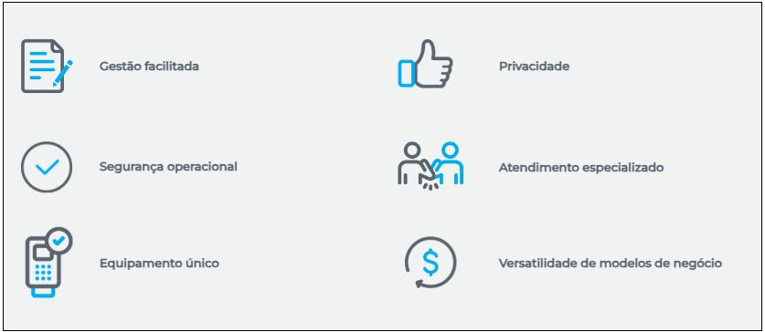
 
<aside style="background-color: #d4edda; padding: 15px; border-left: 5px solid #28a745; color: #155724;margin-top: 20px; margin-bottom: 20px;"> São elegíveis para utilizar a solução de API Pix da Cielo os clientes que já possuam o Pix habilitado na Cielo. A solução está disponível exclusivamente para clientes Pessoa Jurídica (PJ), independentemente do porte ou faixa de faturamento. Clientes Pessoa Física (PF) não são elegíveis. </aside> 

## Modelos de negócio 

A API Pix é destinada a clientes que utilizam soluções de captura como, por exemplo, TEF, Cielo Smart e E-commerce, e desejam realizar transações Pix por meio dessas plataformas. 

- **TEF (Transferência Eletrônica de Fundos)**: Integra a automação comercial do estabelecimento ao sistema Cielo, permitindo vendas com cartões por meio de leitores de tarja magnética e chip. 
- **Cielo Smart**: É uma plataforma aberta que possibilita a integração completa com sistemas de gestão de loja. Para quem já possui um sistema de gestão completo, oferece integração simples e rápida. Para quem não possui, disponibiliza relatórios de pagamento, catálogo de produtos, leitor de código de barras e outros recursos exclusivos. 
- **E-commerce**: É uma solução digital para pagamentos online no checkout do seu site. Com recursos avançados como blindagem antifraude e inteligência de dados, você acompanha o status da transação diretamente no nosso portal. 

## Primeiros passos

Está iniciando agora a sua jornada de integração e não sabe por onde começar? Aqui, você encontra uma visão simplificada dos principais passos para integrar com a API Pix.  

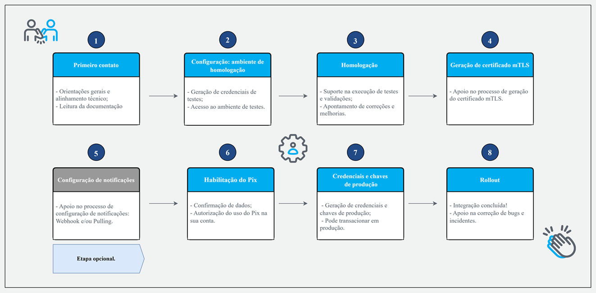

**1. Acesso à documentação**: Consulte a documentação técnica da API Pix e explore o  Swagger, onde estão disponíveis os endpoints, métodos, parâmetros e exemplos de requisições e respostas.  

<aside style="background-color: #d4edda; padding: 15px; border-left: 5px solid #28a745; color: #155724;margin-top: 20px; margin-bottom: 20px;"> Se ainda não for parceiro, solicite o cadastro via e-mail apipix.suporte@cielo.com.br.  </aside> 

**2.** [Solicitação de credenciais Sandbox](https://developercielo.github.io/manual/apipix#solicita%C3%A7%C3%A3o-de-credenciais-sandbox): A solicitação deve ser realizada por e-mail. Você vai precisar de Client ID e Client Secret (credenciais de autenticação OAuth2) e de uma Chave Pix transacional (tipo aleatória). 

**3. Homologação**: Suporte na execução de testes e validações juntamente com apontamento de correções e melhorias. 

**4.** [Geração de certificado mTLS](https://developercielo.github.io/manual/apipix#gera%C3%A7%C3%A3o-de-certificado-mtls): Em produção, é obrigatório o uso de mTLS para: geração de cobranças, devoluções, consultas. No ambiente Sandbox, o mTLS não é exigido.  

**5. Recebimento de notificações**: Esta etapa é opcional, porém altamente recomendada. Enquanto o polling realiza consultas periódicas para verificar atualizações de status, o webhook envia notificações automaticamente sempre que uma alteração ocorre. Você pode optar por utilizar apenas um dos métodos, mas a abordagem mais robusta e eficiente é combinar ambos 

**6.** [Habilitação do Pix](https://developercielo.github.io/manual/apipix#habilitando-o-pix): Habilite a funcionalidade Pix no Portal Cielo.  

**7.** [Credenciais e chaves de produção](https://developercielo.github.io/manual/apipix#solicita%C3%A7%C3%A3o-de-credenciais-produ%C3%A7%C3%A3o): Gere suas credenciais e chaves de produção. 

**8. Rollout**: Com a integração concluída, é possível gerar e pagar QR Codes, realizar devoluções, fazer transações de Pix automático e testar notificações. 

Ao longo desta documentação, todas estas etapas são descritas detalhadamente.

## Glossário

Este glossário reúne os principais termos utilizados no ecossistema da API Pix. Ele foi criado para facilitar a compreensão de conceitos técnicos e operacionais, promovendo uma integração mais eficiente com nossas soluções. Consulte-o sempre que tiver dúvidas sobre siglas, nomenclaturas ou funcionalidades.

| Termo                           | Descrição |
|--------------------------------|-----------|
| Chave                          | Campo obrigatório que determina a chave Pix registrada junto ao Banco Central. Essa chave identifica o usuário recebedor e os dados da conta transacional à qual a cobrança está vinculada. |
| Client_ID                      | Componente de acesso à API Pix que identifica um elemento de software cliente do usuário. Para acessar a API, é necessário utilizar o Client_ID e um segredo, ambos fornecidos pelo PSP do usuário durante o cadastramento. Um mesmo usuário pode ter mais de um Client_ID, caso possua múltiplos elementos de software cliente. |
| Escopos                        | Definem as autorizações associadas a cada serviço da API. Cada Client_ID possui acesso a um ou mais escopos, determinando quais serviços podem ser acessados. |
| Facilitador de Serviço de Saque (FSS) | Participante do Pix que atua como provedor de conta transacional e é autorizado pelo Banco Central do Brasil a oferecer o serviço de saque, diretamente ou por meio de agente de saque, mediante contrato específico. |
| Payload JSON                   | Conteúdo retornado a partir da chamada à URL, obtido por meio da leitura do QR Code dinâmico, que representa uma cobrança. |
| PSP Pagador                    | Instituição do Pix na qual o usuário pagador mantém sua conta transacional. Atua como ponte técnica e regulatória entre o usuário pagador e o sistema de pagamentos. |
| PSP Recebedor                  | Instituição do Pix na qual o usuário recebedor mantém sua conta transacional. Para oferecer integração automatizada com o arranjo Pix, deve seguir as especificações da API Pix definidas pelo Banco Central. |
| TransactionId (txid)          | Identificador único da transação, gerado pelo usuário recebedor e enviado ao PSP recebedor na criação da cobrança. Utilizado para conciliação de pagamentos e deve ser único por usuário recebedor (CPF/CNPJ). |
| Usuário pagador                | Pessoa que efetua o pagamento de uma cobrança via Pix, tendo sua conta transacional debitada. |
| Usuário recebedor              | Pessoa que recebe cobranças via Pix e pode utilizar a API Pix para automatizar a geração de cobranças e a conciliação de pagamentos. |

## Suporte técnico 

Nosso objetivo é apoiar você em cada etapa. Caso tenha dúvidas, envie um e-mail para **apipix.suporte@cielo.com.br**.

## Seja um parceiro

A Aliança Cielo objetiva construir parcerias estratégicas com empresas de tecnologia, ampliando nossa atuação no mercado com soluções integradas e completas. A proposta é democratizar o acesso à inovação, conectando nossos serviços às soluções dos parceiros. A maioria das parcerias é formada por meio da integração entre os produtos da Cielo e as soluções dos parceiros. Também há troca de leads qualificados, criando oportunidades comerciais para ambos os lados. 
  
**Quem pode ser parceiro?**

O programa é destinado a empresas de tecnologia de todos os portes que atuam nos segmentos do varejo físico e do e-commerce. Isso inclui Software Houses, TEF Houses, desenvolvedores de soluções integradas com maquininhas e aplicativos para Cielo Smart, além de plataformas de e-commerce, orquestradores de pagamento, agências implementadoras e criadores de marketplaces. 


Ficou com dúvidas? Envie um e-mail para **parcerias@cielo.com.br** ou [acesse o site](https://www.cielo.com.br/alianca/) com mais informações sobre o programa de parcerias e seus benefícios. 

# VISÃO GERAL TÉCNICA

## Funcionalidades 

A API Pix disponibiliza um conjunto de recursos projetados para otimizar a jornada de pagamento, ampliar a automação operacional e proporcionar maior controle sobre as transações financeiras. Entre os principais destaques estão: 

**Cobrança** 

- Geração de QR Code imediato para pagamento instantâneo, válido para uma única utilização; 
- Personalização do tempo de expiração do QR Code; 
- Alteração ou remoção de um QR Code imediato previamente gerado; 
- Geração de cobranças, por meio do Pix Automático. 
<br/>
<br/>

**Conciliação**  

- Geração de relatórios e consulta de transações, utilizando TXID ou ID E2E como parâmetros;  
- Consulta de informações de um QR Code imediato específico; 
- Lista de todos os QR Codes imediatos disponíveis. 

<aside style="background-color: #d4edda; padding: 15px; border-left: 5px solid #28a745; color: #155724;margin-top: 20px; margin-bottom: 20px;"> O tempo de expiração do QR Code é totalmente parametrizável, podendo ser definido conforme a necessidade do negócio. Caso nenhum valor seja enviado, aplica‑se o prazo padrão de 42.300 segundos (12 horas). Em operações de frente de caixa, é comum que esse tempo seja reduzido para cerca de 5 minutos.   </aside>

**Devolução**  

- Devolução de transações Pix, sempre de forma individual, identificando a transação original a ser devolvida de forma total ou parcial.
<br/>
<br/>

**Pix automático** 

- Criação de pedidos de autorização de recorrência, nos quais o usuário pagador concede permissão para que cobranças automáticas sejam debitadas de sua conta transacional em intervalos pré-estabelecidos; 
- Consulta, atualização ou cancelamento de recorrências ativas, garantindo total controle sobre o ciclo de cobrança.
<br/>

## Arquitetura 

Na implementação da API, a Cielo é responsável por gerar o QR Code para pagamentos via Pix, garantindo conformidade com os requisitos de segurança do Banco Central. Durante a transação, são identificadas informações importantes, como: 

- Data e hora da operação; 
- Nome do pagador; 
- Nome do recebedor; 
- Valor da transação.

## Fluxo da API Pix 

A API Pix é o elemento do arranjo responsável por viabilizar que usuários pagadores ou recebedores automatizem a comunicação com seus respectivos Prestadores de Serviços de Pagamento (PSPs). Por meio dessa interface, é possível realizar ou receber transações Pix de maneira integrada, segura e sem necessidade de interações manuais. 

O foco da API está na automação do fluxo do usuário recebedor, permitindo que ele: 

- Gere cobranças de forma programática; 
- Acompanhe e confirme, via integração, o pagamento dessas cobranças dentro do próprio arranjo Pix. 
<br/>
<br/>
Abaixo, você confere os possíveis caminhos de integração dos sistemas do usuário recebedor com a API Pix do PSP, neste caso a Cielo. 

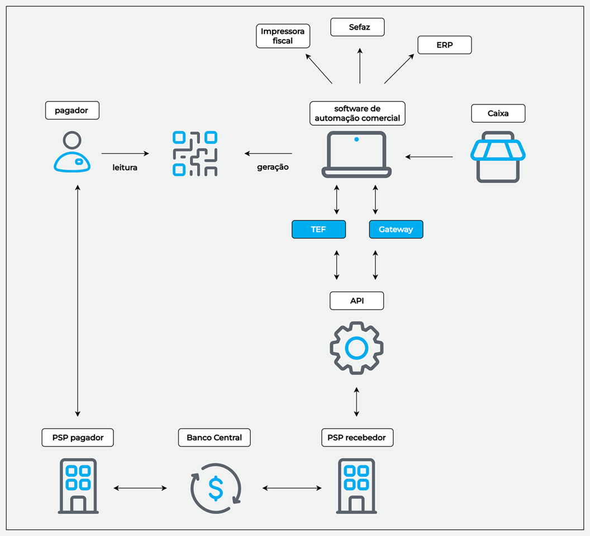

**Primeira etapa: Cobrança com geração do QR Code** 

1. Uma venda é iniciada no ponto de venda (PDV); 
2. O software de automação comercial recebe essa informação e envia os dados para ERP, Sefaz (quando houver nota fiscal) e para a impressora fiscal quando necessário; 
3. Em seguida, o software de automação solicita ao módulo TEF/Gateway que gere uma cobrança Pix; 
4. O TEF ou Gateway se conecta à API Pix do PSP recebedor; 
5. A API Pix gera um QR Code dinâmico contendo as informações necessárias;  
6. O QR Code gerado é exibido no PDV para o cliente. 

**Segunda etapa: Pagamento pelo usuário pagador** 

1. O pagador lê o QR Code com o app do banco ou carteira digital; 
2. O app envia a ordem de pagamento ao PSP pagador (banco do cliente); 
3. O PSP pagador envia o pagamento ao PSP recebedor, usando a infraestrutura do Banco Central. 

**Terceira etapa: Confirmação do pagamento e retorno ao comércio**

1. O PSP recebedor recebe o pagamento e atualiza o status da cobrança. 
2. A API Pix comunica ao Gateway/TEF que a cobrança foi liquidada. Isso ocorre por consulta ativa ou por notificação (webhook), dependendo da integração.  
3. O TEF/Gateway informa o SW de automação comercial que o pagamento foi confirmado. 
4. O PDV então libera a venda, finaliza o pedido, registra no ERP, emite nota fiscal pela Sefaz e/ou dispara outros processos automáticos internos.

## Requisitos de segurança

Para garantir a conformidade e a proteção das informações, devem ser adotadas as seguintes medidas: 

### Comunicação e autenticação

A Cielo utiliza seu próprio Resource Server, que implementa o OAuth 2.0 (RFC 6749) com TLS mútuo (mTLS – RFC 8705), conforme regulamentações do Banco Central. Assim, o processo de comunicação e autenticação deve seguir os seguintes critérios: 

- Toda conexão com a API deve ser criptografada utilizando TLS versão 1.2 ou superior, permitindo apenas cipher suites que ofereçam forward secrecy.
- A API deve suportar múltiplos níveis de autorização ou papéis, segregando as funcionalidades de acordo com perfis (escopos OAuth) dos usuários clientes.
- Os escopos OAuth serão definidos na especificação Open API 3.0 da API Pix e permitirão associar diferentes perfis de autorização ao software cliente.
- A API Pix exige autenticação mútua por certificados. Isso significa que tanto o cliente quanto o servidor apresentam seus certificados, que são validados pelo outro lado. Durante a requisição, o cliente envia seu certificado para validação pela Cielo. A Cielo, por sua vez, também apresenta seu certificado para validação pelo cliente. A autenticação só é concluída mediante validação bem-sucedida dos dois certificados. 
- Os certificados digitais dos clientes podem ser emitidos por ACs externas ou pela própria Cielo, que atua como autoridade certificadora. Certificados autoassinados não são aceitos. 
- Cada PSP deve possuir seu próprio Authorization Server e Resource Server associado à API Pix, e ambos devem implementar TLS mútuo.
- O Resource Server do PSP deve confirmar que o thumbprint do certificado associado ao access token apresentado pelo cliente é o mesmo do utilizado na autenticação TLS (proof-of-possession).
- A Cielo utiliza Client Certificate-Bound Access Tokens, vinculando o certificado do cliente ao access token emitido, conforme seção 3 da RFC 8705. 
- O Resource Server da Cielo valida se o thumbprint do certificado associado ao access token corresponde ao certificado utilizado na autenticação TLS (proof-of-possession). 
- O fluxo OAuth utilizado é o Client Credentials Flow.

<aside style="background-color: #d4edda; padding: 15px; border-left: 5px solid #28a745; color: #155724;margin-top: 20px; margin-bottom: 20px;"> Recomenda-se utilizar, no canal TLS do webhook, os mesmos certificados empregados na API Pix para autenticação mútua. Entretanto, não há impedimento para o uso de certificados diferentes, desde que haja acordo prévio entre o PSP e o usuário recebedor.  </aside> 

### Confidencialidade e integridade 

- O processo de cadastro dos clientes para acesso à API ocorre em ambiente autenticado da Cielo com duplo fator de autenticação conforme determinado pelo Bacen. Além disso, utilizamos um canal seguro para envio das credenciais, o que garante rastreabilidade completa de todas as ações realizadas. 
- A API assegura a confidencialidade e a integridade dos dados dos usuários e de suas transações, tanto em trânsito quanto em repouso. 
- A Cielo mantém logs de auditoria de acesso à API por, no mínimo, 1 ano. 
- O client_id utilizado na autenticação é vinculado ao CNPJ ou CPF do estabelecimento recebedor, e somente permite acesso aos recursos relacionados às contas transacionais de titularidade desse mesmo CNPJ ou CPF. 
- A API da Cielo é projetada para atender com alta disponibilidade.
  
## Habilitando o Pix

Para que seja possível efetivar transações Pix, é necessário habilitar este tipo de pagamento. Para realizar essa ação, siga as instruções abaixo.

**1**. Entre no [site Cielo](https://minhaconta2.cielo.com.br/site/login) com seu login e senha.

**2**. Clique em **Meu cadastro**.


**3**. Clique em **Autorizações** e selecione a opção **Pix**.


**4**. Clique em **Iniciar habilitação**. 


**5**. Na opção **Habilitação simplificada**, clique em **Selecionar**. 


**6**. Marque a caixa de aceite , e clique em **Enviar solicitação**.


Após essa habilitação via site Cielo, o estabelecimento estará apto a trabalhar com a modalidade Pix!

<aside style="background-color: #d4edda; padding: 15px; border-left: 5px solid #28a745; color: #155724;margin-top: 20px; margin-bottom: 20px;"> A habilitação também pode ser realizada no app Cielo Gestão.  </aside>


# RECEBIMENTOS PIX  

Com o Pix na Cielo, todo cliente tem uma conta de pagamento gratuita e pode optar como deseja receber as suas vendas: pela Transferência automática ou pela Conta Cielo. 

## Modalidades de recebimento  

Caso escolha transferência automática, há duas opções: 

- **Transferência automática por venda:** Cada venda é transferida de forma automática e instantânea, via Pix, diretamente da conta de pagamento para domicílio bancário escolhido pelo cliente. 
- **Transferência programada:** As vendas via Pix são acumuladas na Conta Cielo e transferidas automaticamente para o banco do cliente, também via Pix, em até 4 períodos diários em horários pré-definidos.

<aside style="background-color: #d4edda; padding: 15px; border-left: 5px solid #28a745; color: #155724;margin-top: 20px; margin-bottom: 20px;"> Todos os clientes habilitados para Pix na Cielo começam com a transferência automática por venda ativada. Essa configuração pode ser alterada a qualquer momento. Caso o cliente opte por gerenciar o saldo na Conta Cielo, a funcionalidade de transferência automática será desativada. </aside>

Ao optar pela Conta Cielo, suas vendas são direcionadas para essa conta, permitindo que você utilize todas as funcionalidades do Pix diretamente pelo App Cielo Gestão. O saldo das vendas realizadas via Pix pode ser usado para fazer transferências e pagamentos por Pix. Nessa modalidade, o valor das vendas não é transferido automaticamente para um domicílio bancário escolhido pelo cliente. 

## Como alterar a modalidade de recebimento Pix?  

 A modalidade de recebimento Pix pode ser alterada via site Cielo ou via app Cielo Gestão.  

Antes de aprender como alterar a modalidade de recebimento, confira as regras para alteração: 

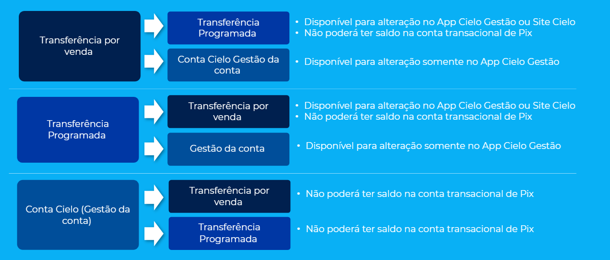

### Aderindo a transferência programada  

#### Via app Cielo Gestão

Siga o passo-a-passo abaixo para alterar a modalidade de recebimento para transferência programada via app Cielo Gestão: 

**1.** Na área logada do Pix no app Cielo Gestão, selecione a opção **Recebimentos Pix**. 

**2.** Clique em **Transferência programada**. 

**4.** Clique em **Configurar**. 

**5.** Selecione o horário da transferência. 

**6.** Marque o opt-in e clique em **Ativar modalidade**. 

**7.** Seu token de segurança será validado. 

Pronto! Seu modelo de recebimento foi alterado. 

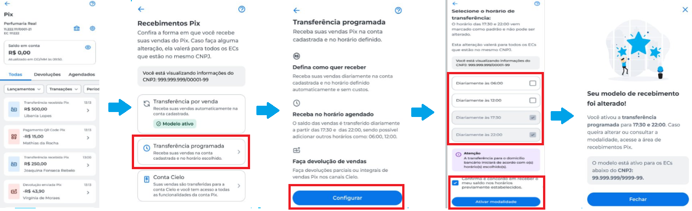

#### Via site Cielo 

Siga o passo-a-passo abaixo para alterar a modalidade de recebimento para transferência programada via site Cielo: 

**1.** Na área logada do site Cielo, no menu superior clique em **Pix > Configurações**.  

**2.** Clique em **Recebimentos**. 

**3.** Selecione a opção **Transferência programada**.

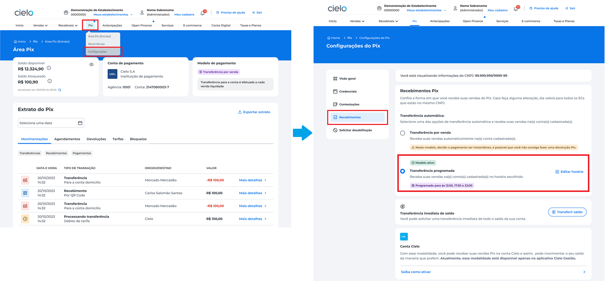

**4.** Selecione o horário da transferência. 

**5.** Marque o opt-in e clique em **Ativar**. 

**6.** Para prosseguir, insira o token de segurança Cielo Gestão e clique em **Verificar**.

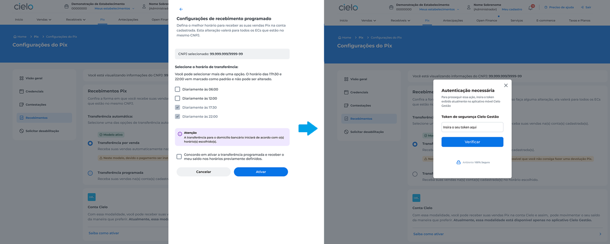

Pronto. Seu modelo de recebimento foi alterado! 

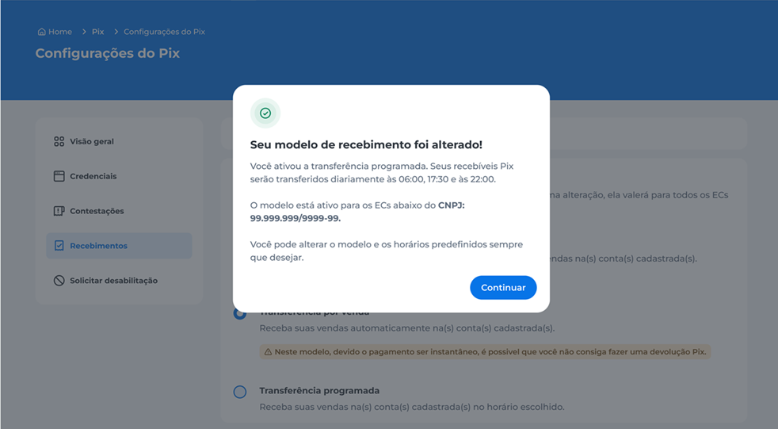

### Aderindo a transferência por venda

#### Via app Cielo Gestão

Siga o passo-a-passo abaixo para alterar a modalidade de recebimento para transferência por venda via app Cielo Gestão: 

**1.** Na área logada do Pix no app Cielo Gestão, selecione a opção **Recebimentos Pix**.

**2.** Clique em Transferência por venda.

**3.** Marque o opt-in e clique em **Ativar modalidade**.

**4.** Seu token de segurança será validado. 

Pronto! Seu modelo de recebimento foi alterado. 

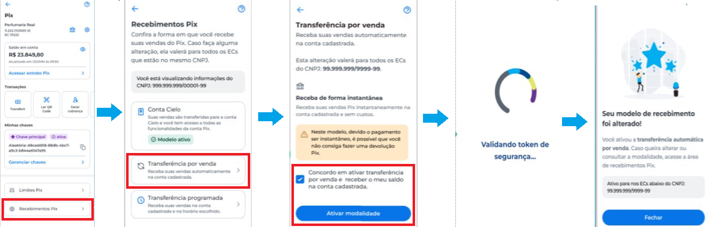

#### Via site Cielo

Siga o passo-a-passo abaixo para alterar a modalidade de recebimento para transferência por venda via site Cielo: 

**1.** Na área logada do site Cielo, no menu superior clique em **Pix > Configurações**.  

**2.** Clique em **Recebimentos**. 

**3.** Selecione a opção **Transferência por venda**.

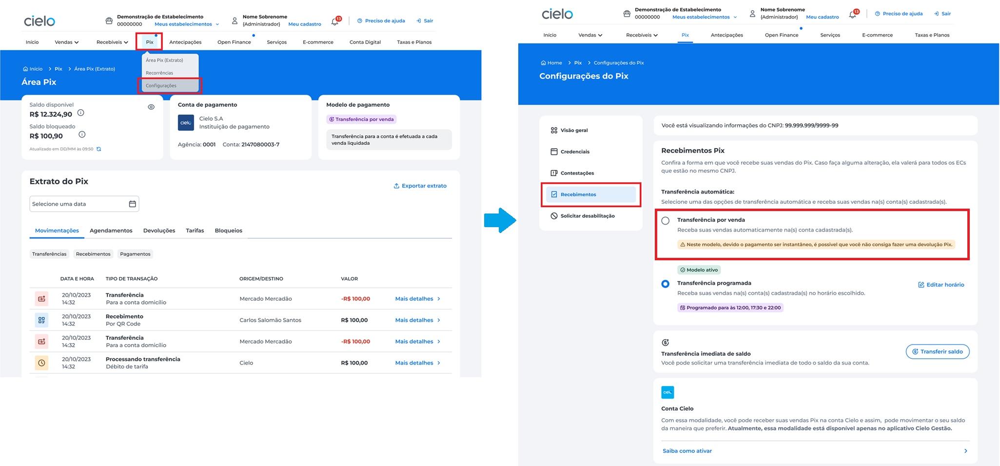

**4.** Marque o opt-in e clique em **Ativar**.

**5.** Para prosseguir, insira o token de segurança Cielo Gestão e clique em **Verificar**.

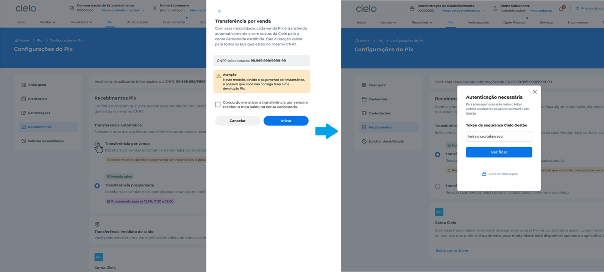

Pronto. Seu modelo de recebimento foi alterado! 

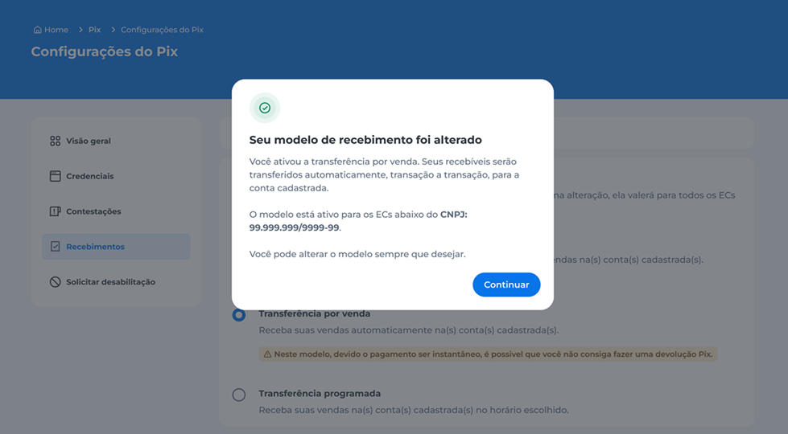

### Aderindo a Conta Cielo 

A adesão a Conta Cielo pode acontecer somente via app.  

Siga o passo-a-passo abaixo para alterar a modalidade de recebimento para transferência por venda: 

**1.** Na área logada do Pix no app Cielo Gestão, selecione a opção **Recebimentos Pix**. 

**2.** Clique em **Conta Cielo**. 

**3.** Marque o opt-in e clique em **Ativar modalidade**. 

**4.** Seu token de segurança será validado. 

Pronto! Seu modelo de recebimento foi alterado. 

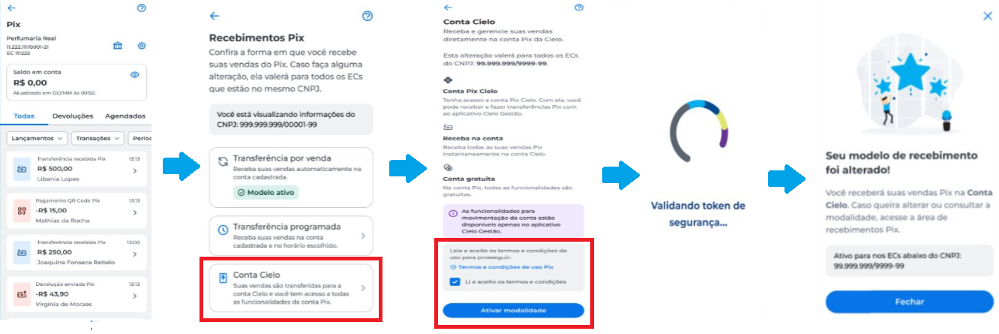

# INTEGRAÇÃO COM A API

Aqui, você encontra todas as informações necessárias sobre endpoints e recursos disponíveis na API Pix. 

Para utilizar a API PIX, as requisições devem ser executadas utilizando as respectivas credenciais dos ambientes de Homologação e Produção.

## Ambientes

- **Sandbox:** É o ambiente destinado à realização de testes. As operações são executadas em ambiente real, porém não produtivo. 
- **Produção:** É o ambiente transacional integrado ao ambiente da Cielo. As operações realizadas nesse ambiente são reais e não podem ser desfeitas.

<br/>

| Ambiente   | Base da URL                                           |
|------------|--------------------------------------------------------|
| Sandbox    | https://api2.cielo.com.br/sandbox/cielo-pix/v1        |
| Produção   | https://api-mtls.cielo.com.br/cielo-pix/v1            |

Todas as chamadas devem ser executadas utilizando as respectivas credenciais dos ambientes de Sandbox e Produção. 

## Arquitetura da API

A API Pix está detalhada no formato OpenAPI 3.077 e o formato de dados utilizados é o JSON.  

A automação do usuário recebedor interage com a API utilizando web services baseados em REST sobre HTTPS. 

O modelo empregado na integração das APIs é simples. Para executar uma operação: 

**1.** Combine a base da URL do ambiente com o endpoint da operação desejada. 
Ex.: https://api-mtls.cielo.com.br/cielo-pix/v1/ 

**2.** Envie a requisição para a URL utilizando o método HTTP adequado à operação. 

| Método HTTP | Descrição                                                         |
|-------------|-------------------------------------------------------------------|
| GET         | Retorna recursos já existentes, ex.: consulta de cobrança.        |
| POST        | Cria um novo recurso, ex.: criação de cobrança.                   |
| PUT         | Atualiza um recurso existente, ex.: realizar devolução.           |
| DELETE      | Exclui um recurso, ex.: exclui um webhook.                        |
| PATCH       | Revisa um recurso, ex.: revisa uma cobrança.                      |

Cada envio de requisição irá retornar um código de Status HTTP, indicando se ela foi realizada com sucesso ou não. 

## Código de status HTTP

Os códigos do padrão HTTP, retornados como resposta à requisição feita para a API, informam se as informações enviadas à API estão obtendo sucesso ao atingir nossos endpoints. 

| Código | Status | Descrição | Exemplo de situações em que pode ocorrer |
|--------|---------|------------|-------------------------------------------|
| 200 | OK | Operação realizada com sucesso | Cobrança recorrente revisada<br>Dados da cobrança recorrente<br>Lista de cobranças recorrentes<br>Lista de cobranças imediatas<br>Lista dos Pix recebidos de acordo com o critério de busca<br>Lista dos locations cadastrados de acordo com o critério de busca<br>Dados da location do Payload<br>Entidade representada pelo recurso informado desvinculada com sucesso<br>Dados da recorrência<br>Recorrência revisada<br>Dados da solicitação da recorrência<br>Cobrança imediata revisada. A revisão deve ser incrementada em 1.<br>Dados da cobrança imediata.<br>Dados da devolução<br>Webhook para notificações acerca de Pix recebidos associados a um txid.<br>Dados do webhook.<br>Webhook para notificações. |
| 201 | Created | A solicitação foi realizada, resultando na criação de um novo recurso | Access Token Criado<br>Cobrança imediata recorrente<br>Cobrança recorrente criada<br>Cobrança recorrente<br>Dados da location do Payload<br>Recorrência criada<br>Dados da solicitação da recorrência<br>Solicitação de recorrência atualizada<br>Cobrança imediata criada<br>Dados da devolução |
| 204 | Empty | Operação realizada com sucesso, mas nenhuma resposta foi retornada | Webhook para notificações foi cancelado. |
| 400 | Bad Request | A requisição possui parâmetro(s) inválido(s) | Requisição com formato inválido |
| 401 | Unauthorized | O token de acesso não foi informado ou não possui acesso às APIs | Erro credencial inválida |
| 403 | Forbidden | O acesso ao rescurso foi negado | Requisição de participante autenticado que viola alguma regra de autorização |
| 404 | Not Found | O recurso informado no request não foi encontrado | Recurso solicitado não foi encontrado |
| 503 | Service unavailable | Serviço não está disponível no momento. Serviço solicitado pode estar em manutenção ou fora da janela de funcionamento | Serviço não está disponível no momento. Serviço solicitado pode estar em manutenção ou fora da janela de funcionamento. |


## Credenciais e autenticação

Abaixo, você aprende como solicitar credenciais Sandbox e, em seguida, credenciais Produção. 

### Solicitação de credenciais Sandbox 

Para obter acesso ao ambiente Sandbox, solicite à Cielo, por meio do e‑mail **apipix.suporte@cielo.com.br**, as seguintes credenciais: 

- Client ID e Client Secret (utilizados para autenticação via OAuth2). 
- Chave Pix transacional (tipo: aleatória).
<br/>
<br/>

No ambiente Sandbox, após gerar o QR Code, envie-o por e-mail apipix.suporte@cielo.com.br  para que a Cielo efetue o pagamento. Configure um tempo de expiração maior para o QR Code. 

### Solicitação de credenciais Produção

Para transacionar em nome dos clientes da Cielo, os parceiros devem ter as seguintes chaves do cliente:  

- Client ID
- Client Secret
- Chave Pix 

<aside style="background-color: #d4edda; padding: 15px; border-left: 5px solid #28a745; color: #155724;margin-top: 20px; margin-bottom: 20px;"> Cada estabelecimento comercial precisa ter credenciais próprias.</aside>

Siga o passo-a-passo abaixo para gerar credenciais de Produção: 

**1.** No site da Cielo, acesse o portal [Minha Conta](https://minhaconta2.cielo.com.br/minha-conta/home) e clique em **Meu Cadastro**.

**2.** Na aba **Autorizações**, clique em **Pix**.

**3.** Selecione a opção **Novo acesso**.


**4.** Clique em **Criar credencial**.


**5.** Selecione o parceiro.


**6.** Clique em **Criar**.


**7.** Aceite os termos de uso e marque a caixa.


**8.** Clique no botão **Autenticar e continuar**.


**9** Insira o token de segurança.

A ativação do token deve ser realizada através do Cielo Gestão.


Pronto! Credencial criada com sucesso. 


Após essa etapa, o cliente poderá copiar o Cliente ID, Client Secret e Chave Transacional para realizar onboarding no portal parceiro.

<aside style="background-color: #f8d7da; padding: 15px; border-left: 5px solid #dc3545; color: #721c24;margin-top: 20px; margin-bottom: 20px;"> As credenciais precisam ser copiadas/baixadas dentro de 3 minutos. Caso contrário, será necessário gerar uma nova credencial. </aside>


## Geração de certificado mTLS 

Com mTLS, seu sistema precisa provar sua identidade usando um certificado cliente. Sem esse certificado, a API Pix não permite conexões. O mTLS adiciona uma camada extra de criptografia e validação.  Isso evita interceptação de dados e acesso indevido à API.  

Nesse contexto, o arquivo .csr (Certificate Signing Request) é o pedido de certificado contendo sua chave pública e os dados da sua empresa. Você gera o .csr localmente, envia para a Cielo e nós devolvemos um certificado assinado que sua aplicação deve usar. 

Para obter o certificado assinado pela Cielo, gere um arquivo .csr com o seguinte comando no terminal (CMD): 

**openssl req -new -newkey rsa:2048 -nodes -keyout chave_privada.key -out certificado.csr** 

Você deve passar as seguintes informações: 

**Certificado do tipo MTLS**  
E-mail: apipix.suporte@cielo.com.br <br/>
Common Name (CN) = api-insiraaquionomedoparceiro-mtls <br/>
Organizational Unit (OU) = PIX <br/>
Organization (O) = CIELO S.A.  <br/>
Locality (L) = Barueri <br/>
State (ST) = SP <br/>
Country (C)C= BR <br/>
<br/>
Envie o .csr para: **apipix.suporte@cielo.com.br**. 

<aside style="background-color: #f8d7da; padding: 15px; border-left: 5px solid #dc3545; color: #721c24;margin-top: 20px; margin-bottom: 20px;"> Todas as informações acima são obrigatórias. Caso qualquer dado seja enviado de forma incorreta ou incompleta, o certificado não poderá ser gerado e será necessário reenviar as informações.  </aside>

Ao preencher os campos obrigatórios listados acima, lembre-se: 

- Caracteres especiais (como símbolos e acentos) não são aceitos.
- No campo Common Name (CN), onde aparece “api-insiraaquionomedoparceiro-mtls”, substitua o trecho **insiraaquionomedoparceiro** pelo nome do parceiro.   

## Entidades 

As entidades representam os principais objetos de dados utilizados na comunicação com a API Pix. Elas definem a estrutura das informações que são enviadas e recebidas durante as operações de pedidos e pagamentos. 

**Cobrança (/cob)**

Representa cada uma das cobranças geradas por meio da API Pix, a fim de permitir que o usuário pagador efetue um pagamento identificado para o usuário recebedor. A cobrança é caracterizada por um conjunto de informações que são utilizadas para que o usuário pagador execute um pagamento por meio do Pix, geralmente, em função de acordo comercial entre o usuário pagador e o usuário recebedor, sem se confundir com o pagamento Pix em si. O modelo de cobrança utilizado é para pagamento imediato. 

Estados da cobrança:

- **ATIVA:** indica que a cobrança foi gerada e pronta para ser paga;
- **CONCLUÍDA::** indica que a cobrança já foi paga e, por conseguinte, não pode acolher outro pagamento67;
- **REMOVIDO_PELO_USUARIO_RECEBEDOR:** indica que o usuário recebedor solicitou a remoção da cobrança; e
- **REMOVIDO_PELO_PSP:** indica que o PSP Recebedor solicitou a remoção da cobrança.
<br/>
<br/>

**Pix (/pix)** 
Representa um pagamento recebido por meio do arranjo de pagamentos Pix.

**Devolução (devolução)** 

Representa uma solicitação de devolução de um Pix realizado, cujos fundos já se encontrem disponíveis na conta transacional do usuário recebedor. 

Estados da devolução:

- **EM_PROCESSAMENTO:** indica que a devolução foi solicitada, mas ainda está em processamento no SPI;
- **DEVOLVIDO:** indica que a devolução foi liquidada pelo SPI; e
- **NAO_REALIZADO:** indica que a devolução não pode ser realizada em função de algum erro durante a liquidação (exemplo: saldo insuficiente).

### Cardinalidade entre as entidades

- Uma **Cobrança** pode estar associada a um ou mais **Pix** (mesmo txid);
- Um **Pix** pode estar associado a uma única **Cobrança**. O **Pix**, no entanto, pode existir independentemente da existência de uma **Cobrança**;
- Um **Pix** pode ter uma ou mais **Devoluções** associadas a ele. Uma **Devolução** está sempre associada a um **Pix**.
- Uma **Cobrança** somente pode estar associada a um **PayloadLocation** e, num determinado momento, o PayloadLocation só pode estar associado a uma cobrança.

## Ciclo de vida do TransactionID (txid)

Há duas situações de uso para o campo TransactionId (txid), que envolvem regras distintas para seu preenchimento.

As cobranças para pagamentos imediatos ou com vencimento criadas por meio da API Pix são identificadas unicamente por meio de um txid. O txid pode ser enviado pelo usuário recebedor quando da geração da cobrança, e não poderá se repetir entre cobranças distintas, a fim de garantir a correta conciliação dos pagamentos. Alternativamente, no caso de cobranças para pagamento imediato, é possível que o usuário recebedor delegue a geração do txid para o seu PSP. 

Uma vez que seja solicitada a criação de uma cobrança por meio da API Pix, o PSP Recebedor deve assegurar que não exista repetição do txid para o mesmo usuário recebedor, seja ele enviado pelo usuário ou gerado pelo próprio PSP. Assim, o conjunto CNPJ ou CPF e txid deve ser único para um dado PSP. 

O txid deve ter, no mínimo, 26 caracteres e, no máximo, 35 caracteres de tamanho. Os caracteres aceitos neste contexto são: A-Z, a-z, 0-9.

## Funcionalidades e endpoints

As funcionalidades da API Pix, na versão atual, estão definidas em grupos:

I – Gerenciamento de Cobranças com pagamento imediato (Cob), que trata do ciclo de vida da entidade Cobrança:

|Criação e atualização de cobrança|PUT/cob/{txid}|
|Criação de uma cobrança sem passar txid|POST/cob|
|Consulta de uma cobrança|GET/cob/{txid}|
|Consulta de lista de cobranças|GET/cob|
|Alteração de uma cobrança|PATCH/cob/{txid}|

II – Gerenciamento de Pix Recebidos (Pix), que trata do ciclo de vida das entidades Pix e Devolução:

|Solicitação de devolução|PUT/pix/{e2eid}/devolucao/{id}|
|Consulta de devolução|GET/pix/{e2eid}/devolucao/{id}|

# CASOS DE USO

O objetivo dessa seção é trazer exemplos de como a API Pix pode ser utilizada na automação das interações entre usuários recebedores e seus respectivos PSPs em transações associadas ao Pix. Esses casos de uso NÃO pretendem esgotar as formas de utilização ou as funções disponibilizadas pela API Pix.

## Pagamento imediato (no ato da compra) com QR Code Dinâmico

**Aplicação:** Comerciantes com volumes de vendas médios ou altos. Comércios online.

**1.** O usuário pagador, ao realizar a compra, informa que deseja pagar com Pix; 

**2.** O software de automação utilizado pelo usuário recebedor acessa a API Pix para criação de uma cobrança e, com os dados recebidos como resposta, gera um QR Code Dinâmico, que é apresentado em um dispositivo de exibição qualquer: 

- a. em uma compra presencial, tipicamente uma tela próxima ao caixa ou mesmo um POS;
- b. nas compras online, no dispositivo em uso pelo pagador.

Serviço invocado: PUT /cob/{txid}  Devem ser informados todos os dados necessários para criação do payload da cobrança, conforme especificação detalhada. Alternativamente, se o usuário recebedor não quiser identificar a cobrança imediata com seu próprio número {txid}, pode-se optar por utilizar o método POST /cob.

**3.** O usuário pagador lê, a seguir, o QR Code com o App do seu PSP e efetua o pagamento; 

**4.** O usuário recebedor, de forma automatizada, por meio de nova consulta à API Pix, verifica se o pagamento foi realizado: 
Serviço invocado: GET /cob/{txid}; 

**5.** O usuário recebedor libera os produtos para o usuário pagador ou, no caso das compras online, confirma o recebimento do pagamento. Alternativamente, o passo 4 pode ser realizado com o uso de webhooks configurados no serviço correspondente. Nesse caso, o usuário recebedor seria informado pelo PSP Recebedor do crédito de um Pix associado a um txid na sua conta transacional.

## Efetuar uma devolução

Aplicação: várias (devolução de produto, erro na cobrança, indisponibilidade do produto em estoque etc.) 
Premissa:
Quando comprador e vendedor estiverem de acordo, será possível realizar o processo de devolução de uma transação Pix. Esse processo deverá ser iniciado pelo vendedor, ou seja, por quem recebeu a transação Pix. 
É importante se atentar aos prazos (de acordo com regulamento do Banco Central).

- Para Pix Saque ou Pix Troco: a devolução deverá ser concluída no prazo máximo de até 1 hora após a conclusão da transação.
- Para transferências, vendas e demais transações com o Pix: até 90 dias após a conclusão da transação.

**Importante:** a devolução está disponível exclusivamente para clientes que possuem livre movimentação da conta e deverá ser realizada por meio do App Cielo Gestão ou, caso o cliente possua, pelos meios de captura via API Pix Banco Central (TEF, LIO Integrada ou E-commerce) ou ainda pela API 3.0 (E-commerce).
Os clientes que optarem pela transferência automática não conseguirão efetivar a operação de devolução, devido falta de saldo em conta. Para ter acesso a efetivação, devem alterar o seu perfil para Livre Movimentação.

O usuário pagador solicita ao usuário recebedor, via algum meio de comunicação adequado, a devolução total ou parcial de um pagamento realizado; 

O usuário recebedor concorda e identifica o pagamento original realizado pelo Pix. Há duas situações possíveis: 

a. Quando o Pix está associado a uma Cobrança: 

- Serviço invocado: GET /cob/{txid}  Como resultado, será recebida uma entidade Cobrança que contém uma relação dos Pix recebidos, cada um com a sua identificação (EndToEndId).

b. Quando o Pix não está associado a uma Cobrança. Nesse caso, é necessário saber, por outros meios, o EndToEndId do Pix original. Alternativamente, pode ser uma consulta ampla, trazendo a relação dos Pix recebidos. 

- Serviço invocado: GET /pix/  Podem ser informados parâmetros para limitar a consulta temporalmente (parâmetros início e “fim” podem ser usados). Além disso, pode-se limitar a busca a um usuário pagador específico, por meio do CNPJ/CPF do pagador.

O software de automação do usuário recebedor aciona a API Pix para realizar a devolução.

- Serviço invocado: PUT /pix/{e2eid}/devolucao/{id}  No caso, “id” é um código gerado pelo sistema do usuário recebedor que identifica a devolução associada ao Pix original. Observar, que um Pix pode ter várias devoluções associadas a ele, desde que o montante das devoluções não ultrapasse o valor do Pix original. O “id” deve ser único por EndToEndID Pix. 
O software de automação do usuário recebedor aciona a API Pix para verificar se a devolução foi liquidada: 

- Serviço invocado: GET /pix/{e2eid}/devolucao/{id} 
O usuário pagador recebe um Pix com o valor de devolução acordado.

## Jornada de adesão

Por jornada de adesão, entende-se o processo por meio do qual um usuário recebedor passa a utilizar os serviços de um PSP específico. Do ponto de vista da API Pix, tal processo deve incluir o fornecimento de credenciais de acesso (Client_IDs e senhas) e de certificados ao usuário recebedor. 

No processo de adesão, o Client_ID disponibilizado pelo PSP deve possuir um conjunto de escopos que determinarão as funcionalidades às quais o Usuário Recebedor terá acesso. Os critérios de autorização nos escopos são de responsabilidade do PSP, que pode criar critérios diferenciados em função das características do Usuário Recebedor. 

Dessa forma, é possível, por exemplo, que determinadas funcionalidades estejam acessíveis apenas por usuários que cumpram requisitos adicionais de segurança estipulados por cada PSP.

# PIX AUTOMÁTICO

O Pix Automático é uma funcionalidade do Pix criada para facilitar pagamentos recorrentes, permitindo que o usuário pagador autorize previamente uma cobrança periódica feita por um estabelecimento. Após o consentimento, os débitos são realizados de forma automática na conta do pagador, sem necessidade de ações manuais a cada ciclo. Esse modelo torna o processo mais simples, rápido e seguro para ambos os lados, substituindo mecanismos tradicionais como débito automático, boletos ou renovações manuais de assinatura.

## Benefícios

O Pix Automático permite criar contratos de cobrança que podem ser por tempo indeterminado ou com um período definido, informando data de início e de término. Também é necessário indicar a periodicidade combinada entre pagador e recebedor, que pode ser: semanal, quinzenal, mensal, trimestral ou anual.

Esta solução preenche lacunas atualmente existentes no mercado de meios de pagamento, ao oferecer maior simplicidade para a empresa recebedora. Com ela, o recebedor pode operar utilizando apenas um único provedor de Pix Automático, o que aumenta a eficiência, reduz a carga operacional e acelera processos. Além disso, aproveita a agilidade do Pix, que possui liquidação instantânea, garantindo a identificação e baixa do pagamento de forma imediata.

## Casos de uso

O Pix Automático pode ser aplicado em diversos tipos de pagamentos recorrentes, especialmente aqueles que exigem praticidade e regularidade. Entre os principais casos, destacam‑se:

- Despesas domésticas fixas: Aluguel, água, energia, gás, internet e outros serviços essenciais.
- Mensalidades: Academias, escolas e cursos diversos.
- Assinaturas digitais: Plataformas de streaming, clubes de assinatura, softwares e serviços online.
- Seguros: Cobranças periódicas de diferentes tipos de apólices.

## Fluxo de integração

Para utilização do Pix Automático na visão de usuário recebedor, por meio da API Pix, é necessário seguir os seguintes passos: 

**1. Criação da recorrência**: É o ponto de partida para habilitar o recebimento de pagamentos pelo produto. Nessa etapa, é criado um contrato de recorrência que reúne as informações do recebedor, a descrição do débito recorrente, a periodicidade e a data de início das cobranças. Após a criação, é gerado um identificador para essa recorrência (idRec). 

**2. Autorização do pagador**: Após a criação da recorrência, é necessário que o pagador realize o consentimento para autorizar pagamentos vinculados ao contrato estabelecido. e pagamento da recorrência criada. 

**3. Cobranças recorrentes**: Com o aceite da solicitação de recorrência, o usuário recebedor pode enviar as cobranças correspondentes ao período vigente para agendamento e liquidação. Para isso, cada cobrança deve obedecer as condições definidas no contrato de recorrência, como valor, periodicidade e data de vencimento, além de ter um Txid único por transação. 

**4. Cancelamento**: Pode acontecer a qualquer momento do ciclo de vida do produto e pode partir tanto do usuário recebedor como do pagador.

## Endpoints da API Pix

Abaixo estão listados os principais endpoints da API Pix, com foco nas funcionalidades relacionadas ao Pix Automático. A tabela a seguir resume os métodos disponíveis, sua presença na documentação da Cielo e no Swagger do Bacen. 

| Endpoint                            | Método | Descrição                                   |
|-------------------------------------|--------|-----------------------------------------------|
| /rec (POST)                         | POST   | Criação de recorrência                        |
| /rec/{recUrlAccessToken}            | GET    | Recupera payload da recorrência (JWS)         |
| /cobr (POST)                        | POST   | Criação de cobrança vinculada à recorrência   |
| /cobr/{txid}                        | GET    | Recupera payload da cobrança (JWS)            |
| /pix/{e2eid}/devolucao/{id}         | GET    | Consulta devolução de Pix                     |
| /pix/{e2eid}/devolucao/{id}         | PUT    | Efetua devolução de Pix                       |
| /webhook                            | POST   | Notificação de eventos via webhook            |
| /rec (GET)                          | GET    | Consulta lista de recorrências                |
| /rec/{idRec}                        | GET    | Consulta recorrência específica               |
| /rec/{idRec}                        | DELETE | Cancelamento de recorrência                   |

## Jornadas

As jornadas do Pix são caminhos padronizados definidos pelo Banco Central que determinam como o usuário pagador concede autorização para pagamentos recorrentes no Pix Automático. 

No Pix Automático na Cielo, estão previstas algumas jornadas:
- [Jornadas de adesão](https://developercielo.github.io/manual/apipix#jornadas-de-ades%C3%A3o) (autorização da recorrência)
- [Jornadas de cobrança](https://developercielo.github.io/manual/apipix#jornada-de-cobran%C3%A7a-agendamento) (agendamento)
- [Jornadas do envio de notificações por webhook](https://developercielo.github.io/manual/apipix#fluxos-de-webhook)

### Jornadas de adesão

Para realizar a adesão ao Pix Automático, o usuário recebedor deve primeiro criar a recorrência. Em seguida, ele solicita o aceite do usuário pagador, concluindo assim o processo de adesão ao meio de pagamento. 

<aside style="background-color: #d4edda; padding: 15px; border-left: 5px solid #28a745; color: #155724;margin-top: 20px; margin-bottom: 20px;"> Na Cielo, as jornadas de adesão 1, 2 e 3 já estão disponíveis para os usuários recebedores por meio da API Pix. A jornada 4 ainda está em desenvolvimento para futura disponibilização. </aside>

#### Jornada 1: Por meio de notificação

**1**.O usuário pagador seleciona o Pix Automático como forma de pagamento no ambiente da empresa recebedora e informa os dados de agência e conta.  

**2**. Com essas informações, o recebedor solicita ao seu PSP a criação da recorrência e o envio da solicitação correspondente. 

**3**. Quando o usuário recebedor cria a recorrência, a Cielo retorna um ID de recorrência (IdRec), que poderá ser utilizado pela empresa recebedora para consultar aquele contrato a qualquer momento.  

**4**. É gerada uma solicitação de recorrência vinculada ao IdRec, que também possui um identificador único (IdSolicRec) para consulta. Essa solicitação permanece válida até a data de vencimento definida pelo recebedor. 

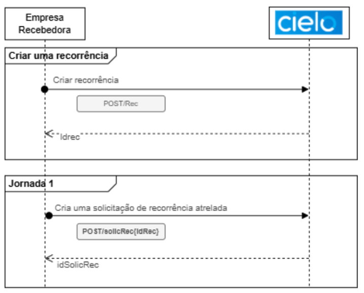

#### Jornada 2: Leitura de QRCode 

**1**. O usuário pagador seleciona o Pix Automático como forma de pagamento, e a empresa recebedora exibe um QR Code contendo todas as informações da recorrência.  

**2**. Ao ler esse QR Code no aplicativo do banco onde possui conta, o pagador é direcionado diretamente para a jornada de autorização dentro do próprio aplicativo bancário. 

<aside style="background-color: #d4edda; padding: 15px; border-left: 5px solid #28a745; color: #155724;margin-top: 20px; margin-bottom: 20px;"> Nessa jornada, a empresa recebedora não precisa solicitar agência e conta do pagador, pois esses dados serão automaticamente associados à recorrência no momento em que ele aceitar a solicitação no seu banco. </aside>

A solicitação de uma recorrência via QR Code é realizada por meio da rota de *location* da recorrência, utilizando um identificador específico destinado a esse fluxo de leitura por QR Code. 

O processo de criação da recorrência permanece igual ao descrito na Jornada 1, adotando o mesmo padrão de identificadores, conforme demonstrado no fluxograma a seguir: 

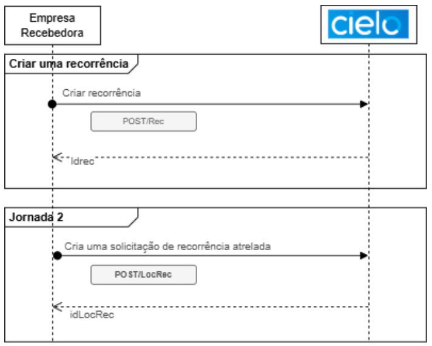

#### Jornada 3: Pagamento imediato de Pix + autorização da recorrência 

**1**. A empresa recebedora disponibiliza ao cliente um QR Code (ou código copia e cola) que reúne as informações necessárias para a autorização da recorrência e para o pagamento imediato da primeira cobrança.   

**2**. O cliente concede a autorização ao mesmo tempo em que realiza o pagamento inicial via Pix. 

**3**. Após o pagamento dessa primeira cobrança, a solicitação do Pix Automático é automaticamente aceita, e as próximas cobranças passam a ocorrer conforme os parâmetros definidos na recorrência. 

<aside style="background-color: #f8d7da; padding: 15px; border-left: 5px solid #dc3545; color: #721c24;margin-top: 20px; margin-bottom: 20px;"> É importante destacar que, se ocorrer qualquer erro no pagamento imediato do QR Code, o fluxo de autorização não prossegue. Isso acontece porque se trata de um QR Code composto, que integra os dois fluxos em um único processo.  </aside>


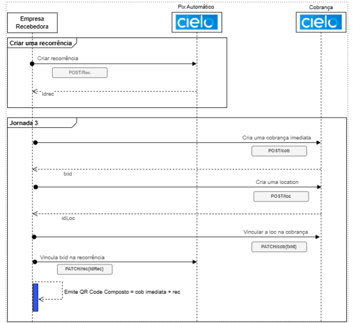

### Jornada de cobrança: Agendamento  

Para agendar uma cobrança no Pix Automático, a empresa recebedora deve enviar a solicitação de acordo com a periodicidade definida no contrato de recorrência. A solicitação de agendamento deve ser enviada entre 10 e 2 dias antes da data de vencimento, conforme regra estabelecida pelo Banco Central. 

O cancelamento do agendamento pode ser realizado tanto pelo pagador quanto pelo recebedor, seguindo prazos específicos para cada parte: 

- **Recebedor**: Pode cancelar até as 22h00 do dia anterior à data prevista para liquidação. 
- **Pagador**: Pode cancelar até as 23h59 do dia anterior à data de liquidação.
<br/>

A consulta de agendamentos e o cancelamento devem ser realizados por meio dos endpoints específicos desse serviço, permitindo que a empresa recebedora acesse o status dos agendamentos, seja de forma individual ou em lista.  

<aside style="background-color: #d4edda; padding: 15px; border-left: 5px solid #28a745; color: #155724;margin-top: 20px; margin-bottom: 20px;"> Na chamada do endpoint CobR, o usuário recebedor deve informar agência e conta de pagamento da Cielo. Como não existe um campo específico para o ISPB, não é possível indicar uma conta de outro PSP. Ou seja, a conta utilizada será sempre a da Cielo. É fundamental lembrar que essa conta não corresponde ao domicílio final de pagamento dos valores do Pix. O domicílio bancário real será aquele definido pela modalidade de recebimento escolhida pelo cliente.  </aside>

Abaixo, apresentamos um exemplo com os campos obrigatórios para criação de cobrança recorrente.  

| Método | Ambiente  | Endpoint                                                      |
|--------|-----------|----------------------------------------------------------------|
| PUT    | Sandbox   | https://api2.cielo.com.br/sandbox/cielo-pix/v1/cobr/{txid}    |
| PUT    | Produção  | https://api2.cielo.com.br/sandbox/cielo-pix/v1/cobr/{txid}    |

Requisição: 

```html
{ 
  "idRec": "RR1234567820240115abcdefghijk", 
  "infoAdicional": "Serviços de Streaming de Música e Filmes.", 
  "calendario": { 
    "dataDeVencimento": "2024-04-15" 
  }, 
  "valor": { 
    "original": "106.07" 
  }, 
  "ajusteDiaUtil": true, 
  "devedor": { 
    "cep": "89256-140", 
    "cidade": "Uberlândia", 
    "email": "sebastiao.tav@mail.com", 
    "logradouro": "Alameda Franco 1056", 
    "uf": "MG" 
  }, 
  "recebedor": { 
    "agencia": "9708", 
    "conta": "012682", 
    "tipoConta": "CORRENTE" 
  } 
} 
```
**Como o cliente acessa os dados da sua conta?**

Na chamada do endpoint CobR, o usuário recebedor deve informar agência e conta de pagamento da Cielo. Para encontrar essses dados, no Site Cielo, em ambiente logado, acesse a aba Pix e serão apresentados os dados da Conta de pagamento, conforme abaixo: 

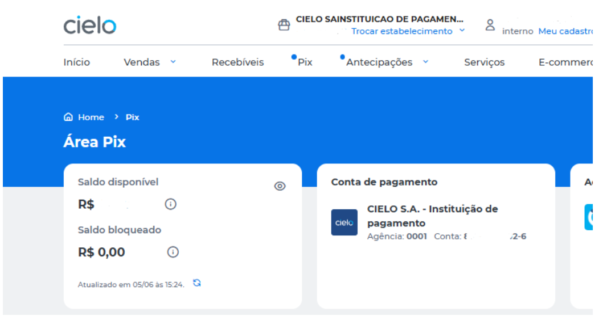

### Fluxos de webhook

A aplicação atua como um monitor ativo de todos os eventos relacionados ao Pix Automático, independentemente de terem sido iniciados pelo pagador ou pelo recebedor. Seu objetivo é notificar o usuário recebedor sobre cada etapa do fluxo do Pix Automático, garantindo visibilidade completa do processo. 

A Cielo disponibiliza esse serviço tanto para as etapas da recorrência — incluindo todos os passos que compõem esse ciclo — quanto para a jornada de agendamento, cobrindo desde a criação do agendamento até a etapa de liquidação. 

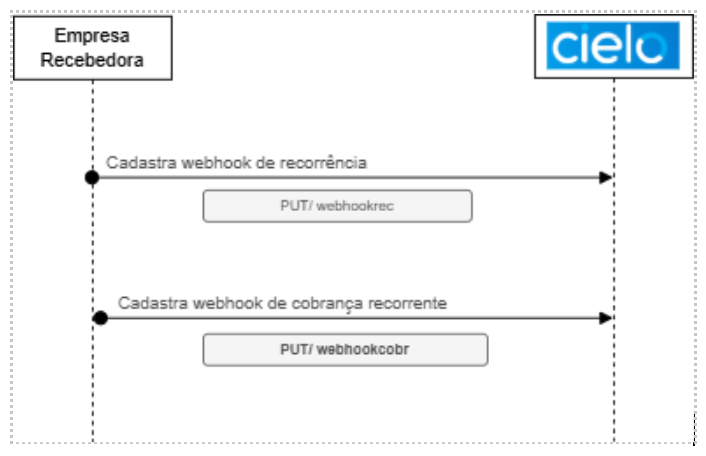

### QR Code composto

Nas jornadas que utilizam QR Code, existem casos em que é empregado o QR Code composto, que oferece um conjunto mais amplo de funcionalidades em comparação ao QR Code estático e ao QR Code dinâmico. A principal diferença desse tipo de QR Code é a presença de uma URL adicional, inserida em um campo específico do payload. Essa URL contém as informações associadas às configurações de recorrência de pagamentos que o usuário recebedor disponibiliza ao usuário pagador. 

| Jornada                     | Descrição                                           |
|-----------------------------|-------------------------------------------------------|
| Jornada 2                   | QR Code apenas com *location* da recorrência         |
| Jornada 3                   | QR Code de uma Cob + *location* da recorrência       |


AS periodicidades possíveis são:

- Semanal;
- Mensal;
- Trimestral;
- Semestral;
- Anual. <br/>
<br/>

**Política de retentativa**

| Política         | Definição                                                                 | Endpoint      |
|------------------|----------------------------------------------------------------------------|---------------|
| NÃO_PERMITE      | Não serão autorizadas retentativas após o vencimento                        | • /rec (POST) |
| PERMITE_3R_7D    | Serão permitidas até 3 tentativas após o vencimento dentro de 7 dias corridos | • /rec (POST) |

**Status de recorrência**

| Status     | Definição                                                                             | Endpoint      |
|------------|-----------------------------------------------------------------------------------------|---------------|
| CRIADA     | Recorrência criada pelo usuário recebedor                                              | • /cobr (GET) |
| ENVIADA    | Recorrência enviada ao PSP do pagador                                                  | • /cobr (GET) |
| RECEBIDA   | Recorrência recebida pelo PSP do pagador                                               | • /cobr (GET) |
| REJEITADA  | Recorrência rejeitada pelo usuário pagador, apenas para a jornada 1, via notificação   | • /cobr (GET) |
| ACEITA     | Recorrência aceita pelo usuário pagador                                                | • /cobr (GET) |
| EXPIRADA   | Data da vigência da recorrência já expirada                                            | • /cobr (GET) |
| CANCELADA  | Recorrência cancelada pelo usuário pagador ou recebedor                                | • /cobr (GET) |

**Tipo de jornada**

| tipoJornada          | Definição                                                                                                                                                                                 | Endpoint      |
|----------------------|---------------------------------------------------------------------------------------------------------------------------------------------------------------------------------------------|---------------|
| JORNADA_1            | Usuário pagador aceitou a recorrência através de notificação externa ao ecossistema                                                                                                        | • /rec (POST) |
| JORNADA_2            | Usuário pagador aceitou a recorrência através de leitura de QR Code de recorrência                                                                                                         | • /rec (POST) |
| JORNADA_3            | Usuário pagador iniciou a recorrência através de leitura de QR Code composto e pagamento de cobrança imediata. O uso desta jornada torna obrigatório o preenchimento de dadosJornada.txid | • /rec (POST) |
| AGUARDANDO_DEFINICAO | Valor inicial posterior à criação e anterior à ativação da recorrência                                                                                                                     | • /rec (POST) |

**Dados de entrada**

| Campo                          | Definição                                                                                                                                                                                                                                                                                                                             | Obrigatório | Tamanho | Tipo         | Exemplo                                       |
|--------------------------------|----------------------------------------------------------------------------------------------------------------------------------------------------------------------------------------------------------------------------------------------------------------------------------------------------------------------------------------|-------------|---------|--------------|-----------------------------------------------|
| vinculo                        | Informações sobre o objeto da recorrência.                                                                                                                                                                                                                                                                                             | Sim         | –       | Objeto       | –                                             |
| objeto (vínculo)               | Identificador do objeto de vínculo.                                                                                                                                                                                                                                                                                                     | Não         | 35      | String       | "Conta de água Av. Brasil, 2804"              |
| contrato (vínculo)             | Número, identificador ou código que representa o objeto da autorização (contrato, pedido etc.).                                                                                                                                                                                                                                         | Sim         | 35      | String       | ContratoXYZ                                   |
| devedor (vínculo)              | O objeto devedor organiza as informações sobre o devedor da recorrência.                                                                                                                                                                                                                                                                | Sim         | –       | Objeto       | –                                             |
| cpf (devedor)                  | CPF do usuário. Não pode ser utilizado ao mesmo tempo que o CNPJ.                                                                                                                                                                                                                                                                       | Sim         | 11      | String       | 09591481080 — Pattern: `/^\d{11}$/`           |
| cnpj (devedor)                 | CNPJ do usuário. Não pode ser utilizado ao mesmo tempo que o CPF.                                                                                                                                                                                                                                                                       | Sim         | 14      | String       | 3202386000185 — Pattern: `/^\d{14}$/`         |
| nome (devedor)                 | Nome do usuário.                                                                                                                                                                                                                                                                                                                       | Sim         | 140     | String       | Ciclano de Tal                                |
| calendario                     | Informações sobre o calendário de recorrência.                                                                                                                                                                                                                                                                                          | Sim         | –       | Objeto       | –                                             |
| datainicial (calendário)       | Data no formato YYYY-MM-DD, segundo ISO 8601. Representa a estimativa do primeiro pagamento.                                                                                                                                                                                                                                            | Sim         | –       | String       | 2025-03-01                                    |
| dataFinal (calendário)         | Campo opcional para autorizações com vigência pré-definida. Compatível com tipoFrequencia e datainicialRecorrencia. Não deve ser preenchido para autorizações de tempo indeterminado. Data ISO 8601 no formato YYYY-MM-DD.                                                                                                               | Não         | –       | String       | 2025-03-01                                    |
| periodicidade                  | Periodicidade das cobranças recorrentes.                                                                                                                                                                                                                                                                                               | Sim         | –       | String ENUM  | MENSAL                                        |
| valor                          | Objeto que agrupa informações de valor.                                                                                                                                                                                                                                                                                                 | Não         | –       | Objeto       | –                                             |
| valorRec (valor)               | Campo opcional. Preenchido apenas quando o valor dos pagamentos é fixo ou não está sujeito a alteração durante a vigência da autorização.                                                                                                                                                                                               | Não         | –       | String       | 100.00 — Pattern: `\d{1,10}\.\d{2}`           |
| valorMinimoRecebedor (valor)   | Campo opcional. Valor definido pelo usuário recebedor. Se o usuário pagador atribuir um valor máximo para os pagamentos daquela autorização, ele não poderá ser inferior ao piso definido pelo usuário recebedor. Não pode ser preenchido nas autorizações de valor fixo, ou seja, com campo valor preenchido.                                                                                                                                                    | Não         | –       | String       | 100.00 — Pattern: `\d{1,10}\.\d{2}`           |
| politicaRetentativa            | Política de retentativas pós-vencimento de recorrência. Determinará se após a data de liquidação determinada na cobrança recorrente será autorizada o reagendamento com data superior a data do vencimento. NAO_PERMITE: Não será autorizado retentativas após o vencimento PERMITE_3R_7D: Será permitida até 3 tentativas após o vencimento dentro do período de 7 dias corridos.                                                                                                                                                                | Sim         | –       | String ENUM  | NAO_PERMITE                                   |
| loc                            | Identificador da *location* a ser informada na criação da recorrência.                                                                                                                                                                                                                                                                  |         | –       |        | –                                             |
| recebedor                      | O objeto recebedor organiza as informações sobre o usuário recebedor da recorrência.                                                                                                                                                                                                                                                   | Sim         | –       | Object       | –                                             |
| cnpj (recebedor)               | CNPJ do usuário recebedor. Não pode ser utilizado ao mesmo tempo que o CPF.                                                                                                                                                                                                                                                             | Sim         | 14      | String       | 32023886000185 — Pattern: `/^\d{14}$/`        |
| nome (recebedor)               | Nome do usuário recebedor.                                                                                                                                                                                                                                                                                                              | Sim         | 140     | String       | Empresa de Serviços S.A.                      |
| ativacao                       | Dados relacionados à confirmação da ativação da recorrência.                                                                                                                                                                                                                                                                            | Não         | –       | Object       | –                                             |
| dadosJornada (ativacao)        | Dado de preenchimento obrigatório quando utilizada a Jornada 3. Este campo deve ser removido pelo PSP Recebedor quando a ativação for realizada pelas jornadas 1, 2 ou 4.                                                                                                                                                                                                                             | Não         | –       | Object       | JORNADA_3                                     |
| txid (dadosJornada)            | Identificador da transação. O campo txid determina o identificador da transação. O objetivo desse campo é ser um elemento que possibilite ao PSP do recebedor apresentar ao usuário recebedor a funcionalidade de conciliação de pagamentos. Na pacs.008, é referenciado como TransactionIdentification <txId> ou idConciliacaoRecebedor.                                                                                                                | Não         | –       | String       | 33beb661bed4a4892feff47dbeb2cd5 — Pattern: `[a-zA-Z0-9]{26,35}` |

**Exemplo de entrada**

```html
{
  "vinculo": {
    "contrato": "63100862",
    "devedor": {
      "cpf": "45164632481",
      "nome": "Fulano de Tal"
    },
    "objeto": "Serviço de Streamming de Música."
  },
  "calendario": {
    "dataFinal": "2025-04-01",
    "dataInicial": "2024-04-01",
    "periodicidade": "MENSAL"
  },
  "valor": {
    "valorRec": "35.00"
  },
  "politicaRetentativa": "NAO_PERMITE",
  "loc": 108,
  "ativacao": {
    "dadosJornada": {
      "txid": "33beb661beda44a8928fef47dbeb2dc5"
    }
  }
}
```

**Dados de saída**

| Campo                         | Definição                                                                                                                                                                                                 | Obrigatório | Tamanho | Tipo    | Exemplo                                                                 |
|-------------------------------|-----------------------------------------------------------------------------------------------------------------------------------------------------------------------------------------------------------|-------------|---------|---------|-------------------------------------------------------------------------|
| dataFinal (calendario)        | Campo opcional que deve ser preenchido para autorizações com vigência pré-definida, devendo ser compatível com os valores informados em tipoFrequencia e a dataInicialRecorrencia. Não deve ser preenchido para autorizações por tempo indeterminado. Trata-se de uma data, no formato YYYY-MM-DD, seguindo ISO 8601. | Não         |         | String  | 2025-03-01                                                             |
| periodicidade                 | Periodicidade das cobranças recorrentes.                                                                                                                                                                  | Sim         |         | String (ENUM) | MENSAL                                                                  |
| valor                         | Campo opcional, deve ser preenchido apenas quando o valor dos pagamentos for fixo ou não for sujeito à alteração durante a vigência da autorização.                                                                 | Não         |         | Object  |                                                                         |
| valorRec (valor)              |                                                                                                                                                                                                           | Não         |         | String  | 100.00 <br/> Pattern: \d{1,10}\.\d{2}                                      |
| valorMinimoRecbedor (valor)   | Campo opcional. Valor definido pelo usuário recebedor. Se o usuário pagador atribuir um valor máximo para os pagamentos daquela autorização, ele não poderá ser inferior ao piso definido pelo usuário recebedor. Não pode ser preenchido nas autorizações de valor fixo, ou seja, com campo valor preenchido. | Não | | String | 100.00 <br/> Pattern: \d{1,10}\.\d{2}                                      |
| politicaRetentativa           | Política de retentativa após vencimento da recorrência. Determinará se após a data de liquidação determinada na cobrança recorrente será autorizado o reagendamento com data superior à data do vencimento. NÃO_PERMITE: Não será autorizado retentativas após o vencimento PERMITE_3R_7D: Será permitida até 3 tentativas após o vencimento dentro do período de 7 dias corridos. | Sim | | String (ENUM) | NAO_PERMITE                                                            |
| loc                           | Location do payload completa                                                                                                                                                                              | Não         |         | Object  |                                                                         |
| criacao (loc)                 | Data e hora em que o location foi criada. Respeita RFC 3339                                                                                                                                              | Não         |         | String  | 2023-12-10T07:10:05.115Z                                                |
| id (loc)                      | Identificador da location a ser informada na criação de uma recorrência                                                                                                                                   | Não         |         | Int64   | 108                                                                     |
| location (loc)                | Localização do payload a ser informada na criação da recorrência                                                                                                                                          | Não         | 77      | String  | pix.example.com/q/v2/rec/2353c790eefb11eaadc10242ac120002               |
| idRec (loc)                   | Identificador da recorrência                                                                                                                                                                               | Não         | 29      | String  | RR1234567820240115abcdefghijk <br/> Pattern: [a-zA-Z0-9]{29}              |
| atualizacao                   | Histórico das mudanças de status da recorrência                                                                                                                                                            | Sim         |         | Object  |                                                                         |
| status                        | Status da recorrência                                                                                                                                                                                      | Sim         |         | String (ENUM) | CRIADA                                                                  |
| data                          | Data e hora do registro do status atualizado. Respeita RFC 3339                                                                                                                                           | Sim         |         | String  | 2023-12-19T12:28:05.230Z                                                |
| recebedor                     | O objeto devedor organiza as informações sobre o devedor da recorrência. CNPJ do usuário. Não pode ser utilizado ao mesmo tempo que o CPF.                                                                 | Sim         |         | Object  |                                                                         |
| cnpj (recebedor)              |                                                                                                                                                                                                           | Sim         | 14      | String  | 8202386000185 <br/> Pattern: ^\d{14}$                                     |
| nome (recebedor)              | Nome do usuário recebedor                                                                                                                                                                                  | Sim         | 140     | String  | Empresa de Serviços S.A                                                |
| ativacao                      | Dados relacionados à confirmação da ativação da recorrência                                                                                                                                               | Não         |         | Object  |                                                                         |
| dadosJornada (ativacao)       | Dado de preenchimento obrigatório quando utilizada a Jornada 3. Este campo deve ser removido pelo PSP Recebedor quando a ativação for realizada pelas jornadas 1, 2 ou 4.                                                                 | Não | | Object |                                                                         |
| tipoJornada                   | Dado relacionado ao caminho percorrido pelo processo de adesão à recorrência pelo usuário pagador, os valores possíveis são                                                                                                                     | Sim | | String (ENUM) | JORNADA_3                                                              |
| txid (dadosJornada)           | Identificador da transação. O campo txid determina o identificador da transação. O objetivo desse campo é ser um elemento que possibilite ao PSP do recebedor apresentar ao usuário recebedor a funcionalidade de conciliação de pagamentos. Na pacs.008, é referenciado como TransactionIdentification <txId> ou idConciliacaoRecebedor. | Não | | String | 33beb661beda44a8928fef47dbeb2dc5 <br/>Pattern: [a-zA-Z0-9]{26,35} |

**Exemplos de saída**

```html
{
  "idRec": "RN1234567820240115abcdefghijk",
  "vinculo": {
    "contrato": "63100862",
    "devedor": {
      "cpf": "45164632481",
      "nome": "Fulano de Tal"
    },
    "objeto": "Serviço de Streamming de Música."
  },
  "calendario": {
    "dataFinal": "2025-04-01",
    "dataInicial": "2024-04-01",
    "periodicidade": "MENSAL"
  },
  "politicaRetentativa": "NAO_PERMITE",
  "recebedor": {
    "cnpj": "01602606113708",
    "nome": "Empresa de Serviços SA"
  },
  "valor": {
    "valorRec": "35.00"
  },
  "status": "CRIADA",
  "loc": {
    "criacao": "2023-12-10T07:10:05.115Z",
    "id": 108,
    "location": "pix.example.com/qr/v2/rec/2353c790eefb11eaadc10242ac120002",
    "idRec": "RN1234567820240115abcdefghijk"
  },
  "ativacao": {
    "dadosJornada": {
      "tipoJornada": "JORNADA_3",
      "txid": "33beb661beda44a8928fef47dbeb2dc5"
    }
  },
  "atualizacao": [
    {
      "data": "2023-12-19T12:28:05.230Z",
      "nome": "CRIADA"
    }
  ]
}
```

**Códigos de retorno**

| Código HTTP | Descrição Técnica              | Quando ocorre                                                                 |
|-------------|--------------------------------|-------------------------------------------------------------------------------|
| **200**     | Sucesso                        | Requisição processada corretamente.                                           |
| **201**     | Criado                         | Recurso criado com sucesso (ex: recorrência ou cobrança).                     |
| **400**     | Requisição inválida            | Campos obrigatórios ausentes, formato inválido, valores fora do padrão.       |
| **401**     | Não autorizado                 | Token de acesso ausente, inválido ou expirado.                                |
| **403**     | Proibido                       | O `client_id` não tem permissão para acessar o recurso.                       |
| **404**     | Não encontrado                 | ID de recorrência, cobrança ou devolução não existe.                          |
| **409**     | Conflito                       | Tentativa de criar uma recorrência ou cobrança com `txid` já existente.       |
| **422**     | Entidade não processável       | Dados válidos em estrutura, mas com regras de negócio violadas.               |
| **500**     | Erro interno do servidor       | Falha inesperada no processamento da requisição.                              |
| **503**     | Serviço indisponível           | API fora do ar, manutenção ou instabilidade temporária.                       |

## Recursos

### Consultar listas de recorrência

Retorna todos os contratos de recorrência de forma paginada a partir das informações do pagador. 

| Ambiente | Método | Endpoint                                                                |
|----------|--------|-------------------------------------------------------------------------|
| Sandbox  | GET   | `https://api2.cielo.com.br/sandbox/cielo-pix/v1/rec`       |
| Produção | GET   | `https://api-mtls.cielo.com.br/cielo-pix/v1/rec`                   |

AS periodicidades possíveis são:

- Semanal;
- Mensal;
- Trimestral;
- Semestral;
- Anual. <br/>
<br/>

**Política de retentativa**

| Política        | Definição                                                                 |
|-----------------|---------------------------------------------------------------------------|
| NÃO_PERMITE | Não será autorizado retentativas após o vencimento                        |
| PERMITE_3R_7D | Será permitida até 3 tentativas após o vencimento dentro de 7 dias corridos |

**Status de recorrência**

| Status     | Definição                                                                 |
|------------|---------------------------------------------------------------------------|
| CRIADA     | Recorrência criada pelo usuário recebedor                               |
| ENVIADA    | Recorrência enviada ao PSP do pagador                                   |
| RECEBIDA   | Recorrência recebida pelo PSP do pagador                                |
| REJEITADA  | Recorrência rejeitada pelo usuário pagador, apenas para a jornada 1, via notificação |
| ACEITA     | Recorrência aceita pelo usuário pagador                                 |
| EXPIRADA   | Data da vigência da recorrência já expirada                             |
| CANCELADA  | Recorrência cancelada pelo usuário pagador ou recebedor                 |

**Tipo de jornada**

| tipoJornada          | Definição                                                                                                                                                     |
|----------------------|---------------------------------------------------------------------------------------------------------------------------------------------------------------|
| JORNADA_1       | Usuário pagador aceitou a recorrência através de notificação externa ao ecossistema                                                                           |
| JORNADA_2        | Usuário pagador aceitou a recorrência através de leitura de QR Code de recorrência                                                                            |
| JORNADA_3        | Usuário pagador iniciou a recorrência através de leitura de QR Code composto e pagamento de cobrança imediata. O uso desta jornada torna obrigatório o preenchimento de `dadosJornada.txid` |
| AGUARDANDO_DEFINICAO | Valor inicial posterior à criação e anterior à ativação da recorrência                                                                                       |

Os possíveis solicitantes de cancelamento da cobrança recorrente são: 

- PSP_PAGADOR
- USUARIO_PAGADOR
- PSP_RECEBEDOR
- USUARIO_RECEBEDOR
<br/>
<br/>

**Códigos de cancelamento**

| Código | Descrição                                                                                     |
|--------|-------------------------------------------------------------------------------------------------|
| **ACCL** | Fechamento de conta. Utilizado para transações relacionadas ao encerramento de uma conta bancária. |
| **CPCL** | Encerramento da empresa.                                                                      |
| **DCSD** | Cancelamento por motivo de falecimento                                                        |
| **FRUD** | Utilizado para transações que foram identificadas como fraudulentas                           |
| **SLCR** | Solicitado pelo usuário pagador                                                               |
| **SLDB** | Solicitado pelo usuário recebedor                                                             |

# SWAGGER

Acesse nosso [Portal de Desenvolvedores](https://desenvolvedores.cielo.com.br/api-portal/pt-br/swagger/cielo-pix/1.0.4#/%3D) para consultar a especificação técnica da API no formato Swagger. Nele, é possível visualizar os endpoints disponíveis, seus métodos e parâmetros, os modelos de requisição e resposta, os códigos de retorno, além de realizar testes das APIs diretamente no ambiente interativo, quando aplicável, facilitando o entendimento e a integração técnica.

# PERGUNTAS FREQUENTES

Aqui, você encontra as respostas para as perguntas mais frequentes sobre a API Pix para facilitar sua jornada com a gente! 

## Modalidades de recebimento Pix

**Se uma modalidade não for definida, qual será considerada?**  
Nesse caso, será considerada a primeira modalidade habilitada para o Estabelecimento Comercial. 

**Posso realizar a alteração de modalidade somente para um Estabelecimento Comercial?**  
Não. A Alteração da modalidade será aplicada para todos os ECs vinculados ao CNPJ. 

**A alteração de modalidade é realizada de forma imediata?** 
Não. A troca de modalidade não ocorre de forma instantânea. Quando você solicita a mudança, é criado um agendamento, e a alteração é efetivada à 0h00 do dia seguinte. Esse processo garante uma conciliação mais organizada e precisa para o cliente. 

**Se eu cancelar a modalidade que estava usando, ocorrerá uma migração automática para uma outra modalidade contratada?**  
Não. A migração não ocorre de forma automática. Caso você cancele a modalidade em uso, você deve acessar o site e selecionar manualmente qual das demais modalidades contratadas deseja ativar. 

**Após a troca da modalidade, consigo consultar as vendas realizadas na modalidade antiga?**  
As vendas realizadas nos últimos 90 dias e transacionadas na modalidade Pix na Cielo ficarão disponíveis para consulta no site, disponíveis na aba **Pix**. 

**Se eu tiver saldo em conta no Pix na Cielo e trocar a modalidade para o Pix nos Bancos, o que acontece com o meu saldo?**  
O saldo permanece disponível na sua conta. Se você utiliza transferência automática ou transferência programada e houver algum problema com o domicílio bancário, basta corrigir os dados para que o valor seja devidamente liquidado. Já no caso de livre movimentação, neste momento, é necessário retornar para a modalidade Pix Cielo para realizar o resgate do saldo disponível em conta.

## Pix Automático 

**Eu preciso solicitar habilitação do Pix Automático?** 
Não. A funcionalidade já está disponível para clientes que possuem o Pix habilitado na Cielo. Caso você ainda não tenha o produto habilitado, entre em contato com o seu representante Cielo. Caso você já tenha o produto habilitado, você deverá fazer a integração com a API Pix ou API E-commerce e, em seguida, ofertar o Pix Automático para os seus clientes.  

**Quem pode se enquadrar como usuário recebedor do Pix Automático?**  
Pessoas jurídicas com número de inscrição no CNPJ ativo podem se enquadrar como usuários recebedores do Pix Automático. 

<aside style="background-color: #f8d7da; padding: 15px; border-left: 5px solid #dc3545; color: #721c24;margin-top: 20px; margin-bottom: 20px;"> Os PSPs recebedores devem adotar controles para garantir que a funcionalidade não seja disponibilizada a usuários recebedores com indícios de fraude ou má conduta. </aside>
  
**Uma recorrência precisa ter vigência ou quantidade de pagamentos pré-definidos?** 
Não necessariamente. A vigência da recorrência é definida conforme o acordo entre o recebedor e o pagador. A autorização pode ser concedida por prazo indeterminado ou, alternativamente, conter parâmetros pré-definidos, como o número máximo de cobranças ou uma data final de vigência.

**O cancelamento da autorização cancela automaticamente a recorrência?**  
Sim. O cancelamento de uma autorização resulta automaticamente no cancelamento da recorrência, e o inverso também é válido. O cancelamento ocorre de forma imediata. No entanto, agendamentos previamente existentes com liquidação prevista para o mesmo dia serão mantidos. Após o cancelamento da recorrência, o usuário recebedor não poderá mais enviar instruções de pagamento para débitos futuros.

**O que acontece se, no dia do pagamento, o portador não tiver limite ou saldo?** 
Caso o portador não possua limite ou saldo no dia do pagamento, será possível solicitar um ajuste de limite, que deverá ser atendido em até oito horas, permitindo uma nova tentativa de pagamento no mesmo dia. Na ausência de saldo, o portador poderá realizar um depósito na conta para viabilizar a conclusão da operação.

**O que acontece se o portador não tiver saldo, inclusive nas retentativas?**  
Após o esgotamento de todas as tentativas de cobrança, o cliente (EC) será notificado por meio de Webhook e deverá adotar uma forma alternativa de cobrança junto ao cliente final. A autorização do usuário pagador permanecerá vigente, exceto em caso de cancelamento explícito da autorização.

 **O portador será notificado a cada cobrança?**  
Sim. O Pix Automático prevê o envio de comunicações sobre agendamentos e cobranças ao portador, realizadas diretamente pelo banco do próprio portador.

**Como funciona a devolução no Pix Automático?** 
A devolução no Pix Automático segue as mesmas regras e parâmetros aplicáveis à devolução do Pix tradicional, não havendo qualquer diferença em relação ao processo padrão.  

**As taxas do Pix Automático são as mesmas que o Pix convencional?**  
Sim. As taxas seguirão as mesmas taxas que o cliente já tem cadastrado para o Pix Convencional. 


